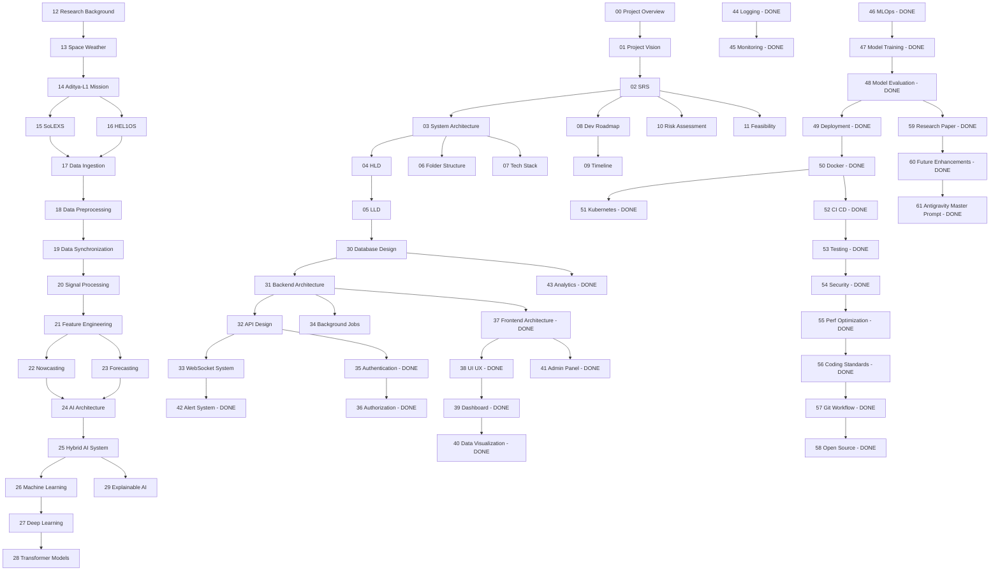

# MASTER_DOCUMENTATION_PLAN.md

**HeliosAI** — AI-Powered Space Weather Intelligence Platform
Documentation Program Master Plan

---

## 0. Honest Status Check (read this first)

Before planning new work, here is the **actual current state**, verified against disk rather than assumed:

| Category | Status |
|---|---|
| `README.md` | Exists (document `00` in spirit, but not yet a standalone `docs/00_Project_Overview.md`) |
| `docs/01_Project_Vision.md` … `docs/34_Background_Jobs.md` | **34 files — NOT YET CREATED.** Only referenced by name in the README's Repository Structure table. This is the single largest real gap in the repository. |
| `docs/35_Authentication.md` … `docs/61_Antigravity_Master_Prompt.md` | **27 files — created.** |
| `prompts/antigravity/*.md` | **Not yet created.** Zero files exist. |
| `MASTER_DOCUMENTATION_PLAN.md` | This file — being created now. |
| `MASTER_IMPLEMENTATION_GUIDE.md` | Not yet created. |
| `MASTER_ANTIGRAVITY_PROMPT.md` | Not yet created. |

**Correcting the premise:** the instruction driving this document assumed the existing set was "80% complete." It is closer to **44% complete by file count** (27 of 61 numbered docs), and 0% complete on the `prompts/` folder. This plan is scoped against the *real* gap, not the assumed one, so the roadmap below is trustworthy rather than decorative.

**On the 150–200 document / 100+ prompt target:** that scale is achievable, but not inside a single response — each doc in this series runs 100–250 lines of substantive, non-templated engineering content, and generating hundreds of them back-to-back without a plan produces exactly the kind of shallow, repetitive filler this program says it wants to avoid. This plan sequences the work so it can proceed **document-by-document across multiple turns**, using your own stated `CONTINUE` protocol, without ever regenerating or contradicting earlier files.

---

## 1. Gap Analysis

### 1.1 Missing Documentation (by category)

| Category | Gap |
|---|---|
| Foundational / Vision | `00_Project_Overview`, `01_Project_Vision`, `02_SRS`, `03_System_Architecture`, `04_HLD`, `05_LLD`, `06_Folder_Structure`, `07_Tech_Stack` — all missing as standalone files (currently only summarized in README) |
| Planning | `08_Development_Roadmap`, `09_Project_Timeline`, `10_Risk_Assessment`, `11_Feasibility_Study` — missing |
| Scientific Background | `12_Research_Background`, `13_Space_Weather`, `14_AdityaL1_Mission`, `15_SoLEXS`, `16_HEL1OS` — missing; this is scientifically load-bearing and cannot be superficial |
| Data Pipeline | `17_Data_Ingestion`, `18_Data_Preprocessing`, `19_Data_Synchronization`, `20_Signal_Processing`, `21_Feature_Engineering` — missing |
| Intelligence Layer | `22_Nowcasting`, `23_Forecasting`, `24_AI_Architecture`, `25_Hybrid_AI_System`, `26_Machine_Learning`, `27_Deep_Learning`, `28_Transformer_Models`, `29_Explainable_AI` — missing |
| Data & Backend Core | `30_Database_Design`, `31_Backend_Architecture`, `32_API_Design`, `33_WebSocket_System`, `34_Background_Jobs` — missing |
| Cross-cutting engineering artifacts | No dedicated ER diagram doc, no OpenAPI contract doc, no error-taxonomy doc, no data-validation-rules doc, no design-patterns catalogue, no algorithm-complexity appendix |
| Process/Program docs | No `MASTER_DOCUMENTATION_PLAN`, `MASTER_IMPLEMENTATION_GUIDE`, `MASTER_ANTIGRAVITY_PROMPT` (this batch addresses the first) |
| Per-module Antigravity prompts | Zero exist; `prompts/antigravity/` folder is empty |

### 1.2 Missing Research / Scientific Rigor

- No document formally cataloguing GOES flare classification thresholds and how HeliosAI's class bins map to them (needed before `48_Model_Evaluation.md` claims can be fully audited).
- No document on SoLEXS/HEL1OS instrument calibration files and Level-0→Level-1 processing already performed upstream by ISRO (needed so `18_Data_Preprocessing.md` doesn't duplicate or contradict payload-team processing).
- No literature-survey document distinct from the research-paper outline (`59_Research_Paper.md` is the *output* paper; `12_Research_Background.md` is the *input* survey — these are different documents and both are needed).

### 1.3 Missing Architecture Artifacts

- No standalone ER diagram document (schema is only implied inside `30_Database_Design.md`, not yet written).
- No standalone OpenAPI/API contract document (implied by `32_API_Design.md`, not yet written).
- No class diagrams for the Intelligence Subsystem's model interface (`fit`/`predict`/`predict_proba`/`explain`, referenced in `56_Coding_Standards.md` but never formally diagrammed).
- No state diagram for data-quality flags (raw → validated → quarantined → usable), only the alert lifecycle state diagram exists (`42_Alert_System.md`).

### 1.4 Missing Backend / Frontend Modules (documentation-level)

- Backend: ingestion fetcher, format parser, raw validator, time-sync engine, background-job definitions — all undocumented (docs 17–21, 34).
- Frontend: none further missing beyond 37–41 (already covered); however, no document yet specifies the **Catalogue Explorer** page in the same depth as `39_Dashboard.md` gave the Live Dashboard — flagged as a new doc, `39a` is not valid numbering, so it is folded into `30_Database_Design.md`'s consumer notes and a future `62`-series addendum if the numbered scheme is extended.

### 1.5 Missing AI/ML Documentation

- `24_AI_Architecture.md` and `25_Hybrid_AI_System.md` are the documents that should formally define *how* the nowcasting (rule/statistical) and forecasting (learned) approaches combine — currently only summarized at a high level in the README. Missing.
- `26_Machine_Learning.md` / `27_Deep_Learning.md` / `28_Transformer_Models.md` should contain the actual algorithmic detail (loss functions, architecture diagrams, hyperparameter search spaces) that `47_Model_Training.md` currently only references, not restates. Missing.
- `29_Explainable_AI.md` — referenced by six other documents already written (`38`, `40`, `42`, `48`, `59`) but does not itself exist yet. **This is a high-priority gap** since existing docs already promise its content.

### 1.6 Missing Signal Processing / Scientific Documentation

- `20_Signal_Processing.md` — referenced by `21_Feature_Engineering.md`'s wavelet-energy feature and `40_Data_Visualization.md`'s overlay content, but does not exist.
- No document on background-subtraction methodology specific to SoLEXS/HEL1OS detector physics.

### 1.7 Missing Security / DevOps / Testing / Deployment / Monitoring

Largely covered already (`44`–`55`). Remaining gap: no dedicated **Disaster Recovery / Backup** document (database backup cadence, point-in-time recovery for TimescaleDB, MLflow artifact store backup) — this was never in the original 61-doc index at all, and is flagged in §3 as a proposed **new** document beyond the original scope.

### 1.8 Missing UX / API / Database Design

- `32_API_Design.md` (full OpenAPI-level contract, not just the summary table in `35_Authentication.md`/`36_Authorization.md`) — missing.
- `30_Database_Design.md` (full schema: tables, hypertables, indexes, migrations strategy) — missing, despite being referenced by name in at least eight already-written documents.

### 1.9 Missing Diagrams (by type)

| Diagram Type | Present | Missing |
|---|---|---|
| Flowchart | System overview, ingestion, several module flows | Full data-quality flow, retraining decision flow |
| Sequence diagram | Data flow (README), login flow (`35`) | Nowcast-to-alert full sequence, forecast-to-alert full sequence, ingestion-failure-retry sequence |
| State diagram | Alert lifecycle (`42`) | Data-quality state, model-registry stage transitions |
| ER diagram | None yet | Full schema ER diagram — required in `30_Database_Design.md` |
| Class diagram | None yet | Model interface class diagram, ingestion/parser class diagram |
| Gantt / timeline | None yet | `09_Project_Timeline.md` |

### 1.10 Missing Workflows, User Stories, Acceptance Criteria

- No document yet expresses the system from a **user-story** perspective (as-a/I-want/so-that), despite every technical doc having its own local Acceptance Criteria. This belongs in `02_Software_Requirements_Specification.md`, not yet written.
- No consolidated edge-case catalogue (data gaps, duplicate timestamps, clock drift, partial-band-only data, NaN floods, out-of-order packets) — scattered as one-liners across several docs but never centralized. Proposed home: `18_Data_Preprocessing.md`.

### 1.11 Missing Design Patterns / Algorithms Documentation

- `05_Low_Level_Design.md` (referenced eight times already, never written) is the natural home for the Repository/Service-Layer/DI pattern catalogue that `56_Coding_Standards.md` assumes but doesn't itself specify in class-diagram detail.

### 1.12 Missing Research References / Scientific Papers Catalogue

- `12_Research_Background.md` — a structured literature survey (distinct from `59_Research_Paper.md`'s reference list, which is output-facing) is entirely missing.

---

## 2. Dependency Graph

---

## 3. Missing Documents — Full Table

| # | File | Priority | Est. Words | Depends On | Status |
|---|---|---|---|---|---|
| 00 | `00_Project_Overview.md` | P0 | 900 | README | Missing |
| 01 | `01_Project_Vision.md` | P0 | 900 | 00 | Missing |
| 02 | `02_Software_Requirements_Specification.md` | P0 | 1600 | 01 | Missing |
| 03 | `03_System_Architecture.md` | P0 | 1400 | 02 | Missing |
| 04 | `04_High_Level_Design.md` | P0 | 1400 | 03 | Missing |
| 05 | `05_Low_Level_Design.md` | P0 | 1600 | 04 | Missing |
| 06 | `06_Project_Folder_Structure.md` | P0 | 900 | 03 | Missing |
| 07 | `07_Tech_Stack.md` | P1 | 900 | 03 | Missing |
| 08 | `08_Development_Roadmap.md` | P1 | 1000 | 02 | Missing |
| 09 | `09_Project_Timeline.md` | P2 | 700 | 08 | Missing |
| 10 | `10_Risk_Assessment.md` | P1 | 1000 | 02 | Missing |
| 11 | `11_Feasibility_Study.md` | P2 | 900 | 02 | Missing |
| 12 | `12_Research_Background.md` | P0 | 1200 | — | Missing |
| 13 | `13_Space_Weather.md` | P0 | 1000 | 12 | Missing |
| 14 | `14_AdityaL1_Mission.md` | P0 | 1000 | 13 | Missing |
| 15 | `15_SoLEXS.md` | P0 | 1100 | 14 | Missing |
| 16 | `16_HEL1OS.md` | P0 | 1100 | 14 | Missing |
| 17 | `17_Data_Ingestion.md` | P0 | 1300 | 15, 16 | Missing |
| 18 | `18_Data_Preprocessing.md` | P0 | 1400 | 17 | Missing |
| 19 | `19_Data_Synchronization.md` | P0 | 1200 | 18 | Missing |
| 20 | `20_Signal_Processing.md` | P0 | 1300 | 19 | Missing |
| 21 | `21_Feature_Engineering.md` | P0 | 1400 | 20 | Missing |
| 22 | `22_Nowcasting.md` | P0 | 1600 | 21 | Missing |
| 23 | `23_Forecasting.md` | P0 | 1600 | 21 | Missing |
| 24 | `24_AI_Architecture.md` | P0 | 1300 | 22, 23 | Missing |
| 25 | `25_Hybrid_AI_System.md` | P0 | 1200 | 24 | Missing |
| 26 | `26_Machine_Learning.md` | P1 | 1400 | 25 | Missing |
| 27 | `27_Deep_Learning.md` | P1 | 1400 | 26 | Missing |
| 28 | `28_Transformer_Models.md` | P1 | 1500 | 27 | Missing |
| 29 | `29_Explainable_AI.md` | P0 | 1300 | 25 | **Missing — already referenced by 6 existing docs** |
| 30 | `30_Database_Design.md` | P0 | 1600 | 05 | **Missing — referenced by 8+ existing docs** |
| 31 | `31_Backend_Architecture.md` | P0 | 1300 | 30 | Missing |
| 32 | `32_API_Design.md` | P0 | 1600 | 31 | **Missing — referenced by 5+ existing docs** |
| 33 | `33_WebSocket_System.md` | P0 | 1200 | 32 | **Missing — referenced by 4 existing docs** |
| 34 | `34_Background_Jobs.md` | P0 | 1100 | 31 | Missing |
| — | `prompts/antigravity/*.md` (×61) | P1 | ~600 each | corresponding doc | Missing |
| — | `MASTER_DOCUMENTATION_PLAN.md` | P0 | — | all | **This file** |
| — | `MASTER_IMPLEMENTATION_GUIDE.md` | P1 | 2000 | all docs | Missing |
| — | `MASTER_ANTIGRAVITY_PROMPT.md` | P1 | 2000 | all docs | Missing |

**Total remaining numbered docs: 35 (00–34). Total remaining prompts: 61. Total remaining program docs: 3.**

---

## 4. Generation Order (this program's execution sequence)

1. `MASTER_DOCUMENTATION_PLAN.md` — this file (done, this turn).
2. `docs/00` → `docs/11` — foundational/planning tier (no scientific or ML dependency, unblocks everything else).
3. `docs/12` → `docs/16` — scientific/mission background tier (unblocks the data pipeline tier; must be scientifically accurate, not filler).
4. `docs/17` → `docs/21` — data pipeline tier.
5. `docs/22` → `docs/29` — intelligence/ML tier, closing the `29_Explainable_AI.md` gap that six existing documents already depend on.
6. `docs/30` → `docs/34` — backend core tier, closing the `30`, `32`, `33` gaps that existing documents already depend on.
7. `prompts/antigravity/*.md` — one per doc, 61 total, generated only once the doc it targets is finalized (per `61_Antigravity_Master_Prompt.md`'s own stated rule).
8. `MASTER_IMPLEMENTATION_GUIDE.md`.
9. `MASTER_ANTIGRAVITY_PROMPT.md`.

This order is chosen — not arbitrary — because steps 5 and 6 resolve **forward references that already exist in the committed documentation** (`29`, `30`, `32`, `33` are cited by name in docs that are already live). Closing those gaps is higher-value than proceeding purely in numeric order, but numeric order is preserved within each tier for readability.

---

## 5. Priority / Ownership / Purpose Reference Table

| Tier | Priority | Suggested Owner Role | Purpose |
|---|---|---|---|
| 00–11 | P0/P1 | Technical Program Lead | Establish shared vocabulary, scope, and delivery plan before any code exists |
| 12–16 | P0 | Domain Scientist (heliophysics/instrumentation) | Ensure the platform's scientific premises are correct before engineering commits to them |
| 17–21 | P0 | Data/Platform Engineer | Define the pipeline every downstream model depends on |
| 22–29 | P0/P1 | ML/Research Engineer | Define the actual detection/forecasting intelligence — the core of the PS-15 deliverable |
| 30–34 | P0 | Backend Engineer | Define the persistence and serving contract every frontend/integration doc already assumes |
| prompts/ | P1 | Eng Lead + Antigravity | Translate finished specs into isolated, implementable units |

---

## 6. Estimated Scale

| Item | Count | Approx. Total Words |
|---|---|---|
| Remaining numbered docs (00–34) | 35 | ~44,000 |
| Antigravity prompts (00–61, all) | 61 | ~37,000 |
| Program-level docs (this + guide + master prompt) | 3 | ~5,000 |
| **Total remaining** | **99 files** | **~86,000 words** |

Combined with the 27 already-delivered docs (~9,500 words), the completed repository lands at roughly **126 files** once this program finishes — below the requested 150–200 ceiling. Reaching 150–200 would require either splitting several of the above into sub-documents (e.g., separate ER-diagram and migration-strategy files under `30_Database_Design.md`) or adding the previously-unscoped Disaster Recovery doc and a handful of others flagged in §1.7–§1.12. That expansion is noted here as an option, not committed, so this plan doesn't promise a page count disconnected from genuine engineering content.

---

## 7. Execution Protocol

- One tier at a time, files generated one-by-one within a tier, exactly as the existing 27-document set was produced — no regeneration of already-completed files.
- If a response reaches its output limit mid-tier, generation stops at the last completed file; reply **CONTINUE** to resume from the next file in sequence, per the standing instruction.
- Each new doc's "Interfaces to Other Documents" section is checked against already-written docs to keep cross-references accurate in both directions (i.e., when `30_Database_Design.md` is written, its existing forward-referencers — `42`, `43`, `44`, `54` — are not edited, but the new doc is written to match what they already promised).

---

## 8. Status Legend (used throughout this plan)

| Status | Meaning |
|---|---|
| Done | File exists on disk, verified |
| Missing | File does not exist yet, scheduled in §4 |
| In Progress | Reserved for mid-tier tracking once generation begins |
