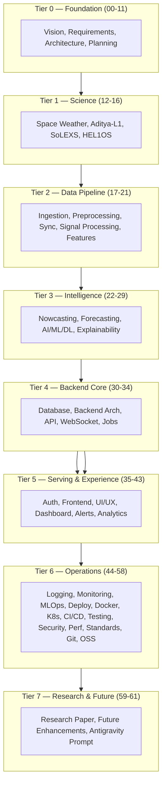

# 00 — Project Overview

**HeliosAI** — AI-Powered Space Weather Intelligence Platform
Document 00 of 61

---

## 1. Executive Summary

HeliosAI is a research-grade platform that fuses Level-1 soft X-ray (SoLEXS) and hard X-ray (HEL1OS) light curves from ISRO's Aditya-L1 mission to nowcast (detect in near real time) and forecast (predict ahead of time, with quantified lead time) solar flares. It exists to answer **Problem Statement 15** with a system, not a notebook: a reproducible pipeline, an auditable model lifecycle, and an operator-facing dashboard, all implemented in Python end-to-end.

This document is the entry point of the 61-document specification set. It does not repeat detail owned by later documents — it orients a new reader (engineer, scientist, or reviewer) toward where that detail lives.

---

## 2. Purpose

- Give any new contributor a five-minute understanding of what HeliosAI is, why it exists, and how the documentation set is organized.
- Serve as the canonical pointer from the README into the numbered `docs/` sequence.
- Establish the vocabulary (nowcast vs. forecast, master catalogue, lead time, dual-band fusion) used consistently across every other document.

---

## 3. Scope

This document covers: what the system is, who it is for, and how to navigate the rest of the documentation. It explicitly does **not** cover requirements detail (`02_SRS.md`), architecture detail (`03`–`05`), or scientific background (`12`–`16`) — those are separate, deeper documents.

---

## 4. Objectives

1. State the problem HeliosAI solves in plain language.
2. Define the core vocabulary used throughout the documentation set.
3. Map the documentation set's structure so any reader can find the right document in under 30 seconds.
4. Establish the project's non-negotiables (all-Python stack, dual-band cross-validation, measured-not-asserted lead time) up front, since later documents assume familiarity with these.

---

## 5. What HeliosAI Is

| It is | It is not |
|---|---|
| A research/decision-support platform | A certified operational safety-of-life warning system |
| A dual-band (soft + hard X-ray) fusion pipeline | A single-instrument detector |
| An auditable, versioned ML system (MLflow-backed) | A one-off notebook model |
| An all-Python stack, frontend included | A React/Next.js application with a Python backend bolted on |
| Open to community contribution (planned) | A closed internal tool |

---

## 6. Core Vocabulary

| Term | Definition |
|---|---|
| **Nowcasting** | Real-time detection and classification of a flare already in progress, from live light-curve data |
| **Forecasting** | Predicting the probability of a flare occurring within a future window (N minutes), before it happens |
| **Lead Time** | The measured interval between a forecast's trigger timestamp and the actual flare's peak timestamp — computed empirically, never asserted |
| **Master Catalogue** | The database-backed, queryable record of all confirmed and tentative flare events, produced by fusing independent SoLEXS and HEL1OS detections |
| **Dual-Band Fusion** | Cross-validating a flare candidate across both instruments before promoting it to the master catalogue, to reduce false alarms |
| **Tentative Detection** | A candidate seen in only one band, flagged rather than silently promoted or silently dropped |
| **Hardness Ratio** | The ratio of hard-to-soft X-ray flux, a first-class engineered feature correlated with flare energetics |

---

## 7. Documentation Map



---

## 8. Reading Guide by Role

| If you are a... | Start with |
|---|---|
| New contributor, general orientation | This document, then `01_Project_Vision.md` |
| Domain scientist | `12_Research_Background.md` → `16_HEL1OS.md` |
| Data/platform engineer | `17_Data_Ingestion.md` → `21_Feature_Engineering.md` |
| ML/research engineer | `22_Nowcasting.md` → `29_Explainable_AI.md` |
| Backend engineer | `30_Database_Design.md` → `34_Background_Jobs.md` |
| Frontend engineer | `37_Frontend_Architecture.md` → `41_Admin_Panel.md` |
| DevOps/SRE | `49_Deployment.md` → `55_Performance_Optimization.md` |
| Reviewer / evaluator (PS-15 judging) | This document, `59_Research_Paper.md`, `48_Model_Evaluation.md` |

---

## 9. Non-Negotiables (apply across all later documents)

1. **All-Python stack**, frontend included — no JS/TS framework dependency.
2. **Dual-band cross-validation** before any catalogue promotion.
3. **Lead time is measured, never asserted** — every forecast alert logs predicted vs. actual timestamps.
4. **No hardcoded secrets, anywhere, ever.**
5. **Documentation-first, one file at a time** — this sequencing rule governs how this very document set is produced.

---

## 10. Acceptance Criteria

- [ ] A reader unfamiliar with the project can explain what HeliosAI does after reading only this document.
- [ ] Every term in §6 is used consistently (not redefined) in all subsequent documents.
- [ ] The documentation map in §7 accurately reflects the final tier structure.

---

## 11. Review Checklist

- [ ] No requirements-level detail leaked into this document (belongs in `02`).
- [ ] No architecture diagrams beyond the documentation map itself (belongs in `03`–`05`).
- [ ] Vocabulary section cross-checked against actual usage in docs `22`, `23`, `42`, `48`.

---

## 12. Future Improvements

- Add a version-stamped glossary page once the documentation set stabilizes post-implementation, since vocabulary tends to drift once code exists.

---

## Antigravity Development Prompt

```
PROJECT CONTEXT:
You are implementing a documentation-only artifact — this task produces no source code.
Repository: HeliosAI. This is document 00 of a 61-document specification set describing
an AI-powered space weather platform that fuses Aditya-L1 SoLEXS (soft X-ray) and HEL1OS
(hard X-ray) light curves to nowcast and forecast solar flares (ISRO Problem Statement 15).

FOLDER:
docs/00_Project_Overview.md (already generated — this prompt is for reference/regeneration only)

FILES TO PRODUCE:
None (documentation task). If regenerating, output exactly one file: docs/00_Project_Overview.md

CODING STANDARDS:
N/A — Markdown only. Follow the structural template used by all other docs in this set:
Executive Summary, Purpose, Scope, Objectives, then topic-specific sections, then Acceptance
Criteria, Review Checklist, Future Improvements, and this Antigravity Development Prompt block.

EXPECTED OUTPUT:
A single self-contained Markdown file matching the content above verbatim in structure and
intent. Must include the documentation-map Mermaid flowchart and the reading-guide-by-role
table exactly as specified.

EDGE CASES / VALIDATION:
- Ensure vocabulary defined here (nowcast, forecast, lead time, master catalogue, tentative
  detection, hardness ratio) is never redefined with conflicting meaning elsewhere.
- Ensure the Mermaid diagram is syntactically valid (renders without error).

TESTING:
Documentation-only — validation is a Markdown lint pass (no broken headers, valid Mermaid
syntax) rather than unit tests.

ACCEPTANCE CRITERIA:
See §10 above.

DELIVERABLES:
docs/00_Project_Overview.md

GIT COMMIT FORMAT:
docs: add 00_Project_Overview.md (project vision and documentation map)
```

---

**Next document:** `01_Project_Vision.md` — say **NEXT** to continue.
