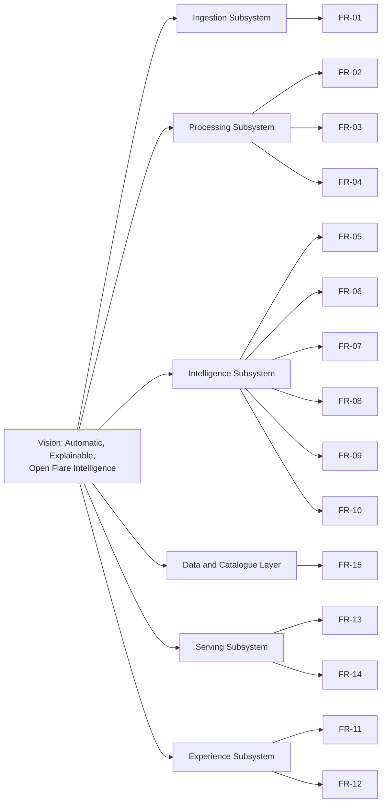
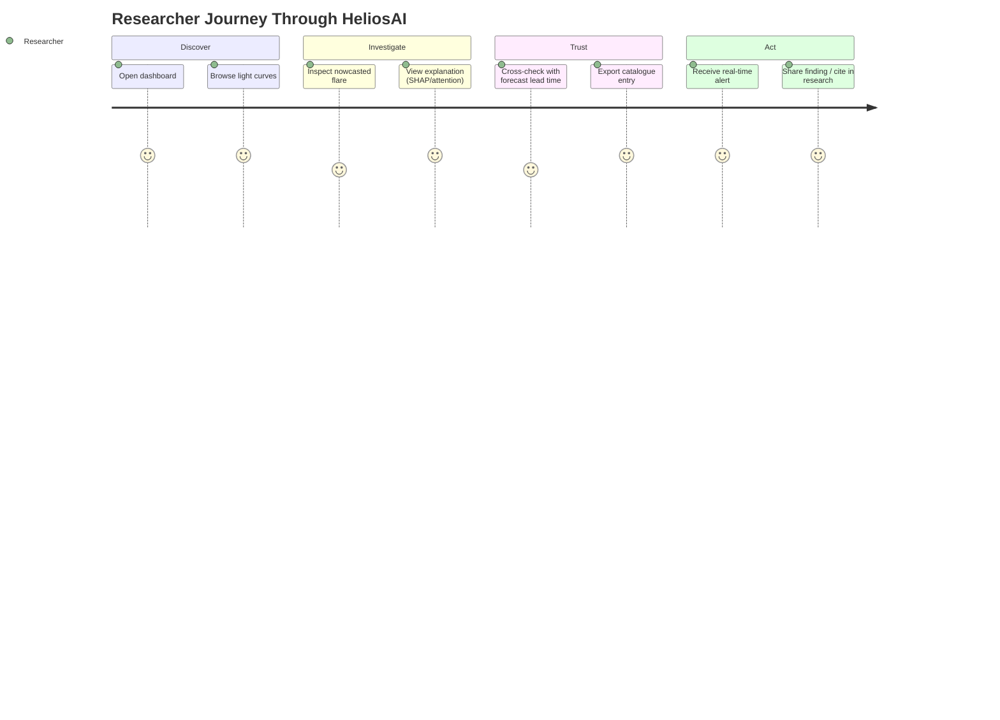
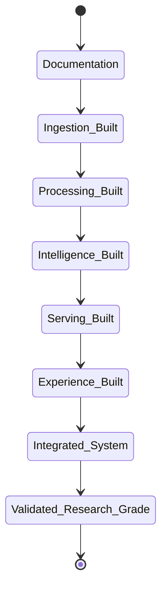

# 01. Project Vision

## Table of Contents

1. [Executive Summary](#executive-summary)
2. [Problem Statement](#problem-statement)
3. [Vision Statement](#vision-statement)
4. [Objectives](#objectives)
5. [Scope](#scope)
6. [Functional Requirements](#functional-requirements)
7. [Non-Functional Requirements](#non-functional-requirements)
8. [Target Users / Stakeholders](#target-users--stakeholders)
9. [Guiding Principles](#guiding-principles)
10. [Architecture Alignment](#architecture-alignment)
11. [Diagrams](#diagrams)
12. [Success Metrics](#success-metrics)
13. [Constraints and Assumptions Boundaries](#constraints-and-assumptions-boundaries)
14. [Error Handling Philosophy](#error-handling-philosophy)
15. [Validation Philosophy](#validation-philosophy)
16. [Testing Philosophy](#testing-philosophy)
17. [Acceptance Criteria](#acceptance-criteria)
18. [Implementation Notes](#implementation-notes)
19. [Future Scope](#future-scope)
20. [References](#references)
21. [Revision History](#revision-history)

---

## Executive Summary

This document defines the **long-term vision** for HeliosAI — what the platform must become, why it exists, who it serves, and what "done well" looks like. It is the north star that every subsequent design document (SRS, architecture, low-level design) must trace back to. Where the README described *what HeliosAI is*, this document describes *why it exists and where it is going*.

HeliosAI's vision is to be the **reference open-source, research-grade platform** for combined soft/hard X-ray solar flare intelligence using Aditya-L1 data — a system a solar physicist, a space-weather operator, or a student contributor can pick up, trust, extend, and learn from.

---

## Problem Statement

Solar flares release enormous amounts of energy across the electromagnetic spectrum in minutes, and their downstream effects — radio blackouts, GPS degradation, satellite anomalies, power-grid induced currents — occur with very little warning. India's Aditya-L1 mission gives, for the first time, a continuous L1-vantage-point soft and hard X-ray view of the Sun via SoLEXS and HEL1OS. Today, using this combined data for **both** rapid detection (nowcasting) and predictive early-warning (forecasting) requires significant manual, ad-hoc scientific effort. There is no unified, automated, explainable, and operationally-usable pipeline that takes raw Level-1 data all the way to a trustworthy, auditable flare catalogue and probability-based forecast with measured lead time.

HeliosAI exists to close that gap.

---

## Vision Statement

> **"To turn raw Aditya-L1 X-ray telemetry into trustworthy, explainable, real-time solar flare intelligence — automatically, reproducibly, and openly."**

Three words anchor every design decision in this project:

- **Automatically** — from data acquisition to alert, minimal manual intervention.
- **Explainably** — every nowcast and forecast must be auditable by a human scientist.
- **Openly** — built as an open-source, community-extensible platform (GSSoC-aligned), not a black box.

---

## Objectives

1. Establish a **single source of truth** master flare catalogue built from cross-validated soft + hard X-ray detections.
2. Provide **quantified, not asserted**, forecast lead times — every prediction's accuracy is measured against ground truth once available.
3. Make the system **usable by a working scientist**, not just a data engineer — via a visual, Python-native dashboard, not a notebook-only artifact.
4. Make the system **extensible by contributors** — modular architecture, one clearly documented module at a time, so open-source contributors (e.g., GSSoC participants) can pick up isolated units of work without needing to understand the entire codebase.
5. Keep the system **scientifically defensible** — every preprocessing step, threshold, and model choice documented and justified, with no unexplained "magic numbers."

---

## Scope

This vision document governs the scope boundary for the entire project. Anything not listed under "In Scope" requires an explicit scope-change decision recorded in a future revision of this document.

### In Scope
- Ingestion, processing, and fusion of SoLEXS + HEL1OS Level-1 data.
- Nowcasting engine (real-time/batch detection + classification).
- Forecasting engine (precursor-based, lead-time-quantified prediction).
- Explainable AI layer for both engines.
- Master flare catalogue (persistent, queryable, exportable).
- Real-time dashboard with alerting.
- REST + WebSocket API surface.
- Authentication/authorization for multi-user deployments.
- Full MLOps lifecycle (training, tracking, registry, retraining).
- Dockerized deployment with CI/CD and monitoring.
- 100% Python implementation, frontend included.

### Out of Scope
- Certification as an official operational space-weather warning system (research/decision-support only).
- Modifying or reprocessing official ISRO calibration pipelines.
- Native mobile applications.
- Non-X-ray instrument fusion in v1 (deferred to Future Scope).

---

## Functional Requirements

| ID | Requirement |
|---|---|
| FR-01 | System shall ingest SoLEXS and HEL1OS Level-1 data automatically on a schedule, with manual-drop fallback. |
| FR-02 | System shall time-synchronize both instrument streams to a common UTC timeline. |
| FR-03 | System shall filter instrumental noise and subtract background from both light curves. |
| FR-04 | System shall engineer flare-relevant features including cross-band hardness ratio. |
| FR-05 | System shall independently detect flare candidates in each band. |
| FR-06 | System shall fuse independent detections into a confidence-scored master catalogue. |
| FR-07 | System shall classify detected flares into class bins (calibrated to GOES-equivalent scale). |
| FR-08 | System shall forecast flare probability over a configurable future horizon (N minutes). |
| FR-09 | System shall record and expose lead time for every forecast once ground truth is known. |
| FR-10 | System shall provide SHAP/attention-based explanations for both nowcasts and forecasts. |
| FR-11 | System shall visualize light curves and catalogue entries in an interactive dashboard. |
| FR-12 | System shall trigger visual (and optionally webhook/email) alerts on nowcast/forecast events. |
| FR-13 | System shall expose REST and WebSocket APIs for programmatic access. |
| FR-14 | System shall support authenticated multi-user access with role-based permissions. |
| FR-15 | System shall track every model training run and allow rollback to prior model versions. |

---

## Non-Functional Requirements

| Category | Requirement |
|---|---|
| Performance | Feature engineering and nowcasting on a new data batch shall complete within a bounded, documented time window (finalized in `55_Performance_Optimization.md`). |
| Scalability | Must scale horizontally for backend/API and support incremental (non-full-reprocess) data handling. |
| Reliability | All ingestion/processing jobs idempotent and safely resumable after failure. |
| Explainability | No model output (nowcast or forecast) may be surfaced to the UI without an attached explanation artifact. |
| Auditability | Every catalogue row traceable to source data snapshot + model version (MLflow run ID). |
| Security | No secrets in code; all endpoints authenticated; documented in `54_Security.md`. |
| Maintainability | 100% Python codebase, enforced coding standards (`56_Coding_Standards.md`), modular per-subsystem boundaries. |
| Portability | Fully reproducible via Docker Compose for local/research deployment. |
| Openness | Codebase and documentation structured for open-source contribution (GSSoC-aligned modular prompts). |

---

## Target Users / Stakeholders

| Stakeholder | Needs from HeliosAI |
|---|---|
| Solar/space-weather researchers | Trustworthy, explainable flare catalogue + forecast; ability to inspect raw vs. processed light curves |
| Space-weather operations desks (research-support capacity) | Real-time dashboard, visual/alert triggers, exportable data |
| Open-source contributors (e.g., GSSoC) | Clear modular architecture, isolated Antigravity prompts per module, well-documented codebase |
| Data scientists / ML engineers | Reproducible training pipelines, experiment tracking, model registry |
| Students / academic users | Research background documentation, explainability tooling, reproducible research artifact (`59_Research_Paper.md`) |

---

## Guiding Principles

1. **No black boxes.** Every automated decision must be explainable.
2. **No unmeasured claims.** Lead time, TPR, FAR — all measured against held-out ground truth, never asserted.
3. **Documentation before code.** Every module is fully specified before implementation (Antigravity workflow).
4. **Python end-to-end.** One language across the stack to maximize scientific-team accessibility and maintainability.
5. **Modular by design.** Each subsystem must be independently understandable, testable, and contributable.
6. **Fail loud, not silent.** Data quality issues, sync failures, or low-confidence detections must be visibly flagged, never silently dropped.

---

## Architecture Alignment

This vision maps directly onto the six subsystems introduced in the README (Ingestion, Processing, Intelligence, Data & Catalogue, Serving, Experience). Each functional requirement above is owned by exactly one subsystem, ensuring no ambiguity in module boundaries when Antigravity master prompts are generated per module later in this documentation set.

---

## Diagrams

### Stakeholder Value Journey

### Vision-to-Release State Progression

---

## Success Metrics

| Metric | Target Definition |
|---|---|
| Detection completeness | Master catalogue captures both low-class (A/B-equivalent) and high-class (M/X-equivalent) flares present in validation windows |
| False Alarm Rate | Minimized via dual-band cross-validation gate; measured per class bin |
| True Positive Rate | Maximized without violating FAR target; measured per class bin |
| Forecast lead time | Empirically measured (predicted trigger → actual peak) and reported with distribution, not a single number |
| Explainability coverage | 100% of surfaced nowcasts/forecasts carry an explanation artifact |
| Contributor onboarding time | A new open-source contributor can pick up a single module's Antigravity prompt and begin work without reading the entire codebase |

---

## Constraints and Assumptions Boundaries

- **Constraint:** ISSDC PRADAN access may be authenticated/manual for some users — the system must not assume unauthenticated programmatic access is always available.
- **Constraint:** Ground-truth labels for supervised forecasting may need to be bootstrapped from GOES-equivalent class mapping or existing flare catalogues, since Aditya-L1 is a newer mission with a shorter historical baseline than GOES.
- **Assumption:** SoLEXS and HEL1OS Level-1 products are calibrated by ISRO upstream; HeliosAI performs scientific *preprocessing*, not instrument calibration.
- **Assumption:** A modern multi-core machine (documented in `07_Tech_Stack.md`) is sufficient for local/research-scale deployment; large-scale/operational deployment is a Future Scope concern.

---

## Error Handling Philosophy

Errors in a scientific pipeline must never fail silently. HeliosAI's guiding rule: **a missing or low-confidence result must be visibly flagged as such, never omitted or guessed.** This applies at every layer:
- Ingestion: missing/corrupt files are logged and quarantined, not skipped silently.
- Processing: synchronization gaps are flagged with explicit `data_quality` flags stored alongside the series.
- Intelligence: low-confidence detections are retained in the catalogue as `tentative`, not discarded.
- Serving: API errors return structured, typed error responses (detailed in `32_API_Design.md`).

---

## Validation Philosophy

- All incoming data is schema- and range-validated before entering the processing pipeline (Pydantic models at ingestion boundary).
- All model outputs are validated against sane physical bounds (e.g., flux cannot be negative) before being written to the catalogue.
- All user-facing inputs (dashboard filters, API query parameters) are validated server-side regardless of client-side validation.

---

## Testing Philosophy

- Unit tests for every transformation function (signal processing, feature engineering).
- Integration tests for the full ingestion → catalogue pipeline using recorded fixture data (a small, checked-in sample of real or synthetic SoLEXS/HEL1OS data).
- Model evaluation tests that assert minimum performance thresholds are met before a model can be promoted in the MLflow registry.
- Full testing strategy detailed in `53_Testing.md`.

---

## Acceptance Criteria

- [ ] Vision statement is traceable to every functional requirement.
- [ ] Every functional requirement is owned by exactly one subsystem.
- [ ] Success metrics are measurable, not aspirational-only.
- [ ] Constraints reflect real-world PRADAN access limitations rather than assuming ideal conditions.
- [ ] Error handling and validation philosophies are consistent with the "no silent failure" principle carried through all later design docs.

---

## Implementation Notes

- This document is intentionally implementation-agnostic on class names, schemas, and endpoints — those belong in `05_Low_Level_Design.md`, `30_Database_Design.md`, and `32_API_Design.md`.
- Every subsequent document must reference back to the FR-IDs defined here when justifying design choices, to keep the full documentation set internally consistent.

---

## Future Scope

- Multi-mission fusion (GOES, Solar Orbiter STIX) as an extension of the dual-band fusion principle established here.
- Community-contributed model variants registered through the same MLflow registry, enabling open benchmarking (GSSoC-aligned).
- Progression from decision-support to a candidate operational-support tool, contingent on extended validation over multiple solar cycles' worth of data.

---

## References

1. HeliosAI `README.md` — architecture and tech stack baseline.
2. ISRO Aditya-L1 Mission overview.
3. ISSDC PRADAN Portal documentation.
4. GOES XRS flare classification scheme (for class-bin calibration reference).

---

## Revision History

| Version | Date | Author | Notes |
|---|---|---|---|
| 0.1 | 2026-07-11 | HeliosAI Documentation (Antigravity workflow) | Initial project vision — objectives, FR/NFR baseline, stakeholder mapping, success metrics established |
