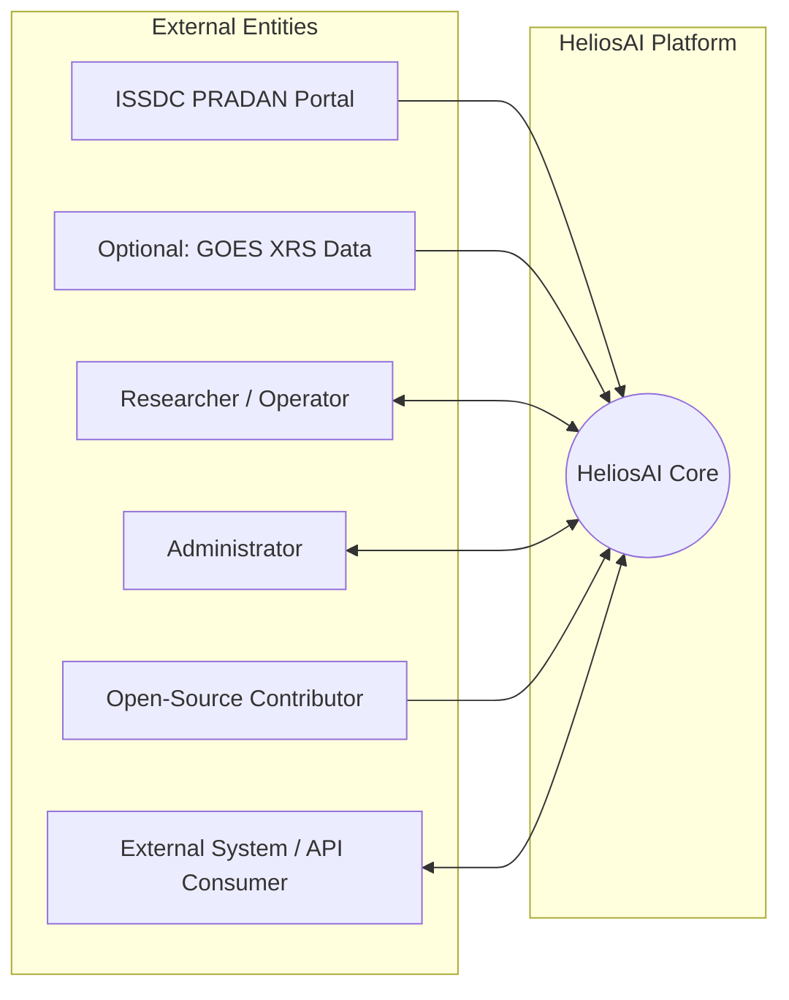
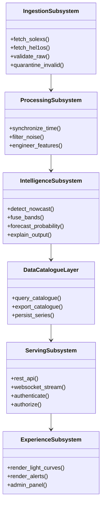
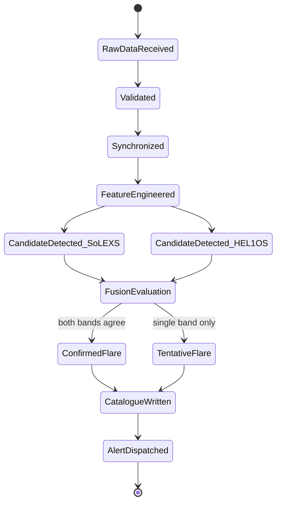

# 02. Software Requirements Specification (SRS)

## Table of Contents

1. [Executive Summary](#executive-summary)
2. [Problem Statement](#problem-statement)
3. [Objectives](#objectives)
4. [Scope](#scope)
5. [Document Conventions](#document-conventions)
6. [Stakeholders and User Classes](#stakeholders-and-user-classes)
7. [System Context](#system-context)
8. [Functional Requirements](#functional-requirements)
9. [Non-Functional Requirements](#non-functional-requirements)
10. [External Interface Requirements](#external-interface-requirements)
11. [Data Requirements](#data-requirements)
12. [Architecture](#architecture)
13. [Diagrams](#diagrams)
14. [Algorithms (Requirement-Level)](#algorithms-requirement-level)
15. [Database Tables (Requirement-Level)](#database-tables-requirement-level)
16. [API Design (Requirement-Level)](#api-design-requirement-level)
17. [Security Requirements](#security-requirements)
18. [Performance Requirements](#performance-requirements)
19. [Scalability Requirements](#scalability-requirements)
20. [Error Handling Requirements](#error-handling-requirements)
21. [Validation Requirements](#validation-requirements)
22. [Testing Requirements](#testing-requirements)
23. [Traceability Matrix](#traceability-matrix)
24. [Acceptance Criteria](#acceptance-criteria)
25. [Implementation Notes](#implementation-notes)
26. [Future Scope](#future-scope)
27. [References](#references)
28. [Revision History](#revision-history)

---

## Executive Summary

This SRS is the binding, testable specification for HeliosAI. Where `01_Project_Vision.md` defines *why* and *what direction*, this document defines *precisely what the system must do*, in language specific enough to design against and test against. Every requirement in this document carries a unique ID and is later traced to architecture, database schema, API endpoints, and test cases across the rest of the documentation set.

---

## Problem Statement

*(Carried forward from README and Vision for document self-containment.)* HeliosAI must convert raw Aditya-L1 SoLEXS (soft X-ray) and HEL1OS (hard X-ray) Level-1 telemetry into (a) a cross-validated, automated nowcast catalogue of solar flares and (b) a lead-time-quantified probabilistic forecast of upcoming flares, exposed through an explainable, real-time, Python-native interface.

---

## Objectives

1. Specify unambiguous functional behavior for every subsystem defined in the README/Vision.
2. Specify measurable non-functional targets (performance, scalability, security).
3. Specify all external interfaces (data sources, APIs, UI) precisely enough to design against.
4. Establish a requirement-to-design-to-test traceability matrix that later documents must honor.

---

## Scope

This SRS covers the entire HeliosAI v1 system as scoped in `01_Project_Vision.md` (Ingestion, Processing, Intelligence, Data & Catalogue, Serving, Experience subsystems), implemented entirely in Python. Anything outside that scope boundary (see Vision doc's Out of Scope section) is excluded from this SRS and instead tracked in `60_Future_Enhancements.md`.

---

## Document Conventions

- Requirement IDs: `FR-xx` (Functional), `NFR-xx` (Non-Functional), `EIR-xx` (External Interface), `DR-xx` (Data).
- **MUST** = mandatory for v1 acceptance. **SHOULD** = strongly desired, may slip to a fast-follow. **MAY** = optional/stretch.
- All timestamps in the system are stored and reasoned about in **UTC**; display-layer localization is a UI concern only (see `38_UI_UX.md`).

---

## Stakeholders and User Classes

| User Class | Description | Primary Interactions |
|---|---|---|
| Researcher | Solar/space-weather scientist | Dashboard, catalogue export, explanation review |
| Operator | Research-support monitoring role | Real-time dashboard, alert console |
| Contributor | Open-source developer (e.g., GSSoC) | Codebase, Antigravity module prompts, tests |
| Administrator | Manages users, retraining, system health | Admin panel, monitoring dashboards |
| External System | Programmatic API consumer | REST/WebSocket API |

---

## System Context

---

## Functional Requirements

### Ingestion

| ID | Requirement | Priority |
|---|---|---|
| FR-01 | System MUST fetch SoLEXS and HEL1OS Level-1 files from ISSDC PRADAN on a configurable schedule. | MUST |
| FR-02 | System MUST support a manual-drop ingestion mode (watched directory) when programmatic PRADAN access is unavailable. | MUST |
| FR-03 | System MUST parse instrument-native file formats (FITS/CDF/CSV, per payload documentation) into a normalized internal schema. | MUST |
| FR-04 | System MUST validate raw ingested data against expected schema and physical value ranges before further processing. | MUST |
| FR-05 | System MUST quarantine and log corrupt/incomplete files rather than silently dropping them. | MUST |

### Processing

| ID | Requirement | Priority |
|---|---|---|
| FR-06 | System MUST convert spacecraft/instrument timestamps to a synchronized UTC timeline shared by both instruments. | MUST |
| FR-07 | System MUST flag and record time-synchronization gaps as explicit data-quality metadata. | MUST |
| FR-08 | System MUST perform background subtraction and noise filtering on both light curves. | MUST |
| FR-09 | System MUST engineer flare-relevant features, including cross-band hardness ratio (HEL1OS/SoLEXS flux), flux gradients, rise/decay time constants, and wavelet-domain energy. | MUST |
| FR-10 | System MUST persist both raw-cleaned and feature-engineered series to the time-series database. | MUST |

### Nowcasting

| ID | Requirement | Priority |
|---|---|---|
| FR-11 | System MUST independently detect flare candidates in the SoLEXS series. | MUST |
| FR-12 | System MUST independently detect flare candidates in the HEL1OS series. | MUST |
| FR-13 | System MUST fuse independent per-band candidates into a confidence-scored master catalogue entry. | MUST |
| FR-14 | System MUST classify each catalogue entry into a flare-class bin calibrated to a GOES-equivalent scale. | MUST |
| FR-15 | System MUST label single-band-only detections as `tentative` rather than discarding them. | MUST |

### Forecasting

| ID | Requirement | Priority |
|---|---|---|
| FR-16 | System MUST predict the probability of a flare occurring within a configurable future horizon N (default options: 15/30/60 minutes). | MUST |
| FR-17 | System MUST support at least one classical ML baseline (gradient-boosted trees) and at least one deep sequence model (LSTM/GRU or Transformer-family) for forecasting. | MUST |
| FR-18 | System MUST record `predicted_trigger_ts` for every forecast event at prediction time. | MUST |
| FR-19 | System MUST compute and store `lead_time = actual_peak_ts - predicted_trigger_ts` once ground truth becomes available. | MUST |
| FR-20 | System SHOULD support model comparison across architectures via the MLflow registry. | SHOULD |

### Explainability

| ID | Requirement | Priority |
|---|---|---|
| FR-21 | System MUST attach a SHAP-based explanation to every tree-model-driven nowcast/forecast. | MUST |
| FR-22 | System MUST attach an attention-weight or integrated-gradients explanation to every deep-model-driven nowcast/forecast. | MUST |
| FR-23 | System MUST NOT surface a nowcast/forecast to the dashboard or API without an attached explanation artifact reference. | MUST |

### Catalogue and Data Access

| ID | Requirement | Priority |
|---|---|---|
| FR-24 | System MUST provide a queryable master flare catalogue (by time range, class, confidence, band). | MUST |
| FR-25 | System MUST support catalogue export (CSV/JSON) for offline research use. | MUST |

### Dashboard and Alerts

| ID | Requirement | Priority |
|---|---|---|
| FR-26 | System MUST visualize soft and hard X-ray light curves with overlaid detected/forecasted flare markers. | MUST |
| FR-27 | System MUST trigger a visible dashboard alert when a nowcast or forecast event is generated. | MUST |
| FR-28 | System SHOULD support optional webhook/email alert dispatch. | SHOULD |

### API, Auth, MLOps

| ID | Requirement | Priority |
|---|---|---|
| FR-29 | System MUST expose REST endpoints for catalogue, light curve, and model-metadata access. | MUST |
| FR-30 | System MUST expose a WebSocket stream for real-time catalogue/alert updates. | MUST |
| FR-31 | System MUST authenticate all API and dashboard access (JWT/OAuth2). | MUST |
| FR-32 | System MUST support role-based authorization (Researcher/Operator/Administrator). | MUST |
| FR-33 | System MUST track every model training run (parameters, metrics, artifacts) in MLflow. | MUST |
| FR-34 | System SHOULD support triggered/scheduled retraining pipelines. | SHOULD |

---

## Non-Functional Requirements

| ID | Category | Requirement |
|---|---|---|
| NFR-01 | Performance | End-to-end nowcast latency (new data available → catalogue entry) bounded and documented per deployment profile (see `55_Performance_Optimization.md`). |
| NFR-02 | Scalability | Ingestion and processing must handle incremental batches without full-history reprocessing. |
| NFR-03 | Reliability | All pipeline jobs idempotent; safe to re-run without data duplication or corruption. |
| NFR-04 | Availability | Dashboard and API MUST remain responsive under normal research-scale concurrent load (target concurrency documented in `45_Monitoring.md`). |
| NFR-05 | Security | No hardcoded secrets; all secrets via environment/secret manager (see `54_Security.md`). |
| NFR-06 | Maintainability | 100% Python; adherence to `56_Coding_Standards.md`; module boundaries per subsystem. |
| NFR-07 | Portability | Full stack deployable via `docker compose up` for local/research use. |
| NFR-08 | Auditability | Every catalogue/forecast row traceable to source data snapshot and MLflow run ID. |
| NFR-09 | Explainability | 100% of surfaced outputs carry explanation artifacts (ties to FR-23). |
| NFR-10 | Observability | All services expose Prometheus-compatible metrics; dashboards in Grafana. |

---

## External Interface Requirements

| ID | Interface | Description |
|---|---|---|
| EIR-01 | ISSDC PRADAN Portal | Data source for SoLEXS/HEL1OS Level-1 files; programmatic where possible, manual-drop fallback otherwise |
| EIR-02 | GOES XRS (optional) | Supplementary data source for cross-validation/class-bin calibration |
| EIR-03 | REST API | JSON over HTTPS; OpenAPI-documented (auto-generated via FastAPI) |
| EIR-04 | WebSocket API | Real-time catalogue/alert push channel |
| EIR-05 | Dashboard UI | Browser-based, served by Dash application; no native mobile app in v1 |
| EIR-06 | MLflow Tracking Server | Internal interface for experiment tracking/model registry |

---

## Data Requirements

| ID | Requirement |
|---|---|
| DR-01 | Raw ingested light curve data MUST be retained (immutable) separately from cleaned/derived data, to allow full pipeline reprocessing. |
| DR-02 | All time-series data MUST carry explicit UTC timestamps at ingestion. |
| DR-03 | All catalogue entries MUST reference the source data snapshot and processing pipeline version. |
| DR-04 | Feature-engineered series MUST be versioned alongside the feature-engineering code version that produced them. |
| DR-05 | Model artifacts and their training data lineage MUST be retrievable via MLflow run ID. |

Full schema detail in `30_Database_Design.md`.

---

## Architecture

This SRS assumes and requires the six-subsystem architecture established in the README and Vision documents (Ingestion, Processing, Intelligence, Data & Catalogue, Serving, Experience). Detailed component/sequence/deployment diagrams for this architecture are elaborated in `03_System_Architecture.md`; this SRS provides only the requirement-level view.

---

## Diagrams

### Requirement-to-Subsystem Traceability (Class Diagram View)

### Nowcasting State Machine

---

## Algorithms (Requirement-Level)

At the SRS level, algorithms are specified as **required capabilities**, not implementations (full algorithmic detail lives in `22_Nowcasting.md` and `23_Forecasting.md`):

1. **Per-band flare detection** — MUST support threshold-crossing and changepoint-style detection at minimum.
2. **Cross-band fusion** — MUST implement a documented, configurable confidence-fusion rule (not a hardcoded implicit rule).
3. **Forecasting** — MUST support a rolling-window supervised learning formulation where the label is "flare occurs within horizon N" and the feature window is drawn from a fixed lookback period.
4. **Lead-time computation** — MUST be a deterministic, auditable function of two timestamps, computed only once ground truth is available, never estimated pre-emptively.

---

## Database Tables (Requirement-Level)

At SRS level, the following entities MUST exist (full column-level schema in `30_Database_Design.md`):

- `raw_light_curve_solexs`
- `raw_light_curve_hel1os`
- `processed_light_curve`
- `engineered_features`
- `flare_catalogue`
- `forecast_events`
- `explanation_artifacts`
- `model_runs` (mirrors/links MLflow)
- `users`, `roles`
- `alerts`

---

## API Design (Requirement-Level)

At SRS level, the following endpoint groups MUST exist (full contract in `32_API_Design.md`):

- `GET /api/v1/light-curves` — query processed light curve data
- `GET /api/v1/catalogue` — query master flare catalogue
- `POST /api/v1/catalogue/export` — trigger export job
- `GET /api/v1/forecasts` — query forecast events + lead time once resolved
- `GET /api/v1/explanations/{event_id}` — retrieve explanation artifact
- `WS /ws/v1/stream` — real-time catalogue/alert stream
- `POST /api/v1/auth/login`, `POST /api/v1/auth/refresh` — authentication
- `GET /api/v1/admin/models` — model registry status (admin-only)

---

## Security Requirements

- All endpoints MUST require a valid JWT except `/api/v1/auth/login`.
- Role-based access MUST restrict admin endpoints (`/api/v1/admin/*`) to Administrator role.
- All secrets (DB credentials, JWT signing key, PRADAN credentials if applicable) MUST be sourced from environment variables / secret manager, never committed to source control.
- Full detail in `54_Security.md`.

---

## Performance Requirements

- Ingestion-to-catalogue latency target MUST be defined and measured per deployment profile (local/research vs. future operational scale) — see `55_Performance_Optimization.md`.
- Dashboard queries against the catalogue MUST use indexed, time-range-scoped queries (TimescaleDB hypertable chunking) to avoid full-table scans.

---

## Scalability Requirements

- Processing pipeline MUST be incremental: new data batches processed without reprocessing full historical series.
- Backend API MUST be stateless and horizontally scalable behind NGINX (state lives in PostgreSQL/Redis, not in-process).

---

## Error Handling Requirements

- Every pipeline stage MUST emit structured error/quality logs (never silent `except: pass`).
- Failed ingestion/processing jobs MUST be retryable without manual data cleanup (idempotency requirement, NFR-03).
- API errors MUST return structured, typed error payloads with an error code and human-readable message.

---

## Validation Requirements

- All ingested raw data MUST pass schema + physical-range validation (Pydantic models) before entering processing.
- All model outputs MUST pass sanity bounds validation (e.g., non-negative flux, probability in [0,1]) before catalogue/forecast persistence.
- All API inputs MUST be server-side validated regardless of client-side validation in the dashboard.

---

## Testing Requirements

- Every FR above MUST have at least one corresponding automated test case (unit, integration, or model-evaluation threshold test) — full strategy in `53_Testing.md`.
- CI MUST block merges that reduce test coverage below the project-defined threshold (defined in `52_CI_CD.md`).

---

## Traceability Matrix

| Requirement ID | Owning Subsystem | Primary Design Doc | Primary Test Doc |
|---|---|---|---|
| FR-01–FR-05 | Ingestion | `17_Data_Ingestion.md` | `53_Testing.md` |
| FR-06–FR-10 | Processing | `18_Data_Preprocessing.md`, `19_Data_Synchronization.md`, `20_Signal_Processing.md`, `21_Feature_Engineering.md` | `53_Testing.md` |
| FR-11–FR-15 | Intelligence (Nowcast) | `22_Nowcasting.md` | `53_Testing.md`, `48_Model_Evaluation.md` |
| FR-16–FR-20 | Intelligence (Forecast) | `23_Forecasting.md` | `53_Testing.md`, `48_Model_Evaluation.md` |
| FR-21–FR-23 | Intelligence (XAI) | `29_Explainable_AI.md` | `53_Testing.md` |
| FR-24–FR-25 | Data & Catalogue | `30_Database_Design.md` | `53_Testing.md` |
| FR-26–FR-28 | Experience | `39_Dashboard.md`, `42_Alert_System.md` | `53_Testing.md` |
| FR-29–FR-34 | Serving | `32_API_Design.md`, `33_WebSocket_System.md`, `35_Authentication.md`, `36_Authorization.md`, `46_MLOps.md` | `53_Testing.md` |

---

## Acceptance Criteria

- [ ] Every FR/NFR/EIR/DR has a unique ID and unambiguous, testable wording.
- [ ] Traceability matrix maps every requirement to exactly one owning subsystem and design doc.
- [ ] No requirement contradicts the Vision document's guiding principles (no black boxes, no unmeasured claims).
- [ ] Security and validation requirements are consistent with `01_Project_Vision.md`'s "fail loud, not silent" principle.

---

## Implementation Notes

- This SRS is the last purely-requirements document before architecture-level design begins in `03_System_Architecture.md`.
- All subsequent documents MUST cite requirement IDs from this SRS when justifying a design decision, to preserve traceability.

---

## Future Scope

- Formal requirement management tooling (e.g., linked issue tracker IDs per FR) once the open-source contributor base grows.
- Expansion of NFR targets once real deployment telemetry (via Prometheus/Grafana) establishes empirical baselines.

---

## References

1. `00_Project_Overview.md` / `README.md` — architecture and tech stack baseline.
2. `01_Project_Vision.md` — vision, guiding principles, success metrics.
3. ISSDC PRADAN Portal documentation.
4. GOES XRS flare classification scheme.

---

## Revision History

| Version | Date | Author | Notes |
|---|---|---|---|
| 0.1 | 2026-07-11 | HeliosAI Documentation (Antigravity workflow) | Initial SRS — full FR/NFR/EIR/DR set with traceability matrix established |
