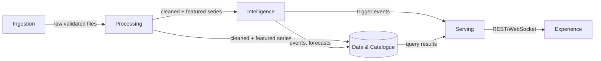
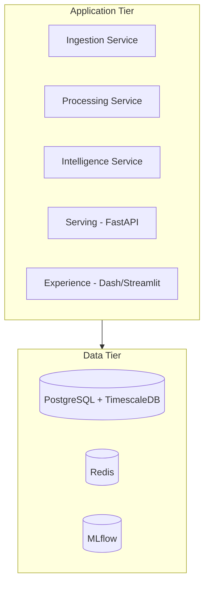
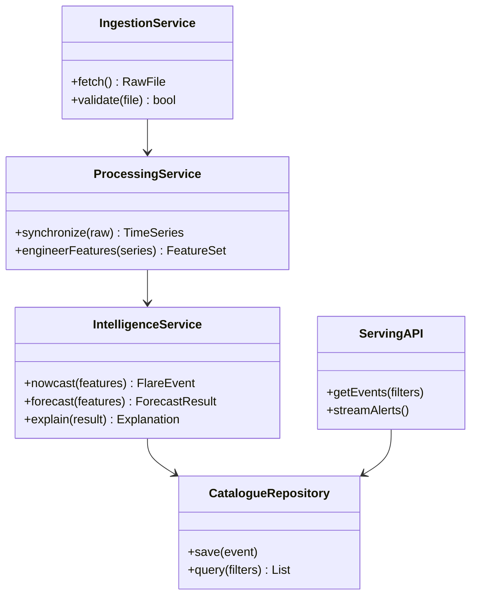

# 03 — System Architecture

**HeliosAI** — AI-Powered Space Weather Intelligence Platform
Document 03 of 61

---

## 1. Executive Summary

This document defines HeliosAI's system architecture at the subsystem level — the six-subsystem decomposition first introduced in the README, now formalized with responsibilities, boundaries, and communication contracts. It is the architectural parent of `04_High_Level_Design.md` and `05_Low_Level_Design.md`.

---

## 2. Purpose

Establish subsystem boundaries so that no later document (backend, frontend, ML) has to re-derive where its responsibilities begin and end.

---

## 3. Scope

Subsystem decomposition, inter-subsystem contracts, deployment topology at the architecture (not infrastructure) level. Excludes database schema (`30`), API contracts (`32`), and infra manifests (`50`, `51`).

---

## 4. Objectives

1. Decompose the platform into subsystems with single, clear responsibilities.
2. Define the contract (data format, protocol) at every subsystem boundary.
3. Establish the architectural style (layered + event-driven hybrid) used consistently downstream.

---

## 5. Architectural Style

HeliosAI uses a **layered architecture with an event-driven core**: ingestion and processing are pipeline-staged (layered), while nowcasting/forecasting/alerting communicate via a publish-subscribe pattern (Redis Pub/Sub) so new consumers (e.g., a future webhook integration) can subscribe without modifying producers.

---

## 6. Subsystem Responsibilities

| Subsystem | Responsibility | Does NOT own |
|---|---|---|
| Ingestion | Fetch, validate, and hand off raw SoLEXS/HEL1OS files | Time synchronization, feature computation |
| Processing | Time-sync, clean, engineer features | Model inference, alerting |
| Intelligence | Nowcast, forecast, explain | Data persistence schema, API exposure |
| Data & Catalogue | Persist light curves, features, events, model runs | Business logic (fusion rules, thresholds) |
| Serving | Expose REST/WebSocket, authenticate, dispatch alerts | UI rendering |
| Experience | Render dashboard, admin panel, catalogue browser | Any data mutation logic (always delegates to Serving) |

---

## 7. Subsystem Interaction Diagram



---

## 8. Boundary Contracts

| Boundary | Format | Protocol |
|---|---|---|
| Ingestion → Processing | Parsed FITS/CDF/CSV records, validated schema | In-process / Celery task payload |
| Processing → Intelligence | Feature-engineered time-series windows | Redis Pub/Sub (streaming) + TimescaleDB (batch) |
| Intelligence → Data & Catalogue | Catalogue entries, forecast records, model metadata | SQLAlchemy ORM writes |
| Data & Catalogue → Serving | Query results | SQLAlchemy / async DB driver |
| Serving → Experience | JSON (REST), JSON frames (WebSocket) | HTTPS / WSS |

---

## 9. Deployment Topology (Architecture-Level)



Full container/orchestration detail is in `49_Deployment.md`, `50_Docker.md`, `51_Kubernetes.md` — this document stays at logical topology only.

---

## 10. Design Patterns Applied

| Pattern | Where |
|---|---|
| Pipeline / Pipes-and-Filters | Ingestion → Processing chain |
| Publish-Subscribe | Processing → Intelligence, Intelligence → Serving alert path |
| Repository Pattern | Data & Catalogue access from Serving/Intelligence |
| Strategy Pattern | Swappable model families behind a common Intelligence interface (`05_Low_Level_Design.md`) |
| Facade | Serving subsystem as the single entry point for Experience |

---

## 11. Class Diagram (Subsystem-Level Interfaces)



---

## 12. Research Notes

Architecture mirrors common scientific-pipeline patterns from other space-mission ground-segment systems (payload → Level-1 processing → derived products → catalogue → distribution), adapted with a real-time alerting layer not typically present in purely offline scientific pipelines.

---

## 13. Acceptance Criteria

- [ ] Every subsystem responsibility is exclusive — no two subsystems claim the same responsibility.
- [ ] Every boundary contract specifies both format and protocol.
- [ ] Diagrams render without Mermaid syntax errors.

---

## 14. Review Checklist

- [ ] No database schema detail leaked (belongs in `30`).
- [ ] No API endpoint detail leaked (belongs in `32`).

---

## 15. Future Improvements

- Revisit the event-driven boundary choice if multi-mission fusion (`60_Future_Enhancements.md`) requires a heavier message bus (e.g., Kafka) than Redis Pub/Sub can comfortably support.

---

## Antigravity Development Prompt

```
PROJECT CONTEXT:
HeliosAI dual-band Aditya-L1 flare nowcasting/forecasting platform (ISRO PS-15).
Document 03 of 61: System Architecture — six-subsystem decomposition and boundary contracts.

FOLDER: docs/03_System_Architecture.md

FILES TO PRODUCE: docs/03_System_Architecture.md only.

CODING STANDARDS: Markdown; Mermaid diagrams must be syntactically valid; subsystem names
must exactly match those used in the README ("Ingestion", "Processing", "Intelligence",
"Data & Catalogue", "Serving", "Experience") with no renaming.

EXPECTED OUTPUT: Subsystem responsibility table, interaction diagram, boundary contract
table, deployment topology diagram, design pattern table, subsystem-level class diagram —
exactly as sectioned above.

EDGE CASES / VALIDATION: No subsystem may own a responsibility claimed by another (validate
the responsibility table is mutually exclusive and collectively exhaustive across FR-* IDs
from 02_SRS.md).

TESTING: Architecture review checklist (§14) applied before this doc is considered final;
downstream docs (04, 05, 30-34) must not contradict the boundary contracts defined here.

ACCEPTANCE CRITERIA: See §13 above.

DELIVERABLES: docs/03_System_Architecture.md

GIT COMMIT FORMAT: docs: add 03_System_Architecture.md (subsystem decomposition and contracts)
```

---

**Next document:** `04_High_Level_Design.md` — say **NEXT** to continue.
