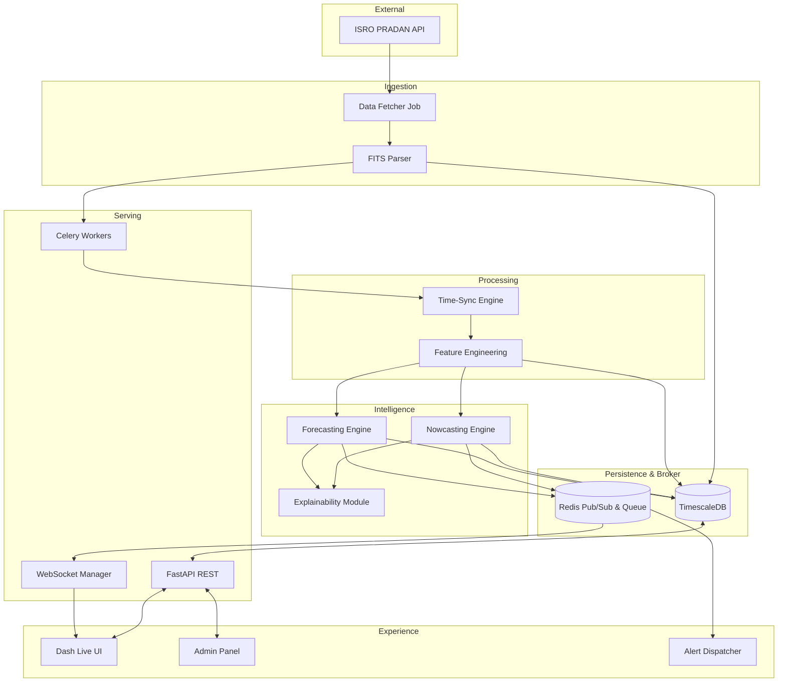

# 03 — System Architecture

**HeliosAI** — AI-Powered Space Weather Intelligence Platform
Document 03 of 61

---

## 1. Purpose

This document provides a high-level overview of the HeliosAI system architecture. It defines the major components, their interactions, and how they collectively satisfy the requirements outlined in `02_Software_Requirements_Specification.md`.

---

## 2. Architectural Principles

- **Modular Monolith (for now):** The system is logically separated into distinct modules (Ingestion, Intelligence, API, Frontend) but deployed together to simplify research and local deployment, with the ability to scale horizontally later (e.g., via Kubernetes).
- **Event-Driven Data Flow:** Data ingestion triggers processing, which triggers inference, which triggers WebSockets/Alerts.
- **Single Source of Truth:** TimescaleDB acts as the unified storage for raw telemetry, processed features, and the master flare catalogue.

---

## 3. High-Level Component View

The HeliosAI architecture consists of five primary layers:

### 3.1 Data Ingestion Layer
- **Components:** ISRO PRADAN API Fetchers, FITS Parsers.
- **Responsibility:** Periodically polls for new SoLEXS and HEL1OS Level-1 data, parses the FITS format, and normalizes the initial data structures.

### 3.2 Processing & Feature Layer
- **Components:** Time-Sync Engine, Signal Processor, Feature Store (Logical).
- **Responsibility:** Aligns the disparate timestamps of the two instruments, cleanses data (handling gaps/NaNs), and engineers features like the Hardness Ratio and wavelet transforms.

### 3.3 Intelligence Layer
- **Components:** Nowcasting Engine (Rule/Statistical), Forecasting Engine (ML/DL Models), XAI Explainer.
- **Responsibility:** Applies loaded models to the live feature stream to detect ongoing flares, predict future probabilities, and generate explainability outputs (e.g., SHAP values).

### 3.4 Data & Serving Layer
- **Components:** TimescaleDB (PostgreSQL), Redis, FastAPI Backend.
- **Responsibility:** Persists all time-series data and metadata. Redis acts as the message broker for Celery and the pub/sub backbone for WebSockets. FastAPI serves REST endpoints.

### 3.5 Experience Layer
- **Components:** Dash Live Dashboard, Streamlit Admin Panel, Alert Dispatcher.
- **Responsibility:** Consumes the API and WebSocket streams to render the operator interface and dispatches external notifications (e.g., email, webhook).

---

## 4. System Flow Diagram



---

## 5. Technology Mapping

| Layer | Primary Technology |
|---|---|
| Frontend | Plotly Dash (Dashboard), Streamlit (Admin Panel) |
| API / WebSockets | FastAPI, Uvicorn |
| Asynchronous Tasks | Celery |
| Broker / Cache | Redis |
| Database | TimescaleDB (PostgreSQL Extension) |
| Machine Learning | scikit-learn, PyTorch, XGBoost |
| MLOps | MLflow, Apache Airflow |

---

## 6. Interfaces to Other Documents

- **`04_High_Level_Design.md`** — expands on the structural patterns bridging these components.
- **`30_Database_Design.md`** — details the schema inside TimescaleDB.
- **`31_Backend_Architecture.md`** — details the FastAPI and Celery implementations.

---

## 7. Acceptance Criteria

- [ ] Architecture diagrams clearly distinguish between synchronous and asynchronous flows.
- [ ] Technology mapping aligns completely with `07_Tech_Stack.md`.
- [ ] Diagram components map to the functional requirements defined in `02_SRS.md`.

---

## 8. Review Checklist

- [ ] The Mermaid flowchart renders correctly.
- [ ] No specific code-level interfaces (classes, functions) are defined here (they belong in `05_LLD.md`).

---

## 9. Future Improvements

- Add a physical deployment diagram (mapping components to Docker containers) if not adequately covered by `49_Deployment.md`.

---

## Antigravity Development Prompt

```
PROJECT CONTEXT:
You are implementing a documentation-only artifact — this task produces no source code.
Repository: HeliosAI. This is document 03 of a 61-document specification set.

FOLDER:
docs/03_System_Architecture.md

FILES TO PRODUCE:
None (documentation task). Output exactly one file: docs/03_System_Architecture.md

CODING STANDARDS:
N/A — Markdown only. Follow the structural template used by all other docs.

EXPECTED OUTPUT:
A single self-contained Markdown file outlining the 5-layer architecture and a flowchart.

TESTING:
Documentation-only — validation is a Markdown lint pass.

ACCEPTANCE CRITERIA:
See §7 above.

DELIVERABLES:
docs/03_System_Architecture.md

GIT COMMIT FORMAT:
docs: add 03_System_Architecture.md (high-level system components and flow)
```

---

**Next document:** `04_High_Level_Design.md` — say **NEXT** to continue.
