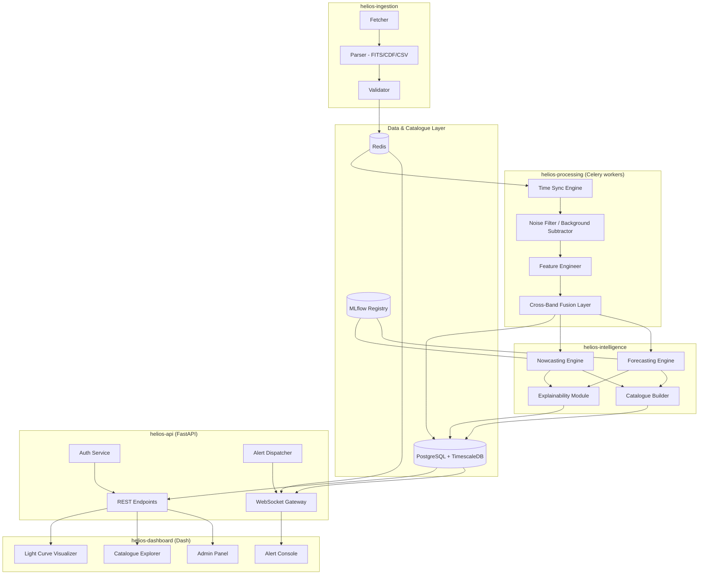
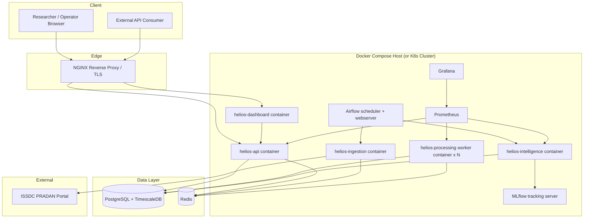
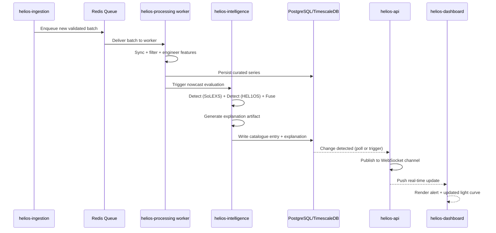
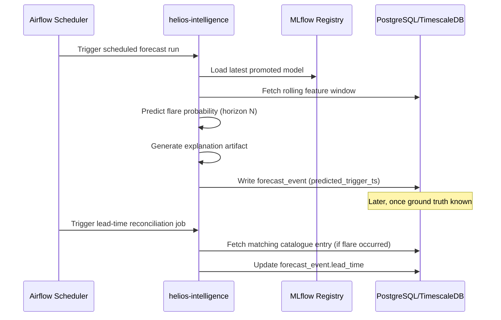
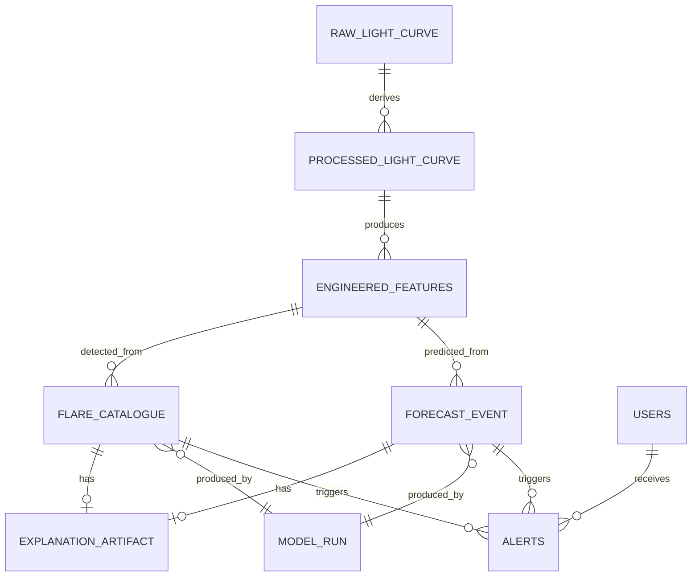

# 03. System Architecture

## Table of Contents

1. [Executive Summary](#executive-summary)
2. [Problem Statement](#problem-statement)
3. [Objectives](#objectives)
4. [Scope](#scope)
5. [Architectural Style](#architectural-style)
6. [Subsystem Architecture](#subsystem-architecture)
7. [Component Diagram](#component-diagram)
8. [Deployment Architecture](#deployment-architecture)
9. [Deployment Diagram](#deployment-diagram)
10. [Data Architecture](#data-architecture)
11. [Sequence Diagrams](#sequence-diagrams)
12. [Entity Relationship Overview](#entity-relationship-overview)
13. [Communication Patterns](#communication-patterns)
14. [Folder Structure](#folder-structure)
15. [Database Tables (Architecture-Level)](#database-tables-architecture-level)
16. [API Design (Architecture-Level)](#api-design-architecture-level)
17. [Security Architecture](#security-architecture)
18. [Performance Architecture](#performance-architecture)
19. [Scalability Architecture](#scalability-architecture)
20. [Error Handling Architecture](#error-handling-architecture)
21. [Validation Architecture](#validation-architecture)
22. [Testing Architecture](#testing-architecture)
23. [Design Decisions](#design-decisions)
24. [Acceptance Criteria](#acceptance-criteria)
25. [Implementation Notes](#implementation-notes)
26. [Future Scope](#future-scope)
27. [References](#references)
28. [Revision History](#revision-history)

---

## Executive Summary

This document translates the requirements in `02_Software_Requirements_Specification.md` into a concrete **system architecture**: how subsystems are composed of services, how those services communicate, how they're deployed, and how data flows through the system end-to-end. It is the architectural contract that `04_High_Level_Design.md` and `05_Low_Level_Design.md` refine further, and that every module-level Antigravity prompt must respect.

---

## Problem Statement

A research-grade, real-time-capable, explainable solar flare intelligence pipeline built from two independent instrument streams requires an architecture that (a) keeps ingestion, processing, and modeling loosely coupled so each can evolve independently, (b) supports both batch (historical reprocessing) and streaming (near-real-time) execution modes over the same codebase, and (c) remains fully Python-native across every layer without sacrificing production-grade reliability.

---

## Objectives

1. Define a service-oriented architecture where each of the six subsystems (Ingestion, Processing, Intelligence, Data & Catalogue, Serving, Experience) maps to one or more independently deployable Python services.
2. Define the communication backbone (sync REST, async task queue, pub/sub streaming) connecting those services.
3. Define the deployment topology (Docker Compose for research-scale; optional Kubernetes path for scale-out).
4. Ensure the architecture supports both **batch/backfill** processing and **near-real-time** processing over the identical processing/model code path (no logic duplication between "offline" and "online" modes).

---

## Scope

Architecture-level design for the full HeliosAI v1 system, as scoped by `01_Project_Vision.md` and specified by `02_Software_Requirements_Specification.md`. Excludes low-level class/function signatures (deferred to `05_Low_Level_Design.md`) and column-level schema (deferred to `30_Database_Design.md`).

---

## Functional Requirements

This document architecturally satisfies FR-01 through FR-34 as defined in `02_Software_Requirements_Specification.md`; see the [Traceability Matrix](#design-decisions) mapping below for how each subsystem's internal architecture maps back to those requirement IDs.

## Non Functional Requirements

This document is architected to satisfy NFR-01 through NFR-10 (performance, scalability, reliability, security, maintainability, portability, auditability, explainability, observability) as defined in the SRS. Specific architectural mechanisms for each are detailed in their respective sections below (Performance Architecture, Scalability Architecture, Security Architecture, etc.).

---

## Architectural Style

HeliosAI uses a **modular service-oriented monolith-to-microservices hybrid**, sometimes called a "modular monolith with extractable services":

- Each subsystem is implemented as a **separately runnable Python package/service** with its own Dockerfile, but subsystems that are tightly coupled and low-latency-sensitive (Processing → Intelligence for nowcasting) share a process boundary option for research-scale deployment, while remaining architecturally separable for future Kubernetes-based scale-out.
- This hybrid approach was chosen over a pure microservices architecture because: (a) the team/contributor base is research-oriented and benefits from simpler local development (`docker compose up`), and (b) true microservices overhead (service mesh, distributed tracing complexity) is not justified at research scale, but the module boundaries are kept clean enough that extraction into true microservices is possible later (see Future Scope).

**Execution modes supported by the same codebase:**
- **Batch mode** — Airflow-orchestrated DAGs for scheduled ingestion, full/partial reprocessing, and scheduled retraining.
- **Streaming/near-real-time mode** — Celery workers consuming from Redis queues, triggered as soon as new validated data lands, feeding the nowcasting/forecasting engines with minimal added latency.

---

## Subsystem Architecture

| Subsystem | Deployable Unit(s) | Primary Tech |
|---|---|---|
| Ingestion | `helios-ingestion` service + Airflow DAGs | Python, Requests/HTTPX, Astropy/SunPy parsers, Pydantic |
| Processing | `helios-processing` service (Celery workers) | NumPy, SciPy, Pandas, PyWavelets |
| Intelligence | `helios-intelligence` service (nowcast + forecast + XAI submodules) | PyTorch, Scikit-learn, XGBoost/LightGBM/CatBoost, SHAP, Captum |
| Data & Catalogue | PostgreSQL + TimescaleDB, Redis, MLflow tracking server | PostgreSQL 15+, TimescaleDB extension, Redis 7+ |
| Serving | `helios-api` service | FastAPI, Uvicorn/Gunicorn, WebSockets |
| Experience | `helios-dashboard` service | Plotly Dash, Dash Bootstrap Components |

---

## Component Diagram



---

## Deployment Architecture

Two supported deployment profiles:

1. **Research/Local Profile (v1 default)** — `docker compose up`, single-host, all services as Docker containers on one machine (or one small VM), suitable for a research group.
2. **Scale-Out Profile (future-ready)** — Kubernetes manifests (`infra/k8s/`) allowing the same container images to be deployed with horizontal pod autoscaling for the API and processing workers, documented in `51_Kubernetes.md`.

NGINX sits in front of `helios-api` and `helios-dashboard` as a reverse proxy/TLS terminator in both profiles.

---

## Deployment Diagram



---

## Data Architecture

- **Raw zone**: immutable raw ingested files + parsed-but-unprocessed series (per DR-01).
- **Curated zone**: time-synchronized, noise-filtered, feature-engineered series (TimescaleDB hypertables).
- **Intelligence zone**: catalogue entries, forecast events, explanation artifacts — all foreign-keyed back to the curated zone's data snapshot ID.
- **Registry zone**: MLflow-tracked model artifacts, linked from intelligence zone rows via `model_run_id`.

This zoning ensures FR-01 (raw retained), DR-01 (raw/derived separation), and NFR-08 (auditability) are architecturally enforced, not just conventionally followed.

---

## Sequence Diagrams

### Near-Real-Time Nowcasting Path



### Scheduled Forecast Evaluation Path



---

## Entity Relationship Overview

Full column-level ERD lives in `30_Database_Design.md`; the architecture-level relationship overview:



---

## Communication Patterns

| Pattern | Used For | Technology |
|---|---|---|
| Synchronous REST | Dashboard ↔ API, external API consumers | FastAPI over HTTPS |
| Asynchronous task queue | Ingestion → Processing, Processing → Intelligence (streaming mode) | Celery + Redis |
| Scheduled orchestration | Batch ingestion, scheduled retraining, lead-time reconciliation | Apache Airflow |
| Publish/Subscribe | Real-time catalogue/alert push to dashboard | Redis Pub/Sub → FastAPI WebSocket |
| Experiment tracking RPC | Intelligence ↔ MLflow | MLflow Python client / REST |

---

## Folder Structure

High-level only (full structure detailed in `06_Project_Folder_Structure.md`):

```
HeliosAI/
├── services/
│   ├── ingestion/
│   ├── processing/
│   ├── intelligence/
│   ├── api/
│   └── dashboard/
├── shared/
│   ├── schemas/        # Shared Pydantic models
│   ├── db/              # SQLAlchemy models, Alembic migrations
│   └── config/
├── infra/
│   ├── docker/
│   └── k8s/
├── airflow/
│   └── dags/
├── docs/
└── tests/
```

---

## Database Tables (Architecture-Level)

See [Entity Relationship Overview](#entity-relationship-overview) above; full DDL-level design in `30_Database_Design.md`.

---

## API Design (Architecture-Level)

`helios-api` is the single Serving-layer entry point; it does not directly perform processing or modeling — it only orchestrates reads/writes against the Data & Catalogue layer and publishes real-time events. Full endpoint contracts in `32_API_Design.md`.

---

## Security Architecture

- NGINX terminates TLS; internal service-to-service traffic stays within the Docker Compose / Kubernetes internal network (not exposed publicly).
- `helios-api` is the only service exposed to end users; `helios-ingestion`, `helios-processing`, and `helios-intelligence` are internal-only.
- JWT issued by `helios-api`'s Auth Service; validated on every protected route.
- Full detail in `54_Security.md`.

---

## Performance Architecture

- Celery worker pool sized per deployment profile to keep near-real-time nowcasting latency within the NFR-01 target.
- TimescaleDB hypertable chunking aligned to typical query time-ranges (e.g., per-day chunks) to keep dashboard queries fast.
- Redis used both as Celery broker and as a hot cache for the most recent light-curve window, avoiding repeated DB round-trips for the live dashboard view.

---

## Scalability Architecture

- `helios-api` and `helios-processing` workers are stateless and horizontally scalable; `helios-intelligence` model-serving components can be scaled independently since inference is typically the most compute-intensive step.
- Kubernetes Horizontal Pod Autoscaler configuration for scale-out profile is documented in `51_Kubernetes.md`.

---

## Error Handling Architecture

- Every service uses structured logging (`structlog`) with a consistent schema (service name, correlation ID, severity, message, context).
- A correlation ID is generated at ingestion and propagated through Processing → Intelligence → Serving, enabling end-to-end tracing of a single data batch through the whole pipeline (supports NFR-08 auditability).
- Failed Celery tasks retry with exponential backoff up to a configured limit, then land in a dead-letter queue for manual/administrator review (visible in the Admin Panel).

---

## Validation Architecture

- Pydantic models define the contract at every service boundary (Ingestion output, Processing output, Intelligence output) — not just at the API layer — so invalid data cannot silently cross a subsystem boundary.
- Shared `shared/schemas/` package ensures all services validate against the same schema definitions, preventing drift between subsystems.

---

## Testing Architecture

- Each service has its own unit test suite; a top-level `tests/integration/` suite exercises full ingestion→catalogue flows against a Dockerized test environment with fixture data.
- CI (`52_CI_CD.md`) runs unit tests per-service in parallel, then integration tests against the Compose stack, before allowing merge.

---

## Design Decisions

| Decision | Rationale | Traces to |
|---|---|---|
| Modular monolith-to-microservices hybrid over pure microservices | Simpler research-scale local dev, extractable later | NFR-06, NFR-07 |
| Celery (streaming) + Airflow (batch/scheduled) split | Cleanly separates low-latency triggered work from scheduled orchestration | FR-01, FR-16, NFR-01 |
| Shared processing/model code path for batch and streaming modes | Prevents logic drift between backfill and live nowcasting | FR-11–FR-20 |
| Correlation-ID-based tracing | Enables end-to-end auditability without a full distributed tracing stack at research scale | NFR-08 |
| Redis Pub/Sub → WebSocket for real-time UI updates | Avoids dashboard polling; keeps alert latency low | FR-27, FR-30 |

---

## Acceptance Criteria

- [ ] Every subsystem from the SRS maps to exactly one deployable unit (or clearly scoped sub-service) in this architecture.
- [ ] Both batch and streaming execution modes are architecturally supported without code duplication.
- [ ] Deployment diagram covers all services named in the component diagram.
- [ ] Security architecture confirms only `helios-api` and `helios-dashboard` are externally exposed.
- [ ] All Mermaid diagrams render without syntax errors.

---

## Implementation Notes

- `04_High_Level_Design.md` will expand each component box in the Component Diagram into its constituent modules/classes.
- `05_Low_Level_Design.md` will provide function-level detail, including exact method signatures per Antigravity module prompt.

---

## Future Scope

- Extraction of `helios-intelligence` into fully independent microservices per model family (classical ML vs. deep sequence models) if inference load justifies it.
- Migration from Airflow-only batch orchestration to a hybrid with Dagster/Prefect if the contributor community prefers, evaluated in a future ADR (architecture decision record).
- Full Kubernetes-native deployment (`51_Kubernetes.md`) as the default profile once the project moves beyond single-research-group usage.

---

## References

1. `02_Software_Requirements_Specification.md` — requirement source for this architecture.
2. FastAPI, Celery, Airflow, MLflow official architecture documentation.
3. TimescaleDB hypertable design best practices.

---

## Revision History

| Version | Date | Author | Notes |
|---|---|---|---|
| 0.1 | 2026-07-11 | HeliosAI Documentation (Antigravity workflow) | Initial system architecture — subsystem-to-service mapping, component/deployment/sequence diagrams, data zoning established |

---

**Next document:** `04_High_Level_Design.md` — say **NEXT** to continue.
