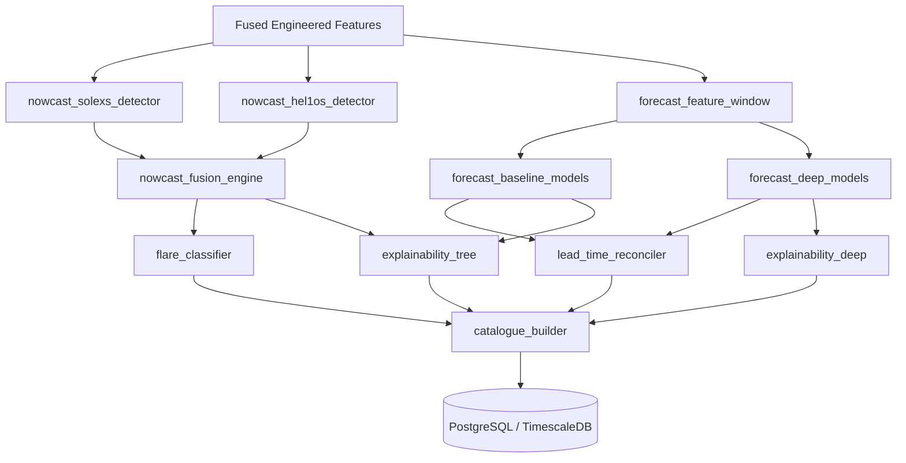
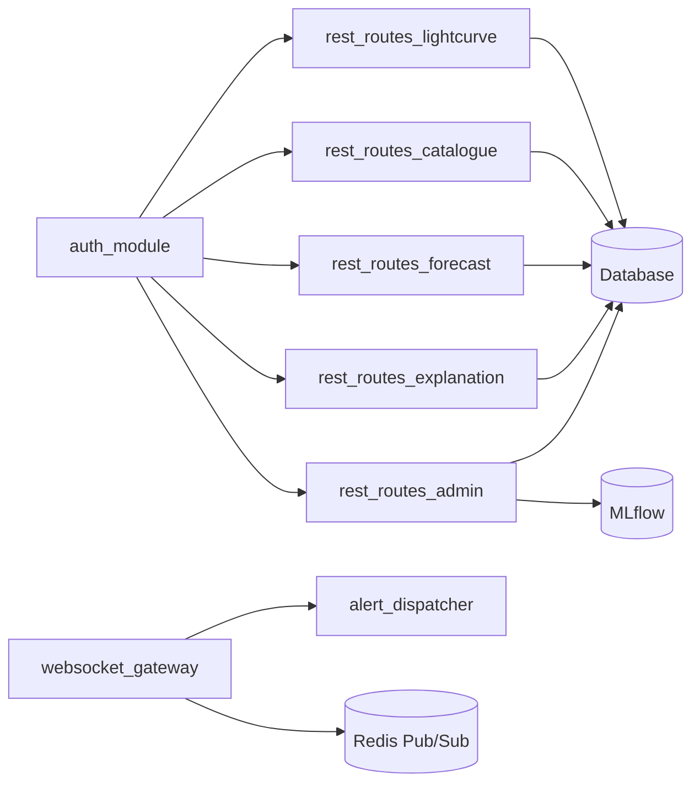
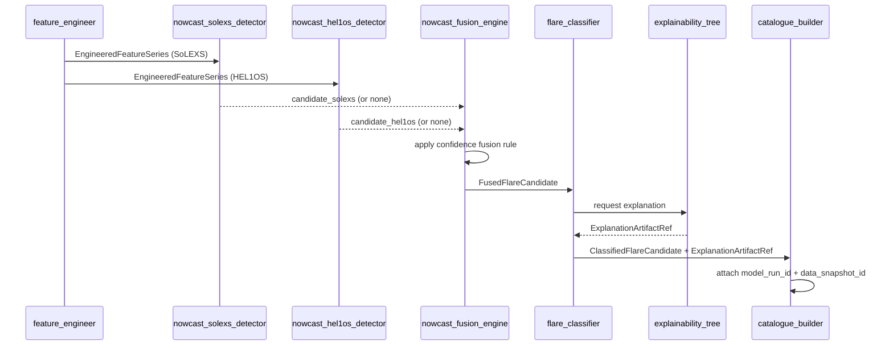
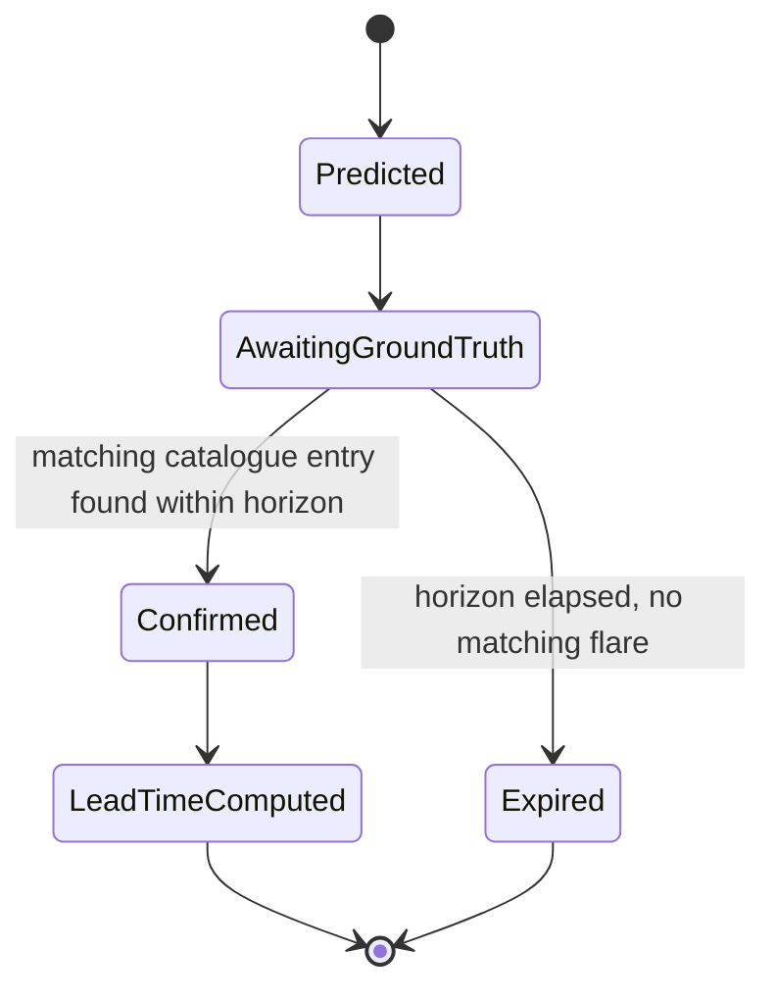

# 04. High-Level Design (HLD)

## Table of Contents

1. [Executive Summary](#executive-summary)
2. [Problem Statement](#problem-statement)
3. [Objectives](#objectives)
4. [Scope](#scope)
5. [Design Approach](#design-approach)
6. [Module Breakdown Per Subsystem](#module-breakdown-per-subsystem)
7. [Component Diagrams (Per Subsystem)](#component-diagrams-per-subsystem)
8. [Cross-Module Interfaces](#cross-module-interfaces)
9. [Sequence Diagrams](#sequence-diagrams)
10. [State Diagrams](#state-diagrams)
11. [Folder Structure](#folder-structure)
12. [Database Tables (HLD-Level)](#database-tables-hld-level)
13. [API Design (HLD-Level)](#api-design-hld-level)
14. [Security](#security)
15. [Performance](#performance)
16. [Scalability](#scalability)
17. [Error Handling](#error-handling)
18. [Validation](#validation)
19. [Testing](#testing)
20. [Design Decisions](#design-decisions)
21. [Acceptance Criteria](#acceptance-criteria)
22. [Implementation Notes](#implementation-notes)
23. [Future Scope](#future-scope)
24. [References](#references)
25. [Revision History](#revision-history)

---

## Executive Summary

This document expands each component box from `03_System_Architecture.md`'s Component Diagram into its constituent **modules** — the unit of design that will each receive a dedicated Antigravity master prompt for implementation. Where the System Architecture doc answered "what services exist and how do they talk," this document answers "what modules live inside each service, what does each module own, and how do modules within and across services interface with each other."

---

## Problem Statement

Without an explicit module breakdown, "helios-intelligence" or "helios-processing" as single monolithic services would become unmanageable for both human contributors and downstream AI-assisted implementation (Antigravity workflow). Each service must be decomposed into cohesive, independently testable, independently promptable modules with clearly typed interfaces.

---

## Objectives

1. Decompose every service defined in `03_System_Architecture.md` into named modules with single, clear responsibilities.
2. Define the interface (function signatures at a conceptual level, not full code) between modules.
3. Provide the module inventory that `61_Antigravity_Master_Prompt.md` and `prompts/antigravity/*.md` will be built from — one prompt per module (or tightly-coupled module cluster).

---

## Scope

Covers module-level decomposition for all six subsystems. Full function/class signatures and database column definitions are deferred to `05_Low_Level_Design.md` and `30_Database_Design.md` respectively.

---

## Design Approach

Each module follows a consistent internal shape to keep the codebase predictable across 60+ documented components:

- `interface.py` (or equivalent) — the public contract (Pydantic input/output models + function/class signatures).
- `core/` — internal implementation, not imported directly by other modules.
- `tests/` — module-local unit tests.
- A one-page module spec (this HLD) + a dedicated Antigravity prompt (generated later) that a contributor or AI agent can execute against in isolation, given only the module's declared interface and its upstream/downstream module interfaces.

This mirrors the "Antigravity workflow" principle already established in Daksh's prior projects: **strict context isolation, dedicated branch per module, atomic commits, conflict prevention.**

---

## Module Breakdown Per Subsystem

### 1. Ingestion Subsystem (`services/ingestion/`)

| Module | Responsibility |
|---|---|
| `fetcher` | Scheduled/on-demand retrieval of SoLEXS & HEL1OS L1 files from PRADAN; manual-drop directory watcher fallback |
| `parser` | Format-specific parsing (FITS/CDF/CSV) into normalized internal `RawLightCurve` schema |
| `validator` | Schema + physical-range validation; quarantine routing for invalid files |
| `ingestion_publisher` | Publishes validated raw batches to the Redis queue for Processing to consume |

### 2. Processing Subsystem (`services/processing/`)

| Module | Responsibility |
|---|---|
| `time_sync` | Converts instrument/spacecraft time to UTC; flags synchronization gaps |
| `noise_filter` | Background subtraction, instrumental noise filtering |
| `feature_engineer` | Computes hardness ratio, flux gradients, rise/decay constants, wavelet-domain features |
| `band_fusion` | Aligns SoLEXS + HEL1OS engineered series on a common timeline for downstream fusion-aware modeling |
| `persistence_writer` | Writes curated + engineered series to TimescaleDB |

### 3. Intelligence Subsystem (`services/intelligence/`)

| Module | Responsibility |
|---|---|
| `nowcast_solexs_detector` | Independent flare candidate detection on SoLEXS series |
| `nowcast_hel1os_detector` | Independent flare candidate detection on HEL1OS series |
| `nowcast_fusion_engine` | Confidence-weighted fusion of per-band candidates into catalogue-ready entries |
| `flare_classifier` | Assigns GOES-equivalent class bin to a confirmed/tentative flare |
| `forecast_feature_window` | Builds rolling lookback feature windows for forecasting models |
| `forecast_baseline_models` | XGBoost/LightGBM/CatBoost baseline forecasting implementations |
| `forecast_deep_models` | LSTM/GRU/Transformer-family (Informer, PatchTST, TFT) forecasting implementations |
| `lead_time_reconciler` | Matches resolved forecast events against actual catalogue entries; computes lead time |
| `explainability_tree` | SHAP explanation generation for tree-based models |
| `explainability_deep` | Captum-based attention/integrated-gradients explanation for deep models |
| `catalogue_builder` | Assembles final catalogue/forecast rows with all required metadata (model_run_id, data snapshot, explanation ref) |

### 4. Data & Catalogue Subsystem

| Module | Responsibility |
|---|---|
| `db_models` (shared) | SQLAlchemy ORM models, shared across services via `shared/db/` |
| `migrations` (Alembic) | Schema versioning |
| `catalogue_query_service` | Query/export logic for the master catalogue (used by API layer) |
| `mlflow_client_wrapper` | Standardized wrapper around MLflow tracking/registry calls used by Intelligence modules |

### 5. Serving Subsystem (`services/api/`)

| Module | Responsibility |
|---|---|
| `auth_module` | JWT/OAuth2 login, refresh, role-based authorization |
| `rest_routes_lightcurve` | Light curve query endpoints |
| `rest_routes_catalogue` | Catalogue query/export endpoints |
| `rest_routes_forecast` | Forecast query endpoints |
| `rest_routes_explanation` | Explanation artifact retrieval endpoints |
| `rest_routes_admin` | Admin-only model/registry/system status endpoints |
| `websocket_gateway` | Real-time catalogue/alert push via Redis Pub/Sub bridge |
| `alert_dispatcher` | Formats and routes alerts to WebSocket clients + optional webhook/email |

### 6. Experience Subsystem (`services/dashboard/`)

| Module | Responsibility |
|---|---|
| `layout_shell` | Top-level Dash app layout, navigation, theming |
| `lightcurve_view` | Interactive dual-band light curve visualization with flare markers |
| `catalogue_view` | Filterable/sortable catalogue explorer table |
| `alert_console` | Real-time alert feed (WebSocket-connected) |
| `explanation_view` | Renders SHAP/attention explanation artifacts alongside the triggering event |
| `admin_panel` | User management, model registry status, retraining triggers |

---

## Component Diagrams (Per Subsystem)

### Intelligence Subsystem Internal Component Diagram



### Serving Subsystem Internal Component Diagram



---

## Cross-Module Interfaces

| From Module | To Module | Contract |
|---|---|---|
| `ingestion_publisher` | `time_sync` | `RawLightCurveBatch` (Pydantic) via Redis queue message |
| `feature_engineer` | `nowcast_*_detector`, `forecast_feature_window` | `EngineeredFeatureSeries` (Pydantic), keyed by instrument + time range |
| `nowcast_fusion_engine` | `flare_classifier` | `FusedFlareCandidate` |
| `flare_classifier` | `catalogue_builder` | `ClassifiedFlareCandidate` |
| `forecast_baseline_models` / `forecast_deep_models` | `lead_time_reconciler` | `ForecastPrediction` (includes `predicted_trigger_ts`) |
| `explainability_tree` / `explainability_deep` | `catalogue_builder` | `ExplanationArtifactRef` |
| `catalogue_builder` | `db_models` | ORM-mapped insert via `shared/db/` |
| `catalogue_query_service` | `rest_routes_catalogue` | Typed query result → Pydantic response model |
| `websocket_gateway` | `alert_console` (dashboard) | JSON event payload over WebSocket |

All cross-module contracts are defined once in `shared/schemas/` and imported by both sides of every interface — this is an explicit design decision to prevent schema drift, tying back to the Validation Architecture in `03_System_Architecture.md`.

---

## Sequence Diagrams

### Module-Level View of Nowcast Fusion



---

## State Diagrams

### Forecast Event Lifecycle



---

## Folder Structure

```
services/
├── ingestion/
│   ├── fetcher/
│   ├── parser/
│   ├── validator/
│   └── ingestion_publisher/
├── processing/
│   ├── time_sync/
│   ├── noise_filter/
│   ├── feature_engineer/
│   ├── band_fusion/
│   └── persistence_writer/
├── intelligence/
│   ├── nowcast_solexs_detector/
│   ├── nowcast_hel1os_detector/
│   ├── nowcast_fusion_engine/
│   ├── flare_classifier/
│   ├── forecast_feature_window/
│   ├── forecast_baseline_models/
│   ├── forecast_deep_models/
│   ├── lead_time_reconciler/
│   ├── explainability_tree/
│   ├── explainability_deep/
│   └── catalogue_builder/
├── api/
│   ├── auth_module/
│   ├── rest_routes_lightcurve/
│   ├── rest_routes_catalogue/
│   ├── rest_routes_forecast/
│   ├── rest_routes_explanation/
│   ├── rest_routes_admin/
│   ├── websocket_gateway/
│   └── alert_dispatcher/
└── dashboard/
    ├── layout_shell/
    ├── lightcurve_view/
    ├── catalogue_view/
    ├── alert_console/
    ├── explanation_view/
    └── admin_panel/
```

---

## Database Tables (HLD-Level)

Modules that own persistence: `persistence_writer` (curated/feature tables), `catalogue_builder` (catalogue/forecast/explanation tables), `db_models`/`migrations` (schema definitions shared across all). Full DDL in `30_Database_Design.md`.

---

## API Design (HLD-Level)

Each `rest_routes_*` module maps 1:1 to an endpoint group defined in `02_Software_Requirements_Specification.md`'s API Design section. Full request/response contracts in `32_API_Design.md`.

---

## Security

- `auth_module` is the single point of JWT issuance/validation; all other `rest_routes_*` modules depend on it via a shared FastAPI dependency, never re-implementing auth logic.
- Module-to-module communication within a service is in-process (no network hop, no auth needed); cross-service communication (e.g., Processing → Intelligence via Redis) carries a signed correlation ID but not a full JWT, since it's internal-network-only per the Security Architecture in `03_System_Architecture.md`.

---

## Performance

- `nowcast_solexs_detector` and `nowcast_hel1os_detector` run in parallel (not sequential) since they are independent, reducing nowcast latency.
- `forecast_baseline_models` and `forecast_deep_models` can run in parallel for model comparison; the catalogue_builder selects/records the promoted model's output per MLflow registry stage tags.

---

## Scalability

- Every module in `intelligence/` is stateless given its inputs (feature series + model registry reference), enabling horizontal scaling of Celery workers running these modules.
- `websocket_gateway` scales via Redis Pub/Sub fan-out, so multiple `helios-api` replicas can each serve their own WebSocket clients while receiving the same published events.

---

## Error Handling

- Every module raises typed exceptions from a shared `shared/exceptions.py` hierarchy (e.g., `DataQualityError`, `ModelInferenceError`, `ExplanationGenerationError`), caught at the service boundary and converted into structured logs / API error responses as appropriate.
- `nowcast_fusion_engine` explicitly handles the "one detector failed, one succeeded" case by falling back to single-band `tentative` classification rather than failing the whole pipeline run.

---

## Validation

- Every module's public interface function validates its Pydantic input model at the function boundary (not just at the outermost API layer), so invalid data cannot propagate silently between modules even within the same service process.

---

## Testing

- Each module ships with unit tests colocated in its own `tests/` directory.
- Cross-module contracts are tested via **contract tests** (a lightweight schema-conformance test) to catch interface drift early, independent of full integration tests.

---

## Design Decisions

| Decision | Rationale |
|---|---|
| One module = one Antigravity prompt (or tightly-coupled cluster) | Enables isolated, parallel contributor work with minimal merge conflicts |
| Shared `shared/schemas/` for all cross-module contracts | Prevents schema drift; single source of truth for data shapes |
| Parallel independent-band detection before fusion | Matches the scientific requirement to cross-validate soft/hard X-ray signals, and improves latency |
| Contract tests separate from full integration tests | Faster feedback loop for contributors working on a single module |

---

## Acceptance Criteria

- [ ] Every service from `03_System_Architecture.md` is fully decomposed into named modules with single responsibilities.
- [ ] Every cross-module interface has a named Pydantic contract type.
- [ ] Module inventory here is exhaustive enough to directly drive the Antigravity prompt set in `61_Antigravity_Master_Prompt.md` and `prompts/antigravity/`.
- [ ] No module has more than one clearly stated responsibility ("single responsibility" check).

---

## Implementation Notes

- `05_Low_Level_Design.md` will provide exact function signatures, class definitions, and algorithmic pseudocode per module listed here.
- The module inventory in this document is the authoritative list used to generate one Antigravity master prompt per module later in this documentation sequence.

---

## Future Scope

- Modules currently colocated within a single service (e.g., all of `intelligence/`) may be split into independently deployed services once contributor/operational scale justifies it — the clean module boundaries defined here make that extraction mechanical rather than a redesign.

---

## References

1. `03_System_Architecture.md` — service-level architecture this HLD expands upon.
2. `02_Software_Requirements_Specification.md` — requirement IDs referenced throughout.

---

## Revision History

| Version | Date | Author | Notes |
|---|---|---|---|
| 0.1 | 2026-07-11 | HeliosAI Documentation (Antigravity workflow) | Initial HLD — full module breakdown per subsystem, cross-module interface contracts, module-level diagrams established |

---

**Next document:** `05_Low_Level_Design.md` — say **NEXT** to continue.
