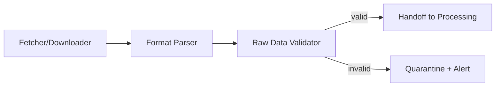
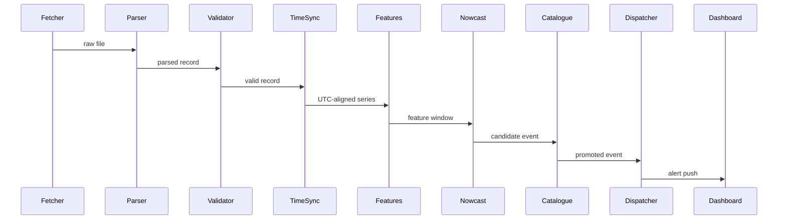
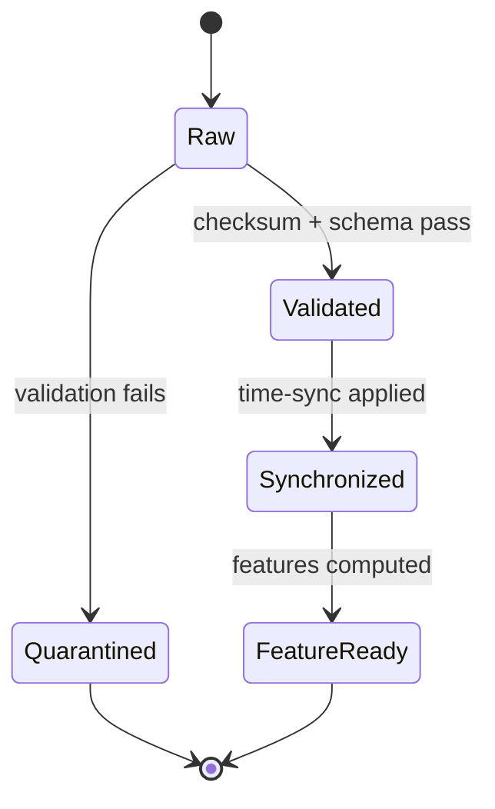

# 04 — High-Level Design

**HeliosAI** — AI-Powered Space Weather Intelligence Platform
Document 04 of 61

---

## 1. Executive Summary

This document takes each subsystem from `03_System_Architecture.md` and decomposes it one level further — into components and their major internal flows — without dropping to code/class-signature detail (that is `05_Low_Level_Design.md`'s job).

---

## 2. Purpose

Bridge the gap between "six subsystems" (architecture) and "actual modules a developer opens a file for" (low-level design), giving each subsystem a concrete component map.

---

## 3. Scope

Component decomposition per subsystem, major internal data flows, and component-level responsibilities. Excludes function signatures, class attributes, and database columns (all in `05`).

---

## 4. Ingestion Subsystem — Components

| Component | Responsibility |
|---|---|
| Fetcher/Downloader Service | Authenticates to PRADAN (or reads manual-drop directory), retrieves raw files |
| Format Parser | Parses FITS/CDF/CSV into an internal raw-record representation |
| Raw Data Validator | Checksum + schema validation before handoff to Processing |



---

## 5. Processing Subsystem — Components

| Component | Responsibility |
|---|---|
| Time Synchronization Engine | Spacecraft time → UTC conversion |
| Noise Filter / Background Subtractor | Instrument-specific background removal |
| Feature Engineering Engine | Hardness ratio, gradients, wavelet energy computation |
| Cross-Band Fusion Layer | Aligns SoLEXS and HEL1OS series onto a shared timeline |

---

## 6. Intelligence Subsystem — Components

| Component | Responsibility |
|---|---|
| Nowcasting Engine | Per-band detection + confidence-weighted fusion |
| Forecasting Engine | Rolling-window probability prediction |
| Explainable AI Layer | SHAP / attention-weight generation per trigger |
| Master Catalogue Builder | Applies promotion rules (confirmed vs. tentative) |

---

## 7. Data & Catalogue Subsystem — Components

| Component | Responsibility |
|---|---|
| TimescaleDB Hypertable Layer | Light-curve and feature storage |
| Catalogue Tables | Flare events, forecasts, alerts |
| MLflow Registry | Model versions, experiment runs |
| Redis Cache/Queue | Feature cache, Celery broker |

---

## 8. Serving Subsystem — Components

| Component | Responsibility |
|---|---|
| FastAPI REST Router | CRUD/read endpoints |
| FastAPI WebSocket Handler | Live push channels |
| Auth Service | JWT issuance/validation |
| Alert Dispatcher | Fan-out to WebSocket, webhook, email |

---

## 9. Experience Subsystem — Components

| Component | Responsibility |
|---|---|
| Dash Dashboard | Live light curves + alert banner |
| Catalogue Explorer | Browsing/filtering historical events |
| Alert Console | Acknowledge/annotate alerts |
| Admin Panel (Streamlit) | User/threshold/ingestion management |

---

## 10. End-to-End Component Flow (Nowcast Path)



---

## 11. State Diagram — Component-Level Data Quality



---

## 12. Research Notes

Component boundaries were chosen to align 1:1 with future Antigravity module prompts (`61_Antigravity_Master_Prompt.md`), so each component here maps cleanly to one implementation branch.

---

## 13. Acceptance Criteria

- [ ] Every component listed has exactly one owning subsystem.
- [ ] Every component appears in at least one diagram.
- [ ] No function-level or schema-level detail present (deferred to `05`).

---

## 14. Review Checklist

- [ ] Cross-checked against `03_System_Architecture.md`'s subsystem responsibility table for consistency.
- [ ] All Mermaid diagrams validated.

---

## 15. Future Improvements

- Add a component-level dependency matrix once implementation begins, to catch accidental coupling early.

---

## Antigravity Development Prompt

```
PROJECT CONTEXT:
HeliosAI dual-band Aditya-L1 flare nowcasting/forecasting platform (ISRO PS-15).
Document 04 of 61: High-Level Design — component decomposition per subsystem.

FOLDER: docs/04_High_Level_Design.md

FILES TO PRODUCE: docs/04_High_Level_Design.md only.

CODING STANDARDS: Markdown; component names must be reused verbatim (not renamed) in
05_Low_Level_Design.md and the corresponding per-module Antigravity prompts.

EXPECTED OUTPUT: Component tables per subsystem, end-to-end sequence diagram for the
nowcast path, data-quality state diagram — matching structure above.

EDGE CASES / VALIDATION: Every component must map to exactly one subsystem from
03_System_Architecture.md; no orphaned or dual-owned components.

TESTING: Structural review — every component referenced in the sequence diagram must also
appear in its subsystem's component table.

ACCEPTANCE CRITERIA: See §13 above.

DELIVERABLES: docs/04_High_Level_Design.md

GIT COMMIT FORMAT: docs: add 04_High_Level_Design.md (component decomposition)
```

---

**Next document:** `05_Low_Level_Design.md` — say **NEXT** to continue.
