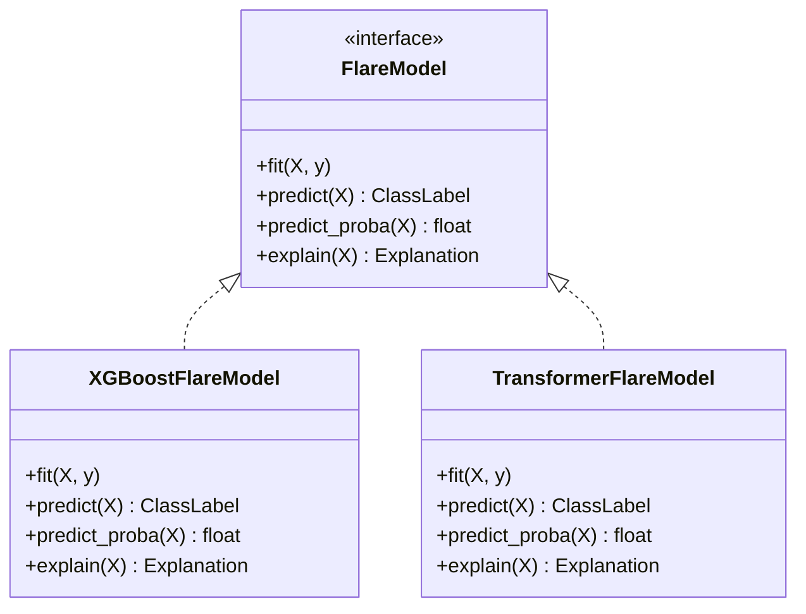
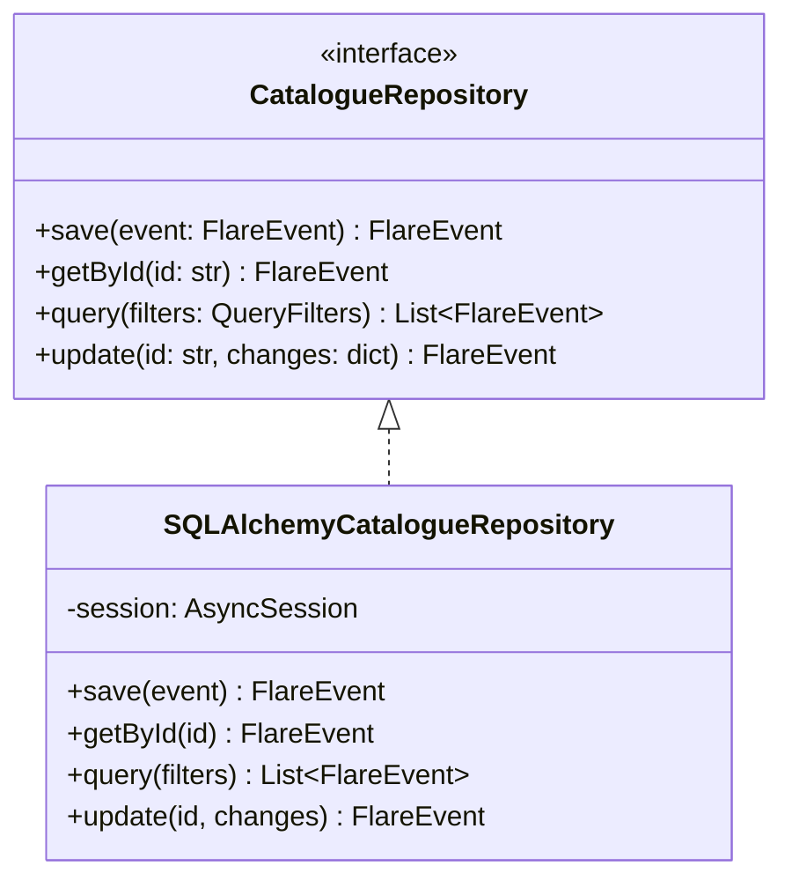
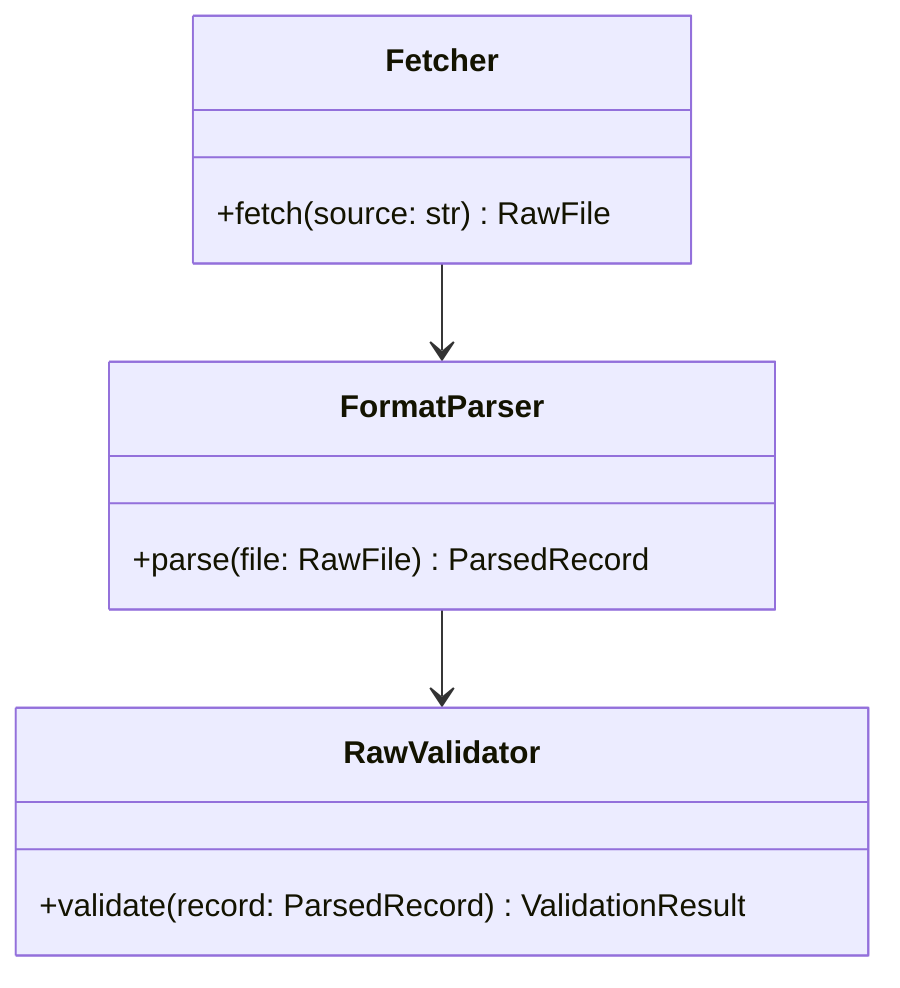

# 05 — Low-Level Design

**HeliosAI** — AI-Powered Space Weather Intelligence Platform
Document 05 of 61

---

## 1. Executive Summary

This document drops to class/interface-level detail for the components defined in `04_High_Level_Design.md`: key class signatures, the shared Intelligence model interface, repository pattern contracts, and the design-pattern rationale that `56_Coding_Standards.md` assumes as already decided.

---

## 2. Purpose

Give implementers (human or Antigravity) exact interface contracts so independently-implemented modules remain compatible without a shared implementation session.

---

## 3. Scope

Class-level interfaces, method signatures (language-level, not full bodies), and pattern application detail. Excludes database column-level schema (`30_Database_Design.md`) and REST route paths (`32_API_Design.md`).

---

## 4. Core Design Patterns and Their Application

| Pattern | Applied To | Rationale |
|---|---|---|
| Repository | All DB access from Serving/Intelligence | Decouples business logic from SQLAlchemy specifics; enables test doubles |
| Service Layer | Business logic orchestration (e.g., `NowcastingService`) | Keeps FastAPI route handlers thin |
| Strategy | Swappable nowcasting/forecasting model backends | Enables A/B model comparison without call-site changes |
| Dependency Injection | FastAPI `Depends()` throughout | Testability, explicit dependency graph |
| Factory | Model instantiation from MLflow registry pointer | Isolates model-loading logic from inference call sites |
| Observer / Pub-Sub | Alert dispatch fan-out | New alert channels subscribe without modifying the Intelligence layer |

---

## 5. Intelligence Subsystem — Shared Model Interface



Every model family (`26_Machine_Learning.md`, `27_Deep_Learning.md`, `28_Transformer_Models.md`) implements this exact interface, referenced already by `56_Coding_Standards.md` §6.

---

## 6. Repository Pattern Contract



Applied identically for `LightCurveRepository`, `AlertRepository`, `ModelRunRepository` — one repository interface per aggregate root, never a generic "god repository."

---

## 7. Service Layer Example — NowcastingService

```python
class NowcastingService:
    def __init__(
        self,
        catalogue_repo: CatalogueRepository,
        soft_detector: FlareModel,
        hard_detector: FlareModel,
        fusion_policy: FusionPolicy,
    ): ...

    def process_window(self, features: FeatureWindow) -> list[FlareEvent]:
        """Detect independently per band, fuse, persist, return promoted events."""
```

Constructor-injected dependencies (repository, detectors, fusion policy) make this class fully testable with in-memory doubles — no database or model required for unit tests (`53_Testing.md`).

---

## 8. Class Diagram — Ingestion Subsystem



---

## 9. Error Handling Contract

| Layer | Exception Base Class | Handling Rule |
|---|---|---|
| Ingestion | `IngestionError` | Retried per `34_Background_Jobs.md` retry policy, then quarantined |
| Processing | `ProcessingError` | Logged with input snapshot ID, does not crash the pipeline for other data |
| Intelligence | `ModelInferenceError` | Falls back to last-known-good model version, alerts `admin` |
| Serving | `APIError` (subclassed per HTTP status) | Converted to structured JSON error response, never a raw stack trace |

---

## 10. Validation Rules (Cross-Cutting)

- All Pydantic models reject unknown fields (`model_config = ConfigDict(extra="forbid")`) to catch upstream schema drift early.
- All timestamps are timezone-aware UTC; naive datetimes are a validation error, not a silent assumption.
- All flux values are validated non-negative; negative flux after background subtraction is flagged, not silently clipped, since it may indicate a calibration issue worth surfacing.

---

## 11. Research Notes

The `FlareModel` interface deliberately mirrors scikit-learn's `fit`/`predict`/`predict_proba` convention so gradient-boosted-tree and deep-learning implementations both feel idiomatic to their respective ecosystems while remaining swappable.

---

## 12. Acceptance Criteria

- [ ] Every interface defined here is implemented by at least one concrete class in later documents.
- [ ] Every pattern in §4 is traceable to a specific class diagram in this document.
- [ ] Error handling contract is referenced (not restated) by `44_Logging.md` and `54_Security.md`.

---

## 13. Review Checklist

- [ ] No database column-level detail (belongs in `30`).
- [ ] No REST path detail (belongs in `32`).
- [ ] All class diagrams valid Mermaid syntax.

---

## 14. Future Improvements

- Add a `FlareModel` ensemble wrapper interface once multiple production models are combined (`60_Future_Enhancements.md` — ensemble forecasting).

---

## Antigravity Development Prompt

```
PROJECT CONTEXT:
HeliosAI dual-band Aditya-L1 flare nowcasting/forecasting platform (ISRO PS-15).
Document 05 of 61: Low-Level Design — class interfaces, patterns, error/validation contracts.

FOLDER: docs/05_Low_Level_Design.md

FILES TO PRODUCE: docs/05_Low_Level_Design.md only.

CODING STANDARDS: Markdown with embedded Python interface snippets (type-hinted, PEP 8
compliant) and Mermaid class diagrams. Interface names (FlareModel, CatalogueRepository,
NowcastingService) are canonical and must be reused verbatim by 22_Nowcasting.md,
23_Forecasting.md, 26-28 (ML/DL/Transformer docs), and 56_Coding_Standards.md.

EXPECTED OUTPUT: Design pattern table, FlareModel interface class diagram, repository
pattern class diagram, service layer example, ingestion class diagram, error handling
contract table, validation rules — exactly as sectioned above.

EDGE CASES / VALIDATION: Every interface must have at least one concrete implementer named
in a later document; every pattern claimed in §4 must have a corresponding diagram.

TESTING: Interface-conformance check once implementation exists — every concrete model class
must satisfy the FlareModel interface's full method signature set.

ACCEPTANCE CRITERIA: See §12 above.

DELIVERABLES: docs/05_Low_Level_Design.md

GIT COMMIT FORMAT: docs: add 05_Low_Level_Design.md (interfaces, patterns, error contracts)
```

---

**Next document:** `06_Project_Folder_Structure.md` — say **NEXT** to continue.
