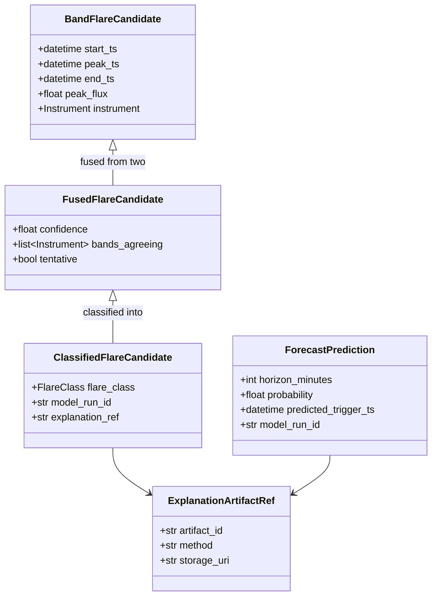

# 05. Low-Level Design (LLD)

## Table of Contents

1. [Executive Summary](#executive-summary)
2. [Problem Statement](#problem-statement)
3. [Objectives](#objectives)
4. [Scope](#scope)
5. [Shared Schemas](#shared-schemas)
6. [Ingestion Subsystem — Low-Level Design](#ingestion-subsystem--low-level-design)
7. [Processing Subsystem — Low-Level Design](#processing-subsystem--low-level-design)
8. [Intelligence Subsystem — Low-Level Design](#intelligence-subsystem--low-level-design)
9. [Serving Subsystem — Low-Level Design](#serving-subsystem--low-level-design)
10. [Experience Subsystem — Low-Level Design](#experience-subsystem--low-level-design)
11. [Class Diagrams](#class-diagrams)
12. [Algorithms (Full Pseudocode)](#algorithms-full-pseudocode)
13. [Database Tables (LLD-Level)](#database-tables-lld-level)
14. [API Design (LLD-Level)](#api-design-lld-level)
15. [Security](#security)
16. [Performance](#performance)
17. [Scalability](#scalability)
18. [Error Handling](#error-handling)
19. [Validation](#validation)
20. [Testing](#testing)
21. [Acceptance Criteria](#acceptance-criteria)
22. [Implementation Notes](#implementation-notes)
23. [Future Scope](#future-scope)
24. [References](#references)
25. [Revision History](#revision-history)

---

## Executive Summary

This document provides **function- and class-level detail** for every module named in `04_High_Level_Design.md`. It is the last design document before implementation-facing artifacts (folder structure finalization, tech stack pinning, and eventually the Antigravity master prompts). Every signature here uses Python type hints and Pydantic models consistent with the 100%-Python tech stack decision in the README.

To keep this document navigable while still exhaustive, it is organized identically to the HLD's module table, with one subsection per module giving: purpose, public interface (typed signatures), internal algorithm summary, dependencies, and error modes. Full algorithmic pseudocode for the scientifically critical modules (fusion, forecasting, lead-time reconciliation) is broken out separately in [Algorithms (Full Pseudocode)](#algorithms-full-pseudocode).

---

## Problem Statement

The HLD establishes module boundaries and contracts but does not specify *how* each module fulfills its contract internally. Without function-level design, downstream Antigravity prompts would leave critical algorithmic decisions (e.g., exact fusion confidence formula, exact lead-time computation) to implementation-time improvisation, undermining the "no unmeasured claims / no black boxes" principle from `01_Project_Vision.md`.

---

## Objectives

1. Specify concrete Python type signatures for every module's public interface.
2. Specify the internal algorithm (pseudocode-level) for every scientifically or architecturally non-trivial module.
3. Specify error types raised by each module, tying back to the shared exception hierarchy from the HLD.

---

## Scope

Covers all modules listed in `04_High_Level_Design.md`. Database column-level definitions are in `30_Database_Design.md`; full REST/WebSocket contracts are in `32_API_Design.md`. This document focuses on **module-internal logic and typed interfaces**.

---

## Shared Schemas

All modules import from `shared/schemas/`. Key shared Pydantic models (abbreviated; full field lists finalized during implementation):

```python
# shared/schemas/lightcurve.py
from pydantic import BaseModel, field_validator
from datetime import datetime
from enum import Enum

class Instrument(str, Enum):
    SOLEXS = "solexs"
    HEL1OS = "hel1os"

class RawLightCurvePoint(BaseModel):
    instrument: Instrument
    spacecraft_time: float          # raw onboard clock value
    flux: float
    energy_channel: str
    quality_flag: int

    @field_validator("flux")
    @classmethod
    def flux_non_negative(cls, v: float) -> float:
        if v < 0:
            raise ValueError("flux must be non-negative")
        return v

class RawLightCurveBatch(BaseModel):
    instrument: Instrument
    source_file: str
    ingested_at: datetime
    points: list[RawLightCurvePoint]
    correlation_id: str

class ProcessedLightCurvePoint(BaseModel):
    instrument: Instrument
    utc_timestamp: datetime
    flux_cleaned: float
    background_level: float
    data_quality_flags: list[str]

class EngineeredFeatureRow(BaseModel):
    utc_timestamp: datetime
    solexs_flux: float
    hel1os_flux: float
    hardness_ratio: float
    flux_gradient_solexs: float
    flux_gradient_hel1os: float
    wavelet_energy_solexs: float
    wavelet_energy_hel1os: float
    data_snapshot_id: str

class FlareClass(str, Enum):
    A = "A"; B = "B"; C = "C"; M = "M"; X = "X"

class FusedFlareCandidate(BaseModel):
    start_ts: datetime
    peak_ts: datetime
    end_ts: datetime
    peak_flux_solexs: float | None
    peak_flux_hel1os: float | None
    confidence: float               # 0.0 - 1.0
    bands_agreeing: list[Instrument]
    tentative: bool

class ClassifiedFlareCandidate(FusedFlareCandidate):
    flare_class: FlareClass
    model_run_id: str
    data_snapshot_id: str
    explanation_ref: str | None

class ForecastPrediction(BaseModel):
    horizon_minutes: int
    probability: float              # 0.0 - 1.0
    predicted_class_if_occurs: FlareClass | None
    predicted_trigger_ts: datetime
    model_run_id: str
    data_snapshot_id: str
    explanation_ref: str | None

class ExplanationArtifactRef(BaseModel):
    artifact_id: str
    method: str                     # "shap" | "integrated_gradients" | "attention"
    storage_uri: str
```

These are the canonical types referenced throughout the module specs below.

---

## Ingestion Subsystem — Low-Level Design

### `fetcher`

```python
class PradanFetcher:
    def __init__(self, config: PradanFetchConfig): ...

    def fetch_latest(self, instrument: Instrument) -> list[Path]:
        """Poll PRADAN for new files since last successful fetch checkpoint.
        Falls back to manual-drop directory scan if PRADAN auth unavailable."""

    def fetch_range(self, instrument: Instrument, start: datetime, end: datetime) -> list[Path]:
        """Used for backfill/reprocessing DAGs."""
```
**Errors:** `PradanUnavailableError`, `FetchCheckpointCorruptError`.
**Dependencies:** `httpx`, checkpoint store (Redis key `fetch:checkpoint:{instrument}`).

### `parser`

```python
class LightCurveParser:
    def parse(self, file_path: Path, instrument: Instrument) -> RawLightCurveBatch:
        """Dispatches to FITS/CDF/CSV-specific parser based on file extension
        and instrument-specific format spec."""
```
**Errors:** `UnsupportedFormatError`, `MalformedFileError`.

### `validator`

```python
class RawDataValidator:
    def validate(self, batch: RawLightCurveBatch) -> ValidationResult:
        """Applies Pydantic schema validation + physical range checks
        (flux >= 0, monotonic-ish spacecraft_time, expected energy channels present)."""
```
Returns `ValidationResult(is_valid: bool, errors: list[str], quarantine_reason: str | None)`. Invalid batches are routed to `data/quarantine/{instrument}/{source_file}` and logged, never silently dropped (FR-05).

### `ingestion_publisher`

```python
class IngestionPublisher:
    def publish(self, batch: RawLightCurveBatch) -> None:
        """Serializes batch to Redis queue 'processing:incoming' with
        correlation_id propagated for end-to-end tracing."""
```

---

## Processing Subsystem — Low-Level Design

### `time_sync`

```python
class TimeSynchronizer:
    def synchronize(self, batch: RawLightCurveBatch, clock_model: SpacecraftClockModel) -> list[ProcessedLightCurvePoint]:
        """Converts spacecraft_time -> UTC using the instrument's clock model
        (offset + drift correction). Flags gaps > configured threshold as
        'sync_gap' in data_quality_flags rather than interpolating silently."""
```

### `noise_filter`

```python
class NoiseFilter:
    def subtract_background(self, points: list[ProcessedLightCurvePoint]) -> list[ProcessedLightCurvePoint]:
        """Rolling-percentile background estimate (e.g., 10th percentile over
        a trailing window) subtracted from raw flux."""

    def filter_noise(self, points: list[ProcessedLightCurvePoint]) -> list[ProcessedLightCurvePoint]:
        """Savitzky-Golay or median filter to suppress instrumental noise
        while preserving flare rise/decay shape."""
```

### `feature_engineer`

```python
class FeatureEngineer:
    def compute_hardness_ratio(self, solexs: float, hel1os: float) -> float:
        """(hel1os - solexs) / (hel1os + solexs), guarded against div-by-zero."""

    def compute_gradient(self, series: list[float], dt: list[float]) -> list[float]:
        """First-derivative flux gradient via finite differences."""

    def compute_wavelet_energy(self, series: list[float], wavelet: str = "morl") -> list[float]:
        """Continuous wavelet transform (PyWavelets) energy per time bin,
        used as a precursor-sensitive feature."""

    def build_feature_row(self, solexs_pt: ProcessedLightCurvePoint,
                           hel1os_pt: ProcessedLightCurvePoint,
                           data_snapshot_id: str) -> EngineeredFeatureRow: ...
```

### `band_fusion`

```python
class BandAligner:
    def align(self, solexs_series: list[ProcessedLightCurvePoint],
              hel1os_series: list[ProcessedLightCurvePoint]) -> list[tuple]:
        """Nearest-neighbor time alignment within a configured tolerance window;
        unmatched points on either side are flagged, not dropped."""
```

### `persistence_writer`

```python
class PersistenceWriter:
    def write_processed(self, points: list[ProcessedLightCurvePoint]) -> None: ...
    def write_features(self, rows: list[EngineeredFeatureRow]) -> str:
        """Returns data_snapshot_id for the written batch, used downstream
        for full auditability (NFR-08)."""
```

---

## Intelligence Subsystem — Low-Level Design

### `nowcast_solexs_detector` / `nowcast_hel1os_detector`

```python
class ThresholdChangepointDetector:
    def __init__(self, threshold_config: DetectorThresholdConfig): ...

    def detect(self, series: list[EngineeredFeatureRow], instrument: Instrument) -> list[BandFlareCandidate]:
        """Combines a static/dynamic flux threshold crossing check with a
        changepoint algorithm (e.g., CUSUM or Bayesian online changepoint
        detection) to identify candidate flare onset/peak/decay windows."""
```
Full algorithm in [Algorithms](#algorithms-full-pseudocode).

### `nowcast_fusion_engine`

```python
class FusionEngine:
    def fuse(self, solexs_candidates: list[BandFlareCandidate],
             hel1os_candidates: list[BandFlareCandidate]) -> list[FusedFlareCandidate]:
        """Time-window overlap matching between band candidates; computes
        a confidence score; marks unmatched single-band candidates tentative."""
```

### `flare_classifier`

```python
class FlareClassifier:
    def classify(self, candidate: FusedFlareCandidate) -> FlareClass:
        """Maps peak flux (SoLEXS primary, HEL1OS as corroboration) to a
        GOES-equivalent class bin via calibrated flux-to-class thresholds."""
```

### `forecast_feature_window` / `forecast_baseline_models` / `forecast_deep_models`

```python
class FeatureWindowBuilder:
    def build_window(self, series: list[EngineeredFeatureRow], lookback_minutes: int) -> "FeatureWindow": ...

class BaselineForecastModel(Protocol):
    def predict_proba(self, window: "FeatureWindow", horizon_minutes: int) -> ForecastPrediction: ...

class XGBoostForecastModel(BaselineForecastModel):
    def __init__(self, model_run_id: str): ...
    def predict_proba(self, window: "FeatureWindow", horizon_minutes: int) -> ForecastPrediction: ...

class DeepForecastModel(Protocol):
    def predict_proba(self, window: "FeatureWindow", horizon_minutes: int) -> ForecastPrediction: ...

class PatchTSTForecastModel(DeepForecastModel):
    def __init__(self, model_run_id: str, checkpoint_uri: str): ...
    def predict_proba(self, window: "FeatureWindow", horizon_minutes: int) -> ForecastPrediction: ...
```

### `lead_time_reconciler`

```python
class LeadTimeReconciler:
    def reconcile(self, forecast: ForecastPrediction, catalogue: "CatalogueQueryService") -> ForecastReconciliationResult:
        """Looks up whether a catalogue entry with peak_ts within
        [predicted_trigger_ts, predicted_trigger_ts + horizon_minutes] exists.
        If yes: lead_time = catalogue_entry.peak_ts - forecast.predicted_trigger_ts (Confirmed).
        If no, once horizon has elapsed: marks Expired (false positive)."""
```
Full algorithm in [Algorithms](#algorithms-full-pseudocode).

### `explainability_tree` / `explainability_deep`

```python
class TreeExplainer:
    def explain(self, model: BaselineForecastModel, window: "FeatureWindow") -> ExplanationArtifactRef:
        """Runs SHAP TreeExplainer, persists force-plot/summary data,
        returns a reference, never the raw explanation inline in the API response."""

class DeepExplainer:
    def explain(self, model: DeepForecastModel, window: "FeatureWindow") -> ExplanationArtifactRef:
        """Runs Captum IntegratedGradients (or attention-weight extraction
        for Transformer-family models), persists artifact, returns reference."""
```

### `catalogue_builder`

```python
class CatalogueBuilder:
    def build_catalogue_entry(self, classified: ClassifiedFlareCandidate) -> "FlareCatalogueRow": ...
    def build_forecast_entry(self, prediction: ForecastPrediction) -> "ForecastEventRow": ...
```

---

## Serving Subsystem — Low-Level Design

### `auth_module`

```python
class AuthService:
    def authenticate(self, username: str, password: str) -> TokenPair: ...
    def refresh(self, refresh_token: str) -> TokenPair: ...
    def get_current_user(self, token: str = Depends(oauth2_scheme)) -> "User": ...
    def require_role(self, role: "Role"): ...  # FastAPI dependency factory
```

### `rest_routes_catalogue` (representative example)

```python
@router.get("/api/v1/catalogue", response_model=list[FlareCatalogueResponse])
def list_catalogue(
    start: datetime | None = None,
    end: datetime | None = None,
    flare_class: FlareClass | None = None,
    min_confidence: float = 0.0,
    include_tentative: bool = True,
    current_user: User = Depends(auth.get_current_user),
) -> list[FlareCatalogueResponse]: ...
```

### `websocket_gateway`

```python
class WebSocketGateway:
    async def connect(self, websocket: WebSocket, user: "User") -> None: ...
    async def broadcast(self, event: "AlertEvent") -> None:
        """Subscribes to Redis Pub/Sub channel 'alerts:stream' and fans out
        to all connected WebSocket clients."""
```

### `alert_dispatcher`

```python
class AlertDispatcher:
    def dispatch(self, event: "AlertEvent") -> None:
        """Publishes to Redis 'alerts:stream'; optionally invokes configured
        webhook/email sender based on user alert preferences (FR-28)."""
```

---

## Experience Subsystem — Low-Level Design

### `lightcurve_view` (Dash)

```python
def register_lightcurve_callbacks(app: Dash) -> None:
    @app.callback(
        Output("lightcurve-graph", "figure"),
        Input("time-range-picker", "value"),
        Input("instrument-toggle", "value"),
    )
    def update_lightcurve(time_range, instruments):
        """Fetches processed light curve + catalogue overlay via REST client,
        renders dual-axis Plotly figure (SoLEXS vs HEL1OS) with flare markers."""
```

### `alert_console` (Dash + WebSocket bridge)

```python
class DashWebSocketBridge:
    def on_message(self, message: dict) -> None:
        """Pushes incoming WebSocket alert events into a Dash
        dcc.Store, triggering a client-side callback to render the alert banner."""
```

---

## Class Diagrams



---

## Algorithms (Full Pseudocode)

### Fusion Confidence Score

```
function fuse(solexs_candidates, hel1os_candidates, overlap_tolerance):
    fused = []
    matched_hel1os = set()

    for sc in solexs_candidates:
        best_match = find_overlapping_candidate(sc, hel1os_candidates, overlap_tolerance)
        if best_match exists:
            confidence = 0.5 * normalize(sc.peak_flux) + 0.5 * normalize(best_match.peak_flux)
            confidence *= overlap_quality(sc, best_match)   # tighter time overlap -> higher confidence
            fused.append(FusedFlareCandidate(
                start_ts = min(sc.start_ts, best_match.start_ts),
                peak_ts = weighted_peak_time(sc, best_match),
                end_ts = max(sc.end_ts, best_match.end_ts),
                confidence = confidence,
                bands_agreeing = [SOLEXS, HEL1OS],
                tentative = False
            ))
            matched_hel1os.add(best_match.id)
        else:
            fused.append(FusedFlareCandidate(
                ...from sc only...,
                confidence = 0.5 * normalize(sc.peak_flux) * SINGLE_BAND_PENALTY,
                bands_agreeing = [SOLEXS],
                tentative = True
            ))

    for hc in hel1os_candidates where hc.id not in matched_hel1os:
        fused.append(FusedFlareCandidate(
            ...from hc only...,
            confidence = 0.5 * normalize(hc.peak_flux) * SINGLE_BAND_PENALTY,
            bands_agreeing = [HEL1OS],
            tentative = True
        ))

    return fused
```
`SINGLE_BAND_PENALTY` is a configured constant (< 1.0) that lowers confidence for single-band detections without discarding them, per FR-15.

### Lead-Time Reconciliation

```
function reconcile(forecast, catalogue_query_service):
    horizon_end = forecast.predicted_trigger_ts + forecast.horizon_minutes
    matches = catalogue_query_service.query(
        peak_ts_between = [forecast.predicted_trigger_ts, horizon_end],
        min_confidence = RECONCILIATION_CONFIDENCE_FLOOR
    )
    if matches is not empty:
        best_match = closest_by_peak_time(matches, forecast.predicted_trigger_ts)
        lead_time = best_match.peak_ts - forecast.predicted_trigger_ts
        return ForecastReconciliationResult(status=CONFIRMED, lead_time=lead_time, matched_catalogue_id=best_match.id)
    elif now() > horizon_end:
        return ForecastReconciliationResult(status=EXPIRED, lead_time=None, matched_catalogue_id=None)
    else:
        return ForecastReconciliationResult(status=AWAITING, lead_time=None, matched_catalogue_id=None)
```

### Threshold + Changepoint Detection (per band)

```
function detect(series, threshold_config):
    baseline = rolling_percentile(series.flux, percentile=10, window=threshold_config.baseline_window)
    residual = series.flux - baseline
    changepoints = cusum_changepoint(residual, drift=threshold_config.cusum_drift,
                                      threshold=threshold_config.cusum_threshold)

    candidates = []
    for cp in changepoints:
        if residual[cp] > threshold_config.min_flux_threshold:
            onset = find_onset_before(cp, residual, threshold_config.onset_fraction)
            peak = find_local_max(cp, residual, search_window=threshold_config.peak_search_window)
            decay_end = find_decay_end(peak, residual, threshold_config.decay_fraction)
            candidates.append(BandFlareCandidate(start_ts=onset, peak_ts=peak, end_ts=decay_end,
                                                  peak_flux=residual[peak], instrument=series.instrument))
    return merge_overlapping(candidates)
```

---

## Database Tables (LLD-Level)

Field-level DDL is defined in `30_Database_Design.md`; every Pydantic model in [Shared Schemas](#shared-schemas) maps 1:1 to a corresponding SQLAlchemy ORM model with matching field names to keep the API/DB layers mechanically consistent.

---

## API Design (LLD-Level)

Endpoint-level request/response schemas are the Pydantic models shown under [Serving Subsystem](#serving-subsystem--low-level-design) above; full contract including status codes and error envelopes in `32_API_Design.md`.

---

## Security

- Every module boundary that crosses a process/service line (Redis queue messages, REST payloads) is validated against its Pydantic schema before use — this is the concrete mechanism implementing NFR-05/NFR-09 validation-security overlap.
- `AuthService.require_role()` is a FastAPI dependency factory, ensuring role checks are declarative at the route level, not scattered as manual `if` checks inside handler bodies (reduces risk of a missed check).

---

## Performance

- `ThresholdChangepointDetector.detect()` for both instruments is designed to run as independent Celery tasks (`nowcast_solexs_detector`, `nowcast_hel1os_detector`), executed in parallel via `celery.group`, before `FusionEngine.fuse()` runs as the join step.
- `FeatureWindowBuilder.build_window()` caches the most recent N minutes of engineered features in Redis to avoid a full TimescaleDB query on every forecast tick in streaming mode.

---

## Scalability

- All Intelligence-layer classes are constructed with an explicit `model_run_id`/`checkpoint_uri`, not a global singleton model — this allows multiple model versions to run concurrently (e.g., canary evaluation) across scaled-out workers.

---

## Error Handling

| Exception | Raised By | Handling |
|---|---|---|
| `PradanUnavailableError` | `fetcher` | Retry with backoff; fall back to manual-drop mode; alert admin after N failures |
| `MalformedFileError` | `parser` | Quarantine file; log; do not crash the fetch loop |
| `DataQualityError` | `validator`, `time_sync` | Quarantine/flag; propagate `data_quality_flags` downstream rather than raising when non-fatal |
| `ModelInferenceError` | `forecast_*_models`, `nowcast_*_detector` | Caught at Celery task level; task retried; if still failing, task routed to dead-letter queue, visible in Admin Panel |
| `ExplanationGenerationError` | `explainability_*` | Per FR-23, if explanation generation fails, the underlying nowcast/forecast is **held back** from the catalogue/API/dashboard until an explanation is successfully attached or an administrator overrides |

---

## Validation

- Every Pydantic model above enforces field-level validation (e.g., `probability` bounded [0,1] via `field_validator`, `flux` non-negative).
- `FusionEngine.fuse()` output is validated to ensure `bands_agreeing` is never empty and `confidence` is always in [0,1] before being passed to `flare_classifier`.

---

## Testing

- Each class above has a corresponding unit test module (e.g., `test_fusion_engine.py` covering: both-bands-match case, single-band-only case, no-candidates case, boundary overlap-tolerance case).
- `lead_time_reconciler` unit tests explicitly cover CONFIRMED, EXPIRED, and AWAITING states with synthetic timestamps.

---

## Acceptance Criteria

- [ ] Every module in `04_High_Level_Design.md`'s inventory has a corresponding LLD subsection with typed signatures.
- [ ] Fusion, lead-time reconciliation, and detection algorithms are specified in unambiguous pseudocode.
- [ ] Every cross-module Pydantic schema referenced in the HLD is concretely defined here.
- [ ] Error type table covers every module category (ingestion, processing, intelligence, serving).

---

## Implementation Notes

- This LLD is the final shared design reference before per-module Antigravity prompts are generated (`61_Antigravity_Master_Prompt.md` and `prompts/antigravity/*.md`); each prompt will quote its module's relevant subsection verbatim as authoritative context.
- Exact hyperparameters (CUSUM drift/threshold, wavelet family, model architectures' layer sizes) are intentionally left as **configuration**, not hardcoded — finalized in `47_Model_Training.md` and a checked-in `config/` module.

---

## Future Scope

- Formal interface versioning (e.g., `EngineeredFeatureRow.v2`) once the schema needs to evolve without breaking already-deployed model artifacts referenced by `model_run_id`.

---

## References

1. `04_High_Level_Design.md` — module inventory this LLD elaborates.
2. `02_Software_Requirements_Specification.md` — requirement IDs referenced throughout.
3. SHAP, Captum, PyWavelets, XGBoost/LightGBM/CatBoost, PyTorch official documentation.

---

## Revision History

| Version | Date | Author | Notes |
|---|---|---|---|
| 0.1 | 2026-07-11 | HeliosAI Documentation (Antigravity workflow) | Initial LLD — full typed interfaces, class diagram, and pseudocode for fusion/detection/lead-time algorithms established |

---

**Next document:** `06_Project_Folder_Structure.md` — say **NEXT** to continue.
