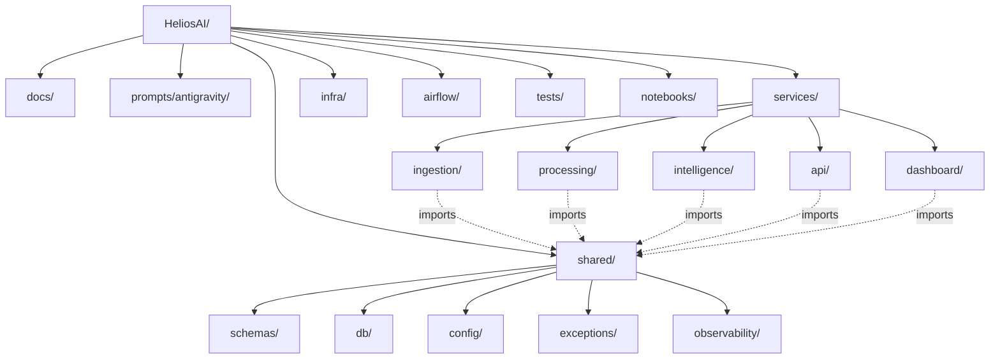
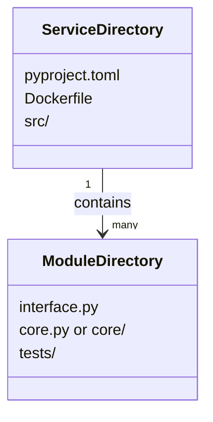

# 06. Project Folder Structure

## Table of Contents

1. [Executive Summary](#executive-summary)
2. [Problem Statement](#problem-statement)
3. [Objectives](#objectives)
4. [Scope](#scope)
5. [Folder Structure Design Principles](#folder-structure-design-principles)
6. [Complete Repository Tree](#complete-repository-tree)
7. [Per-Service Internal Structure](#per-service-internal-structure)
8. [Shared Package Structure](#shared-package-structure)
9. [Infra and Deployment Structure](#infra-and-deployment-structure)
10. [Airflow DAGs Structure](#airflow-dags-structure)
11. [Tests Structure](#tests-structure)
12. [Notebooks Structure](#notebooks-structure)
13. [Diagrams](#diagrams)
14. [Naming Conventions](#naming-conventions)
15. [File Ownership Map](#file-ownership-map)
16. [Security](#security)
17. [Performance](#performance)
18. [Scalability](#scalability)
19. [Error Handling](#error-handling)
20. [Validation](#validation)
21. [Testing](#testing)
22. [Acceptance Criteria](#acceptance-criteria)
23. [Implementation Notes](#implementation-notes)
24. [Future Scope](#future-scope)
25. [References](#references)
26. [Revision History](#revision-history)

---

## Executive Summary

This document is the authoritative, exhaustive repository layout for HeliosAI. Every module named in `04_High_Level_Design.md` and every class/function named in `05_Low_Level_Design.md` has a fixed, predictable home here. This structure is what every Antigravity master prompt will reference when instructing a contributor (human or AI) exactly where new code belongs — eliminating ambiguity about file placement, a common source of merge conflicts in multi-contributor open-source projects.

---

## Problem Statement

Without a fixed, documented folder structure agreed upon before implementation begins, a project with 6 subsystems, 33+ modules, and an open, GSSoC-style contributor base is highly prone to structural drift — duplicated utility code, inconsistent import paths, and merge conflicts from contributors independently deciding where a new file belongs.

---

## Objectives

1. Define one unambiguous folder location for every module identified in the HLD/LLD.
2. Keep each service (`ingestion`, `processing`, `intelligence`, `api`, `dashboard`) independently `pip install`-able / Dockerizable.
3. Ensure shared code (schemas, DB models, config, exceptions) lives in exactly one place, imported — never duplicated — by every service.
4. Keep test, infra, and documentation structure aligned 1:1 with the source structure.

---

## Scope

Covers the full repository tree for the 100%-Python HeliosAI implementation, at the level of directories and representative files. Individual function bodies are out of scope here (see `05_Low_Level_Design.md`).

---

## Folder Structure Design Principles

1. **Service isolation** — each of the 5 runnable services (`ingestion`, `processing`, `intelligence`, `api`, `dashboard`) is a self-contained Python package under `services/`, each with its own `pyproject.toml`/`requirements.txt` and `Dockerfile`.
2. **Shared-nothing except `shared/`** — the only code any two services may both import is what lives in `shared/`. No service imports directly from another service's internals.
3. **One module = one directory** — every module named in the HLD gets its own directory with `interface.py`, `core.py` (or `core/` package), and `tests/`.
4. **Docs mirror code** — `docs/` module-reference numbering (17–45 etc.) corresponds to the subsystem folders under `services/`.
5. **Config is centralized, never hardcoded per-service** — all tunable parameters (thresholds, model hyperparameters, DB URLs) load from `shared/config/` + environment variables, never literals scattered in module code.

---

## Complete Repository Tree

```
HeliosAI/
├── README.md
├── LICENSE
├── CONTRIBUTING.md
├── .env.example
├── .gitignore
├── pyproject.toml                     # workspace-level tooling config (black, ruff, mypy)
├── docker-compose.yml
├── docker-compose.override.yml.example
├── Makefile
│
├── docs/                              # 61-document specification set (this series)
│   └── ...
│
├── prompts/
│   └── antigravity/
│       ├── 00_master_index.md
│       ├── ingestion/
│       │   ├── fetcher.md
│       │   ├── parser.md
│       │   ├── validator.md
│       │   └── ingestion_publisher.md
│       ├── processing/
│       │   ├── time_sync.md
│       │   ├── noise_filter.md
│       │   ├── feature_engineer.md
│       │   ├── band_fusion.md
│       │   └── persistence_writer.md
│       ├── intelligence/
│       │   ├── nowcast_solexs_detector.md
│       │   ├── nowcast_hel1os_detector.md
│       │   ├── nowcast_fusion_engine.md
│       │   ├── flare_classifier.md
│       │   ├── forecast_feature_window.md
│       │   ├── forecast_baseline_models.md
│       │   ├── forecast_deep_models.md
│       │   ├── lead_time_reconciler.md
│       │   ├── explainability_tree.md
│       │   ├── explainability_deep.md
│       │   └── catalogue_builder.md
│       ├── api/
│       │   ├── auth_module.md
│       │   ├── rest_routes_lightcurve.md
│       │   ├── rest_routes_catalogue.md
│       │   ├── rest_routes_forecast.md
│       │   ├── rest_routes_explanation.md
│       │   ├── rest_routes_admin.md
│       │   ├── websocket_gateway.md
│       │   └── alert_dispatcher.md
│       └── dashboard/
│           ├── layout_shell.md
│           ├── lightcurve_view.md
│           ├── catalogue_view.md
│           ├── alert_console.md
│           ├── explanation_view.md
│           └── admin_panel.md
│
├── services/
│   ├── ingestion/
│   ├── processing/
│   ├── intelligence/
│   ├── api/
│   └── dashboard/
│
├── shared/
│   ├── schemas/
│   ├── db/
│   ├── config/
│   ├── exceptions/
│   └── observability/
│
├── infra/
│   ├── docker/
│   └── k8s/
│
├── airflow/
│   └── dags/
│
├── tests/
│   ├── integration/
│   └── fixtures/
│
├── notebooks/
│
├── data/                              # gitignored except .gitkeep; raw/quarantine/backfill working dirs
│   ├── raw/
│   ├── quarantine/
│   └── backfill/
│
└── .github/
    └── workflows/
        ├── ci.yml
        ├── cd.yml
        └── docs-lint.yml
```

---

## Per-Service Internal Structure

### `services/ingestion/`

```
ingestion/
├── pyproject.toml
├── Dockerfile
├── src/
│   └── ingestion/
│       ├── __init__.py
│       ├── fetcher/
│       │   ├── interface.py
│       │   ├── core.py
│       │   └── tests/
│       ├── parser/
│       │   ├── interface.py
│       │   ├── core/
│       │   │   ├── fits_parser.py
│       │   │   ├── cdf_parser.py
│       │   │   └── csv_parser.py
│       │   └── tests/
│       ├── validator/
│       │   ├── interface.py
│       │   ├── core.py
│       │   └── tests/
│       └── ingestion_publisher/
│           ├── interface.py
│           ├── core.py
│           └── tests/
└── main.py                            # entrypoint (fetch loop / manual-drop watcher)
```

### `services/processing/`

```
processing/
├── pyproject.toml
├── Dockerfile
├── src/
│   └── processing/
│       ├── time_sync/
│       ├── noise_filter/
│       ├── feature_engineer/
│       ├── band_fusion/
│       └── persistence_writer/
└── worker.py                          # Celery worker entrypoint
```

### `services/intelligence/`

```
intelligence/
├── pyproject.toml
├── Dockerfile
├── src/
│   └── intelligence/
│       ├── nowcast_solexs_detector/
│       ├── nowcast_hel1os_detector/
│       ├── nowcast_fusion_engine/
│       ├── flare_classifier/
│       ├── forecast_feature_window/
│       ├── forecast_baseline_models/
│       │   ├── interface.py
│       │   ├── xgboost_model.py
│       │   ├── lightgbm_model.py
│       │   └── catboost_model.py
│       ├── forecast_deep_models/
│       │   ├── interface.py
│       │   ├── lstm_model.py
│       │   ├── gru_model.py
│       │   ├── informer_model.py
│       │   ├── patchtst_model.py
│       │   └── tft_model.py
│       ├── lead_time_reconciler/
│       ├── explainability_tree/
│       ├── explainability_deep/
│       └── catalogue_builder/
└── worker.py
```

### `services/api/`

```
api/
├── pyproject.toml
├── Dockerfile
├── src/
│   └── api/
│       ├── main.py                    # FastAPI app factory
│       ├── auth_module/
│       ├── rest_routes_lightcurve/
│       ├── rest_routes_catalogue/
│       ├── rest_routes_forecast/
│       ├── rest_routes_explanation/
│       ├── rest_routes_admin/
│       ├── websocket_gateway/
│       └── alert_dispatcher/
└── tests/
```

### `services/dashboard/`

```
dashboard/
├── pyproject.toml
├── Dockerfile
├── src/
│   └── dashboard/
│       ├── app.py                     # Dash app entrypoint
│       ├── layout_shell/
│       ├── lightcurve_view/
│       ├── catalogue_view/
│       ├── alert_console/
│       ├── explanation_view/
│       ├── admin_panel/
│       └── api_client/                # thin REST/WebSocket client used by all views
└── assets/                            # CSS/static assets for Dash
```

---

## Shared Package Structure

```
shared/
├── pyproject.toml
├── schemas/
│   ├── lightcurve.py
│   ├── catalogue.py
│   ├── forecast.py
│   ├── explanation.py
│   └── auth.py
├── db/
│   ├── models/
│   │   ├── raw_light_curve.py
│   │   ├── processed_light_curve.py
│   │   ├── engineered_features.py
│   │   ├── flare_catalogue.py
│   │   ├── forecast_events.py
│   │   ├── explanation_artifacts.py
│   │   ├── model_runs.py
│   │   ├── users.py
│   │   └── alerts.py
│   ├── session.py
│   └── migrations/                    # Alembic
│       ├── env.py
│       └── versions/
├── config/
│   ├── settings.py                    # Pydantic Settings, env-var driven
│   └── thresholds.yaml                # detector/fusion/forecast tunables
├── exceptions/
│   └── errors.py                      # shared exception hierarchy
└── observability/
    ├── logging.py                     # structlog setup
    └── metrics.py                     # Prometheus client helpers
```

---

## Infra and Deployment Structure

```
infra/
├── docker/
│   ├── base.Dockerfile
│   ├── nginx/
│   │   └── nginx.conf
│   ├── prometheus/
│   │   └── prometheus.yml
│   └── grafana/
│       └── dashboards/
└── k8s/
    ├── namespace.yaml
    ├── ingestion-deployment.yaml
    ├── processing-deployment.yaml
    ├── intelligence-deployment.yaml
    ├── api-deployment.yaml
    ├── dashboard-deployment.yaml
    ├── postgres-statefulset.yaml
    ├── redis-deployment.yaml
    └── hpa.yaml
```

---

## Airflow DAGs Structure

```
airflow/
└── dags/
    ├── ingest_solexs_dag.py
    ├── ingest_hel1os_dag.py
    ├── backfill_reprocess_dag.py
    ├── scheduled_forecast_dag.py
    ├── lead_time_reconciliation_dag.py
    └── model_retraining_dag.py
```

---

## Tests Structure

```
tests/
├── integration/
│   ├── test_end_to_end_nowcast_pipeline.py
│   ├── test_end_to_end_forecast_pipeline.py
│   └── test_api_auth_flow.py
└── fixtures/
    ├── sample_solexs_l1.fits
    ├── sample_hel1os_l1.fits
    └── synthetic_flare_events.json
```

Per-module unit tests live **inside** each module's own `tests/` directory (see Per-Service Internal Structure above), not centralized — this keeps a module's tests co-located with its Antigravity prompt scope.

---

## Notebooks Structure

```
notebooks/
├── 01_explore_solexs_raw.ipynb
├── 02_explore_hel1os_raw.ipynb
├── 03_flare_light_curve_shape_analysis.ipynb
├── 04_feature_engineering_prototyping.ipynb
├── 05_baseline_model_prototyping.ipynb
└── 06_deep_model_prototyping.ipynb
```
Notebooks are for exploration only — no production code is imported *from* a notebook; findings are ported into the proper `services/` module.

---

## Diagrams





---

## Naming Conventions

- Directories: `snake_case`.
- Python files: `snake_case.py`.
- Classes: `PascalCase`.
- Functions/variables: `snake_case`.
- Pydantic models: `PascalCase`, suffixed by role where helpful (`...Request`, `...Response`, `...Row`, `...Event`).
- Docker images: `heliosai/{service-name}:{tag}`.
- Environment variables: `HELIOS_{SERVICE}_{SETTING}` (e.g., `HELIOS_API_JWT_SECRET`).
- Full detail in `56_Coding_Standards.md`.

---

## File Ownership Map

| Path | Owning Doc |
|---|---|
| `services/ingestion/` | `17_Data_Ingestion.md` |
| `services/processing/` | `18_Data_Preprocessing.md`, `19_Data_Synchronization.md`, `20_Signal_Processing.md`, `21_Feature_Engineering.md` |
| `services/intelligence/` (nowcast) | `22_Nowcasting.md` |
| `services/intelligence/` (forecast) | `23_Forecasting.md`, `26_Machine_Learning.md`, `27_Deep_Learning.md`, `28_Transformer_Models.md` |
| `services/intelligence/explainability_*` | `29_Explainable_AI.md` |
| `shared/db/` | `30_Database_Design.md` |
| `services/api/` | `31_Backend_Architecture.md`, `32_API_Design.md`, `33_WebSocket_System.md`, `35_Authentication.md`, `36_Authorization.md` |
| `services/dashboard/` | `37_Frontend_Architecture.md`, `38_UI_UX.md`, `39_Dashboard.md`, `40_Data_Visualization.md`, `41_Admin_Panel.md` |
| `airflow/dags/` | `34_Background_Jobs.md` |
| `infra/` | `49_Deployment.md`, `50_Docker.md`, `51_Kubernetes.md` |
| `.github/workflows/` | `52_CI_CD.md` |

---

## Security

- `.env` (actual secrets) is gitignored; only `.env.example` (placeholder keys, no real values) is committed.
- `shared/config/settings.py` reads all secrets from environment variables via Pydantic `BaseSettings`, never from a committed file.

---

## Performance

- Each service's `Dockerfile` uses a multi-stage build to keep runtime images minimal (build dependencies excluded from the final image), reducing container start-up time relevant to horizontal scaling.

---

## Scalability

- Because every service is its own installable package with its own `Dockerfile`, `infra/k8s/*-deployment.yaml` files can scale each service's replica count independently — directly reflecting the Scalability Architecture in `03_System_Architecture.md`.

---

## Error Handling

- `shared/exceptions/errors.py` is the single hierarchy imported by all services, ensuring error types referenced in `05_Low_Level_Design.md`'s error table exist in exactly one canonical location.

---

## Validation

- `shared/schemas/` is the single source for every Pydantic model referenced across the HLD/LLD; no service is permitted to define a duplicate/parallel schema for the same concept.

---

## Testing

- CI (`52_CI_CD.md`) discovers and runs tests per-service (`services/*/src/**/tests/`) plus the top-level `tests/integration/` suite, and fails the build if any module lacks a `tests/` directory containing at least one test file (structural lint, not just code coverage).

---

## Acceptance Criteria

- [ ] Every module named in `04_High_Level_Design.md` has an exact, unambiguous folder path here.
- [ ] Every doc from `docs/` that governs implementation has a corresponding "owns this path" entry in the File Ownership Map.
- [ ] No shared logic is duplicated across `services/*` — everything reusable lives in `shared/`.
- [ ] Structure supports independent Dockerization and independent CI test runs per service.

---

## Implementation Notes

- This structure will be scaffolded (empty directories + `__init__.py`/`interface.py` stubs) as the very first implementation step, before any module's Antigravity prompt is executed, so every contributor starts from the same skeleton.

---

## Future Scope

- If `services/intelligence/` is later split into independently deployed services (per Future Scope in `03_System_Architecture.md`), this folder structure document will be revised to reflect `services/intelligence-nowcast/` and `services/intelligence-forecast/` as separate top-level services.

---

## References

1. `04_High_Level_Design.md` — module inventory this structure implements.
2. `05_Low_Level_Design.md` — class/function detail per module.
3. `03_System_Architecture.md` — deployable unit boundaries.

---

## Revision History

| Version | Date | Author | Notes |
|---|---|---|---|
| 0.1 | 2026-07-11 | HeliosAI Documentation (Antigravity workflow) | Initial complete repository tree, per-service internal structure, and file ownership map established |

---

**Next document:** `07_Tech_Stack.md` — say **NEXT** to continue.
