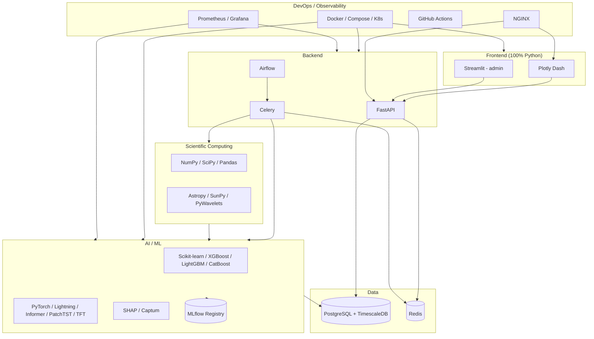

# 07. Tech Stack

## Table of Contents

1. [Executive Summary](#executive-summary)
2. [Problem Statement](#problem-statement)
3. [Objectives](#objectives)
4. [Scope](#scope)
5. [Stack Selection Philosophy](#stack-selection-philosophy)
6. [Frontend Stack](#frontend-stack)
7. [Backend Stack](#backend-stack)
8. [Database Stack](#database-stack)
9. [Scientific Computing Stack](#scientific-computing-stack)
10. [AI/ML Stack](#aiml-stack)
11. [MLOps Stack](#mlops-stack)
12. [DevOps / Deployment Stack](#devops--deployment-stack)
13. [Observability Stack](#observability-stack)
14. [Pinned Versions](#pinned-versions)
15. [Architecture Alignment Diagram](#architecture-alignment-diagram)
16. [Alternatives Considered](#alternatives-considered)
17. [Security](#security)
18. [Performance](#performance)
19. [Scalability](#scalability)
20. [Error Handling](#error-handling)
21. [Validation](#validation)
22. [Testing](#testing)
23. [Acceptance Criteria](#acceptance-criteria)
24. [Implementation Notes](#implementation-notes)
25. [Future Scope](#future-scope)
26. [References](#references)
27. [Revision History](#revision-history)

---

## Executive Summary

This document is the single source of truth for every technology, library, and version used in HeliosAI. It resolves the tech-stack table from the README into concrete, pinned, justified choices — including the explicit decision to implement the **entire platform, frontend included, in Python**, replacing the originally-templated React/Next.js/TypeScript stack.

---

## Problem Statement

A project spanning scientific signal processing, classical ML, deep sequence modeling, real-time streaming, and an interactive dashboard risks technology sprawl if choices aren't centralized and justified. Additionally, the explicit "100% Python" constraint means every layer — including the UI — must be re-derived from Python-native alternatives rather than defaulting to the JS/TS ecosystem that dominates most web frontend tooling.

---

## Objectives

1. Name and justify every technology used in HeliosAI.
2. Provide pinned version guidance to avoid dependency drift across contributor environments.
3. Document why React/Next.js/TypeScript (from the original generic template) was replaced, and what the Python-native replacement is.
4. Provide an architecture-alignment diagram showing how each technology maps to a subsystem from `03_System_Architecture.md`.

---

## Scope

Covers all technology selections for HeliosAI v1. Excludes hypothetical future-scope technologies (tracked separately in [Future Scope](#future-scope) and `60_Future_Enhancements.md`).

---

## Stack Selection Philosophy

1. **Python-first, no exceptions** — every runtime component (frontend included) is Python. Where the ecosystem conventionally reaches for JS (interactive dashboards, real-time UI), we selected the most production-capable Python-native equivalent rather than compromising on this constraint.
2. **Boring where it doesn't matter, best-in-class where it does** — infra (PostgreSQL, Redis, Docker, NGINX) uses proven, "boring" technology; the AI/ML layer uses best-in-class, current architectures (Informer, PatchTST, TFT) because that's where the project's actual novelty and evaluation criteria (TPR/FAR/lead-time) live.
3. **Everything must be swappable behind an interface** — per `05_Low_Level_Design.md`, model classes implement a `Protocol`, so swapping XGBoost for CatBoost, or PatchTST for a future architecture, does not ripple through the rest of the system.
4. **Open-source and permissively licensed** — all selected libraries are permissively licensed (MIT/BSD/Apache-2.0), consistent with HeliosAI's own open-source (GSSoC-aligned) positioning.

---

## Frontend Stack

| Technology | Role | Why |
|---|---|---|
| **Plotly Dash** | Primary interactive dashboard framework | Python-native, callback-driven, production-grade for data-dense scientific dashboards; supports multi-page apps, real-time updates via `dcc.Interval`/WebSocket bridges |
| **Streamlit** | Secondary — admin utilities, rapid internal tooling | Fastest path for simple internal tools (e.g., quick model comparison views) where Dash's full callback machinery is overkill |
| **Plotly.py** | Charting engine underneath Dash | Native interactivity (zoom/pan/hover) essential for inspecting X-ray light curves at flare-relevant time resolution |
| **Dash Bootstrap Components** | Layout/theming | Consistent, responsive layout without writing custom CSS frameworks |
| **Dash AG Grid** | Catalogue explorer table | Sortable/filterable large-table rendering needed for `catalogue_view` module |

> **Explicit substitution note:** the original generic project template specified React, Next.js, TypeScript, TailwindCSS, ShadCN, and Framer Motion. Per the explicit "entire project in Python" requirement, **none of these are used**. Dash + Dash Bootstrap Components + Plotly.py collectively cover the same surface area (component-based UI, interactivity, theming, animation via Plotly transitions) without introducing a second language into the stack.

---

## Backend Stack

| Technology | Role | Why |
|---|---|---|
| **FastAPI** | REST + WebSocket API framework | Async-native, automatic OpenAPI docs, first-class Pydantic integration — matches the "every boundary is validated" principle from the LLD |
| **Uvicorn / Gunicorn** | ASGI server | Uvicorn workers under Gunicorn for production process management |
| **Pydantic v2** | Data validation/schemas | Already the schema backbone across `shared/schemas/`; v2 for performance (Rust core) |
| **SQLAlchemy 2.x** | ORM | Mature, async-capable, works cleanly with TimescaleDB via the Postgres dialect |
| **Alembic** | DB migrations | Standard SQLAlchemy migration tool; versioned, reviewable schema changes |
| **Celery** | Async task queue (streaming/near-real-time processing) | Mature, Redis-backed, supports task groups/chains needed for parallel per-band detection → fusion join |
| **Apache Airflow** | Scheduled/batch orchestration | Purpose-built for DAG-based scheduled ingestion, backfill, and retraining workflows |

---

## Database Stack

| Technology | Role | Why |
|---|---|---|
| **PostgreSQL 15+** | Primary relational store | Reliable, ACID-compliant, rich ecosystem, native JSON support for flexible metadata fields |
| **TimescaleDB** (extension) | Time-series optimization | Hypertables give efficient compression + fast time-range queries for high-frequency light curve data without a separate time-series DB |
| **Redis 7+** | Cache, Celery broker/result backend, Pub/Sub for WebSocket fan-out | Single technology serving three distinct architectural needs, minimizing infra sprawl |

---

## Scientific Computing Stack

| Technology | Role | Why |
|---|---|---|
| **NumPy** | Core numerical arrays | Foundation for all signal processing/feature engineering |
| **SciPy** | Signal processing, statistics | `scipy.signal` for filtering; `scipy.stats` for distribution-based thresholding |
| **Pandas** | Tabular/time-series manipulation | Standard for feature-engineered series prior to model ingestion |
| **Astropy** | FITS file handling, astronomical time/coordinate systems | Standard astronomy Python library; needed for FITS-format L1 data if PRADAN delivers FITS |
| **SunPy** | Solar-physics-specific utilities | Provides solar-domain conventions (flare classification helpers, solar time utilities) that reduce custom code |
| **PyWavelets** | Wavelet transforms | Continuous wavelet transform for precursor-sensitive feature engineering (`feature_engineer` module) |

---

## AI/ML Stack

| Technology | Role | Why |
|---|---|---|
| **Scikit-learn** | Classical ML utilities, preprocessing, metrics | Standard baseline tooling, model evaluation (precision-recall curves for FAR/TPR tuning) |
| **XGBoost** | Gradient-boosted trees (forecasting baseline) | Fast, well-understood, strong tabular baseline, SHAP-compatible |
| **LightGBM** | Gradient-boosted trees (alternative baseline) | Faster training on large feature sets; useful for rapid iteration |
| **CatBoost** | Gradient-boosted trees (alternative baseline) | Strong handling of categorical/quality-flag features without manual encoding |
| **PyTorch** | Deep learning framework | Primary framework for LSTM/GRU/CNN/Transformer-family forecasting models |
| **PyTorch Lightning** | Training loop structure | Reduces boilerplate, standardizes checkpointing/logging across model families |
| **pytorch-forecasting** (or custom implementations) | Informer, PatchTST, TimeMixer, Temporal Fusion Transformer | Provides reference implementations of long-horizon time-series transformer architectures central to the forecasting engine |
| **SHAP** | Explainability (tree models) | Industry-standard, TreeExplainer is efficient for XGBoost/LightGBM/CatBoost |
| **Captum** | Explainability (deep models) | PyTorch-native integrated gradients + attention visualization |

---

## MLOps Stack

| Technology | Role | Why |
|---|---|---|
| **MLflow** | Experiment tracking + model registry | Tracks every training run's parameters/metrics/artifacts (NFR-08 auditability); registry stages (`staging`/`production`) drive which model `catalogue_builder` treats as "promoted" |
| **Apache Airflow** | Retraining orchestration | Same orchestrator as ingestion, avoiding a second scheduling technology just for ML |

---

## DevOps / Deployment Stack

| Technology | Role | Why |
|---|---|---|
| **Docker** | Containerization | One image per service, per `06_Project_Folder_Structure.md` |
| **Docker Compose** | Local/research-scale orchestration | Default v1 deployment profile |
| **Kubernetes** | Scale-out orchestration (optional path) | Documented in `51_Kubernetes.md` for future operational scale |
| **NGINX** | Reverse proxy / TLS termination | Fronts `helios-api` and `helios-dashboard`, per Security Architecture |
| **GitHub Actions** | CI/CD | Runs tests, lint, build, and (optionally) deploy pipelines per `52_CI_CD.md` |

---

## Observability Stack

| Technology | Role | Why |
|---|---|---|
| **Prometheus** | Metrics collection | Standard metrics scraping across all services |
| **Grafana** | Dashboards/alerting on infra metrics | Pairs natively with Prometheus |
| **structlog** | Structured application logging | Consistent, correlation-ID-carrying logs across all services (per Error Handling Architecture) |

---

## Pinned Versions

> Exact pins are finalized in each service's `pyproject.toml` at implementation time; this table gives the target major/minor versions used across design decisions in this documentation set.

| Package | Target Version |
|---|---|
| Python | 3.11.x |
| FastAPI | 0.115.x |
| Pydantic | 2.9.x |
| SQLAlchemy | 2.0.x |
| Celery | 5.4.x |
| Apache Airflow | 2.10.x |
| PostgreSQL | 15.x |
| TimescaleDB | 2.16.x |
| Redis | 7.x |
| Dash | 2.18.x |
| Streamlit | 1.38.x |
| Plotly | 5.24.x |
| PyTorch | 2.4.x |
| PyTorch Lightning | 2.4.x |
| Scikit-learn | 1.5.x |
| XGBoost | 2.1.x |
| LightGBM | 4.5.x |
| CatBoost | 1.2.x |
| SHAP | 0.46.x |
| Captum | 0.7.x |
| MLflow | 2.16.x |
| Astropy | 6.1.x |
| SunPy | 6.0.x |
| PyWavelets | 1.7.x |

---

## Architecture Alignment Diagram

---

## Alternatives Considered

| Decision Point | Chosen | Alternative Considered | Why Rejected |
|---|---|---|---|
| Frontend framework | Plotly Dash | Streamlit as primary | Streamlit's single-script rerun model is less suited to a persistent, multi-view, alert-driven dashboard than Dash's callback graph |
| Frontend framework | Plotly Dash | React/Next.js (original template) | Violates the explicit "100% Python" requirement |
| Time-series DB | TimescaleDB (Postgres extension) | InfluxDB / dedicated TSDB | Avoids a second database technology; Postgres/Timescale gives relational joins (catalogue ↔ features) that a pure TSDB complicates |
| Task queue | Celery | RQ, Dramatiq | Celery's mature ecosystem and `group`/`chain` primitives directly fit the parallel-then-join fusion workflow |
| Deep sequence models | PyTorch | TensorFlow/Keras | PyTorch has stronger current ecosystem support for Informer/PatchTST/TFT reference implementations and Captum integration |
| Explainability (deep) | Captum | Custom SHAP DeepExplainer only | Captum is PyTorch-native and purpose-built for attention/integrated-gradients on transformer architectures |

---

## Security

- All packages pinned to specific minor versions in per-service `pyproject.toml` to avoid unreviewed transitive dependency upgrades.
- Dependency vulnerability scanning integrated into CI (`52_CI_CD.md`) via GitHub's Dependabot + `pip-audit`.

---

## Performance

- PyTorch models loaded once per Celery worker process (not per-task) to avoid repeated model-loading overhead; enforced via worker-level lazy singleton pattern documented in `47_Model_Training.md`.
- TimescaleDB compression policies applied to older (non-hot) chunks to keep storage and query performance balanced at scale.

---

## Scalability

- Every technology chosen here supports horizontal scaling: FastAPI/Celery workers behind load balancing; TimescaleDB read replicas as a future option; Redis Cluster as a future option if Pub/Sub fan-out volume grows.

---

## Error Handling

- Library-level exceptions (e.g., `xgboost.core.XGBoostError`, `torch.cuda.OutOfMemoryError`) are caught at the module boundary and re-raised as HeliosAI's own typed exceptions (`shared/exceptions/errors.py`), so upstream code never needs to know which underlying library raised the original error.

---

## Validation

- Pydantic v2's Rust-accelerated validation is used at every service boundary, chosen partly *because* of its performance characteristics — validation must not become the pipeline's bottleneck given the "validate everything" principle established since the Vision doc.

---

## Testing

- Pytest is the standard test runner across all services (`53_Testing.md`); `pytest-asyncio` for FastAPI/Celery async code paths; `Hypothesis` for property-based testing of signal-processing functions (e.g., fuzzing flux arrays to ensure filters never produce NaN/negative outputs).

---

## Acceptance Criteria

- [ ] Every technology in the README's original tech-stack table is either retained-and-justified or explicitly substituted-and-justified here.
- [ ] Frontend section explicitly documents the React/Next.js/TypeScript → Dash/Streamlit substitution.
- [ ] Every technology maps to at least one subsystem in the Architecture Alignment Diagram.
- [ ] Pinned version table exists for reproducibility.

---

## Implementation Notes

- The pinned versions table will be enforced at implementation time via `pip-compile` or `uv pip compile` lockfiles per service, checked into the repository.

---

## Future Scope

- Evaluate `polars` as a Pandas alternative for large-scale backfill processing if performance profiling in `55_Performance_Optimization.md` reveals a bottleneck.
- Evaluate Ray or Dask for distributed model training if dataset scale grows beyond a single-machine Celery worker's practical capacity.

---

## References

1. `README.md` — original tech-stack table this document resolves into pinned, justified choices.
2. Official documentation: FastAPI, Dash, Streamlit, PyTorch, MLflow, TimescaleDB, Airflow, Celery.

---

## Revision History

| Version | Date | Author | Notes |
|---|---|---|---|
| 0.1 | 2026-07-11 | HeliosAI Documentation (Antigravity workflow) | Initial tech stack — full justification set, pinned versions, alternatives-considered table, explicit Python-only frontend substitution documented |

---

**Next document:** `08_Development_Roadmap.md` — say **NEXT** to continue.
