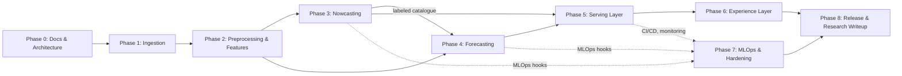

# 08 — Development Roadmap

> **Document 08 of 61** in the HeliosAI documentation set (see `README.md` → Repository Structure). Builds directly on `06_Project_Folder_Structure.md` and `07_Tech_Stack.md`, and precedes `09_Project_Timeline.md`, which will translate this roadmap into dated milestones.

---

## Table of Contents

1. [Purpose of This Document](#purpose-of-this-document)
2. [Roadmap Philosophy](#roadmap-philosophy)
3. [Phase Overview](#phase-overview)
4. [Phase Details](#phase-details)
5. [Cross-Phase Workstreams](#cross-phase-workstreams)
6. [Dependency Graph](#dependency-graph)
7. [Definition of Done (Per Phase)](#definition-of-done-per-phase)
8. [Risk Checkpoints](#risk-checkpoints)
9. [Exit Criteria to Implementation](#exit-criteria-to-implementation)
10. [Revision History](#revision-history)

---

## Purpose of This Document

This document defines **how HeliosAI moves from documentation to a working, deployable system**, without yet assigning calendar dates (dates and durations are deferred to `09_Project_Timeline.md`, keeping this file focused purely on sequencing and dependencies). It answers three questions:

- **What** gets built, in what order.
- **Why** that order (technical dependency, risk-front-loading, or evaluation-criteria priority).
- **What "done" looks like** for each phase, so downstream Antigravity Master Prompts (per `61_Antigravity_Master_Prompt.md`) can be scoped unambiguously.

---

## Roadmap Philosophy

1. **Documentation-first, then module-isolated build.** Per the Antigravity workflow already established in `README.md`, the full 61-document set is completed before implementation begins. This avoids architectural rework mid-build.
2. **Data before models, models before UI.** Nowcasting and forecasting are only as good as the fused light-curve stream beneath them; the dashboard is a consumer of catalogue/model outputs, not a driver of design.
3. **Nowcasting before forecasting.** Nowcasting is the simpler, lower-risk capability (threshold/changepoint detection on observed data) and produces the labeled event catalogue that forecasting models are trained against. Building it first de-risks the harder, precursor-based forecasting problem.
4. **Baselines before deep models.** Classical ML (XGBoost/LightGBM) baselines are built and evaluated before LSTM/GRU/Transformer-family models, so every deep-learning gain is measured against a fast, interpretable reference.
5. **Explainability is built alongside models, not after.** SHAP/Captum integration happens in the same phase as each model class, not retrofitted later.
6. **Infrastructure hardening is continuous, not a final phase.** Docker, CI/CD, monitoring, and security are introduced incrementally from Phase 1 onward rather than bolted on at the end.

---

## Phase Overview

| Phase | Name | Primary Output | Key Docs |
|---|---|---|---|
| 0 | Documentation & Architecture | Full 61-doc set + Antigravity prompts | `00`–`07`, `61` |
| 1 | Data Acquisition & Ingestion | Automated + manual-drop ingestion pipeline | `17`, `19` |
| 2 | Preprocessing & Feature Engineering | Synchronized, cleaned, feature-rich light-curve store | `18`, `20`, `21` |
| 3 | Nowcasting Engine | Master flare catalogue (dual-band, confidence-scored) | `22`, `29` |
| 4 | Forecasting Engine | Lead-time-quantified flare probability models | `23`, `26`, `27`, `28` |
| 5 | Serving Layer | REST/WebSocket API, auth, alerting | `31`–`36` |
| 6 | Experience Layer | Dash dashboard, catalogue explorer, alert console | `37`–`41` |
| 7 | MLOps & Hardening | Training pipelines, monitoring, CI/CD, security | `44`–`55` |
| 8 | Release & Research Writeup | Deployed system + research paper | `49`, `59` |

---

## Phase Details

### Phase 0 — Documentation & Architecture
Establishes problem alignment (`00`), vision (`01`), SRS (`02`), architecture (`03`–`04`), low-level design (`05`), folder structure (`06`), and tech stack (`07`). This document (`08`) and the timeline (`09`) close out the planning sub-sequence before domain-background docs (`10`–`16`) and implementation begin.

### Phase 1 — Data Acquisition & Ingestion
- Implement the **automated fetcher** for ISSDC PRADAN where token/session access is available.
- Implement the **manual-drop ingestion mode** (`data/raw/` watched directory) as the reliable fallback, since PRADAN is often credential-gated.
- Build format parsers for FITS/CDF/CSV Level-1 files for both SoLEXS and HEL1OS.
- Stand up raw-data validation (schema checks, gap detection, corrupt-file quarantine).
- **Why first:** every downstream subsystem — nowcasting, forecasting, dashboard — is blocked without a reliable, validated raw stream.

### Phase 2 — Preprocessing & Feature Engineering
- Spacecraft-time → UTC synchronization engine.
- Background subtraction and noise filtering, with quality flagging.
- Cross-Band Fusion Layer merging SoLEXS and HEL1OS into one time-aligned stream.
- Feature engineering: flux gradients, rise/decay time constants, spectral hardness ratio, wavelet-domain energy.
- **Why second:** this is the shared substrate both intelligence engines (Phase 3, 4) consume; building it once, correctly, avoids duplicated logic in each model track.

### Phase 3 — Nowcasting Engine
- Per-band changepoint/threshold detectors (independent for SoLEXS and HEL1OS).
- Peak/rise/decay estimation per candidate event.
- Flare-class assignment via GOES-equivalent flux-to-class mapping.
- Cross-band confidence fusion gate → master catalogue promotion, with "tentative" flagging for single-band-only detections.
- SHAP-based explainability for the (mostly rule-based/tree-assisted) detection logic.
- **Why third:** produces the **labeled event catalogue** that forecasting model training in Phase 4 depends on.

### Phase 4 — Forecasting Engine
- Rolling-window precursor feature construction over a configurable lookback horizon.
- Baseline gradient-boosted models (XGBoost/LightGBM/CatBoost).
- Deep sequence models: LSTM/GRU, then Informer/PatchTST/Temporal Fusion Transformer.
- Calibrated probability output for N = 15/30/60-minute horizons.
- Empirical lead-time computation (`predicted_trigger_ts` vs. `actual_peak_ts`), logged to MLflow.
- Captum-based explainability (attention weights, integrated gradients) for deep models.
- **Why fourth:** the highest-risk, highest-value capability per the Problem Statement; sequenced after nowcasting so it trains against real, catalogued events rather than synthetic labels.

### Phase 5 — Serving Layer
- FastAPI REST endpoints for catalogue, forecasts, and model metadata.
- FastAPI WebSocket stream for real-time nowcast/forecast push.
- Authentication (FastAPI-Users/JWT, OAuth2) and authorization for multi-user research deployments.
- Alert Dispatcher (webhook/email hooks) wired to nowcast/forecast triggers.

### Phase 6 — Experience Layer
- Plotly Dash primary dashboard: light-curve visualizer with alert overlays.
- Catalogue explorer and alert console.
- Streamlit-based admin panel and internal rapid-prototyping tools.
- UI/UX pass against `38_UI_UX.md` once drafted.

### Phase 7 — MLOps & Hardening
- Airflow DAGs for scheduled ingestion/retraining; Celery for streaming/request-triggered jobs.
- MLflow experiment tracking and model registry wired into both Phase 3 and Phase 4 outputs retroactively, if not already integrated during those phases.
- Prometheus/Grafana monitoring, structured logging.
- Docker Compose finalization, GitHub Actions CI/CD, security hardening (secrets management, endpoint auth review).

### Phase 8 — Release & Research Writeup
- End-to-end acceptance testing against the Acceptance Criteria in `README.md`.
- `docker compose up --build` validated as the canonical local/research deployment path.
- Research paper (`59_Research_Paper.md`) documenting methodology, evaluation results, and lead-time metrics for external review.

---

## Cross-Phase Workstreams

These do not belong to a single phase — they run continuously starting from Phase 1:

- **Testing** (Pytest/pytest-asyncio/Hypothesis) — written alongside each module, not after.
- **Containerization** — each subsystem gets a Dockerfile as it's built, not retrofitted in Phase 7.
- **Explainability** — introduced in the same phase as the model class it explains (Phase 3 and 4), not deferred.
- **Documentation-to-code traceability** — every module implemented must cite the doc section and Antigravity Master Prompt it was built from.

---

## Dependency Graph

---

## Definition of Done (Per Phase)

| Phase | Done When |
|---|---|
| 0 | All 61 docs + Antigravity prompts generated and internally consistent |
| 1 | Both automated and manual-drop ingestion paths tested against sample PRADAN L1 files; raw validator rejects malformed input |
| 2 | Synchronized, feature-engineered light curves persisted to TimescaleDB with documented schema |
| 3 | Master catalogue populated on historical data with per-class precision/recall reported |
| 4 | Forecast probabilities + empirical lead times logged in MLflow for held-out historical flares |
| 5 | REST + WebSocket endpoints pass integration tests; auth enforced on all routes |
| 6 | Dashboard renders live light curves with alert banners triggered from real nowcast/forecast events |
| 7 | CI pipeline green on every merge; Grafana dashboards show ingestion/model health |
| 8 | All Acceptance Criteria in `README.md` checked off; research paper drafted |

---

## Risk Checkpoints

- **After Phase 1:** confirm PRADAN automated access actually works for the target account tier; if not, manual-drop mode becomes the primary (not fallback) path, which should be flagged in `09_Project_Timeline.md`.
- **After Phase 3:** validate that dual-band fusion isn't over-suppressing true single-band-only low-class (A/B) flares before forecasting training begins on this catalogue.
- **After Phase 4:** confirm lead-time metrics are computed empirically (not asserted) before any claims are made in the research paper — this is an explicit Acceptance Criterion.

Full risk register with likelihood/impact scoring is maintained in `10_Risk_Assessment.md`.

---

## Exit Criteria to Implementation

Per the Documentation Index rule in `README.md`, this file is generated **one at a time** in sequence. Implementation work (Phase 1 onward) does not begin until:

1. The full 61-document set is complete, and
2. Each subsystem has a corresponding, context-isolated **Antigravity Master Prompt** (`61_Antigravity_Master_Prompt.md` and the `prompts/antigravity/` set).

**Next document:** `09_Project_Timeline.md` — say **NEXT** to continue.

---

## Revision History

| Version | Date | Author | Notes |
|---|---|---|---|
| 0.1 | 2026-07-12 | HeliosAI Documentation (Antigravity workflow) | Initial Development Roadmap — phase sequencing, dependency graph, and definition-of-done established |
