# 09 — Project Timeline

> **Document 09 of 61** in the HeliosAI documentation set (see `README.md` → Repository Structure). Translates the phase sequencing from `08_Development_Roadmap.md` into sprint-based durations and milestones. Precedes `10_Risk_Assessment.md`.

---

## Table of Contents

1. [Purpose of This Document](#purpose-of-this-document)
2. [Timeline Assumptions](#timeline-assumptions)
3. [Sprint-Level Timeline](#sprint-level-timeline)
4. [Gantt Overview](#gantt-overview)
5. [Milestones](#milestones)
6. [Critical Path](#critical-path)
7. [Buffer & Contingency Allocation](#buffer--contingency-allocation)
8. [Tracking & Reporting Cadence](#tracking--reporting-cadence)
9. [Revision History](#revision-history)

---

## Purpose of This Document

`08_Development_Roadmap.md` defined **what** gets built and in **what order**. This document assigns **relative durations** (in sprints, not fixed calendar dates, since actual start date depends on when the documentation-first phase concludes) so that progress can be tracked, and so the per-module Antigravity Master Prompts can each be scoped against a sprint budget.

Sprint length is assumed to be **2 weeks**, consistent with the GitHub Actions / Agile cadence implied by `52_CI_CD.md` (to be drafted) and typical for a research-group-sized team.

---

## Timeline Assumptions

- Team size: small research/engineering team (assume 2–4 contributors, consistent with a research-group or GSSoC-style open-source deployment per `58_Open_Source_Guidelines.md`).
- Phase 0 (full 61-document set + Antigravity prompts) is treated as **Sprint 0** and is already substantially underway at time of writing.
- Phases can overlap slightly where dependencies allow (e.g., Serving Layer scaffolding can begin before Forecasting is fully complete, since REST/WebSocket contracts can be stubbed early).
- Durations are **estimates for planning purposes only**; they will be revised once `10_Risk_Assessment.md` and `11_Feasibility_Study.md` are complete, and again once real team velocity is observed after Sprint 2.
- PRADAN data-access lead time (manual approval, if required) is the single largest external-dependency risk to this timeline — see [Critical Path](#critical-path).

---

## Sprint-Level Timeline

| Sprint(s) | Phase | Focus | Depends On |
|---|---|---|---|
| 0 (ongoing) | Phase 0 — Documentation & Architecture | Complete all 61 docs + Antigravity prompts | — |
| 1–2 | Phase 1 — Data Acquisition & Ingestion | Automated fetcher, manual-drop mode, format parsers, raw validator | Phase 0 complete |
| 3–4 | Phase 2 — Preprocessing & Feature Engineering | Time-sync engine, background subtraction, Cross-Band Fusion Layer, feature set | Phase 1 |
| 5–6 | Phase 3 — Nowcasting Engine | Per-band detectors, confidence fusion gate, master catalogue, SHAP explainability | Phase 2 |
| 7–9 | Phase 4 — Forecasting Engine | Baselines → deep sequence models → Transformer-family, lead-time computation, Captum explainability | Phase 2, Phase 3 (catalogue) |
| 6–7 (overlap) | Phase 5 — Serving Layer (scaffolding) | API contract stubs, auth scaffolding | Phase 3 (partial) |
| 8–9 | Phase 5 — Serving Layer (completion) | Full REST/WebSocket, alert dispatcher | Phase 4 (near-complete) |
| 10–11 | Phase 6 — Experience Layer | Dash dashboard, catalogue explorer, alert console, Streamlit admin tools | Phase 5 |
| Continuous, 1–12 | Phase 7 — MLOps & Hardening | Airflow DAGs, MLflow integration, monitoring, CI/CD, security | All phases (incremental) |
| 12–13 | Phase 8 — Release & Research Writeup | Acceptance testing, deployment validation, research paper | Phase 6, Phase 7 |

**Total estimated build time (post-documentation): ~13 sprints (~26 weeks / ~6 months)**, before accounting for buffer (see below).

---

## Gantt Overview

```mermaid
gantt
    title HeliosAI Build Timeline (Sprint-Relative)
    dateFormat  X
    axisFormat Sprint %s

    section Phase 0
    Documentation & Architecture     :done, p0, 0, 1

    section Phase 1
    Data Acquisition & Ingestion     :p1, 1, 2

    section Phase 2
    Preprocessing & Features         :p2, 3, 2

    section Phase 3
    Nowcasting Engine                :p3, 5, 2

    section Phase 4
    Forecasting Engine               :p4, 7, 3

    section Phase 5
    Serving Layer                    :p5, 6, 4

    section Phase 6
    Experience Layer                 :p6, 10, 2

    section Phase 7
    MLOps & Hardening                :p7, 1, 12

    section Phase 8
    Release & Research Writeup       :p8, 12, 2
```

---

## Milestones

| Milestone | Target Sprint | Description |
|---|---|---|
| **M0 — Documentation Freeze** | 0 | All 61 docs + Antigravity prompts complete and internally consistent |
| **M1 — First Validated Data Ingested** | 2 | At least one full day of synchronized-but-unprocessed SoLEXS + HEL1OS L1 data ingested via either path |
| **M2 — Feature Store Live** | 4 | TimescaleDB populated with cleaned, feature-engineered light curves |
| **M3 — First Master Catalogue Entry** | 6 | First dual-band-confirmed flare event promoted to the master catalogue |
| **M4 — Baseline Forecast Model Evaluated** | 8 | XGBoost/LightGBM baseline producing calibrated probabilities with measured lead time |
| **M5 — Deep Forecast Model Evaluated** | 9 | Transformer-family model outperforming baseline on held-out historical flares |
| **M6 — API + Alerting Live** | 9 | REST/WebSocket endpoints serving real catalogue/forecast data with working alert dispatch |
| **M7 — Dashboard MVP** | 11 | Dash dashboard rendering live light curves with alert overlays end-to-end |
| **M8 — Release Candidate** | 13 | All Acceptance Criteria in `README.md` satisfied; `docker compose up --build` validated |

---

## Critical Path

The longest dependency chain runs:

**Phase 1 (Ingestion) → Phase 2 (Preprocessing) → Phase 3 (Nowcasting, for labeled events) → Phase 4 (Forecasting) → Phase 5 completion (Serving) → Phase 6 (Experience) → Phase 8 (Release)**

The single highest-risk node on this path is **Phase 1**, specifically PRADAN automated data access — if programmatic access proves unavailable or heavily rate-limited, the manual-drop ingestion mode becomes the primary path, which may slow data volume accumulation needed for robust Phase 4 model training. This is tracked as the top entry in `10_Risk_Assessment.md`.

---

## Buffer & Contingency Allocation

- **+1 sprint buffer** after Phase 4 (Forecasting), since deep sequence model tuning (especially Transformer-family architectures) is historically the least predictable estimate in similar time-series projects.
- **+1 sprint buffer** before Phase 8 (Release), to absorb acceptance-testing findings without slipping the research writeup.
- Phase 7 (MLOps & Hardening) is intentionally modeled as continuous background effort rather than a discrete blocking phase, so it absorbs schedule slack rather than creating it.

**Adjusted total estimate: ~15 sprints (~30 weeks / ~7 months)** from end of documentation phase to release candidate.

---

## Tracking & Reporting Cadence

- Sprint-end demo/review against the milestone table above.
- MLflow run logs and TimescaleDB ingestion metrics reviewed each sprint to catch silent data-quality regressions early (per the Auditability requirement in `README.md`'s Non-Functional Requirements).
- This document will be revisited and revised once `10_Risk_Assessment.md` and `11_Feasibility_Study.md` are complete, and again after real velocity data is available post-Sprint 2.

**Next document:** `10_Risk_Assessment.md` — say **NEXT** to continue.

---

## Revision History

| Version | Date | Author | Notes |
|---|---|---|---|
| 0.1 | 2026-07-12 | HeliosAI Documentation (Antigravity workflow) | Initial Project Timeline — sprint-level schedule, Gantt overview, milestones, and critical path established |
