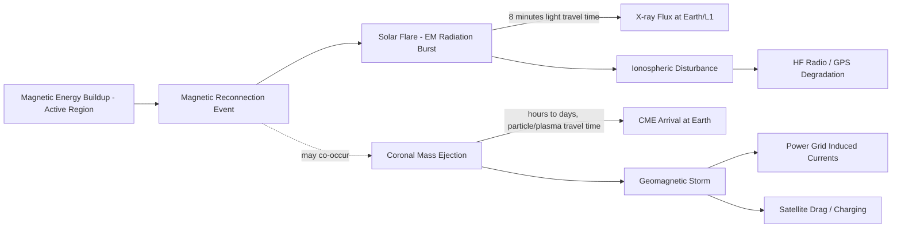

# 13 — Space Weather

> **Document 13 of 61** in the HeliosAI documentation set (see `README.md` → Repository Structure). Goes deeper into the domain science that `12_Research_Background.md` introduced at the literature level. Precedes `14_AdityaL1_Mission.md`, which narrows from general space weather to the specific mission HeliosAI ingests data from.

---

## Table of Contents

1. [Purpose of This Document](#purpose-of-this-document)
2. [What Space Weather Is](#what-space-weather-is)
3. [The Sun-to-Earth Chain](#the-sun-to-earth-chain)
4. [Solar Flares in the Space Weather Chain](#solar-flares-in-the-space-weather-chain)
5. [Real-World Impacts of Flares](#real-world-impacts-of-flares)
6. [Why Early Warning (Nowcasting + Forecasting) Matters](#why-early-warning-nowcasting--forecasting-matters)
7. [The Global Space Weather Monitoring Landscape](#the-global-space-weather-monitoring-landscape)
8. [Where Aditya-L1 Fits](#where-aditya-l1-fits)
9. [Revision History](#revision-history)

---

## Purpose of This Document

This document exists so that anyone implementing or reviewing HeliosAI — including contributors who are strong engineers but not space physicists — understands **why this problem matters** beyond the Problem Statement's own framing, and where solar flare detection sits within the broader space weather picture. It is domain-science grounding, not architecture; architecture resumes in `14_AdityaL1_Mission.md` onward.

---

## What Space Weather Is

"Space weather" refers to the varying conditions in the space environment around Earth — driven primarily by the Sun — that can affect technological systems and human activity. It encompasses several distinct but related phenomena:

- **Solar flares** — sudden electromagnetic radiation bursts (HeliosAI's focus).
- **Coronal Mass Ejections (CMEs)** — large expulsions of plasma and magnetic field from the solar corona, often but not always associated with flares.
- **Solar energetic particle (SEP) events** — high-energy particles accelerated by flares/CMEs, hazardous to spacecraft and astronauts.
- **Geomagnetic storms** — disturbances in Earth's magnetosphere, typically driven by CME arrival, which can induce currents in power grids.

HeliosAI is scoped specifically to the **flare** component of this chain — soft and hard X-ray emission — not CMEs or geomagnetic storms directly, though flares are frequently a leading indicator that a CME or SEP event may follow.

---

## The Sun-to-Earth Chain

The critical timing detail for HeliosAI: **X-ray flare emission reaches Earth (and Aditya-L1 at L1) at light speed — essentially instantaneously in operational terms** — while any associated CME arrives hours to days later. This is precisely why **flare nowcasting/forecasting is itself an early-warning layer** for the slower, often more destructive downstream effects, even though HeliosAI does not model the CME/geomagnetic stages directly.

---

## Solar Flares in the Space Weather Chain

Flares matter operationally for two distinct reasons, both already reflected in the Problem Statement:

1. **Direct effect** — the X-ray/EUV burst itself increases ionization in Earth's upper atmosphere (ionosphere), directly degrading high-frequency (HF) radio propagation and GPS/GNSS signal accuracy, with effects felt within minutes of the flare.
2. **Precursor signal** — larger flares, especially when accompanied by specific magnetic configurations, are statistically associated with higher likelihood of an accompanying CME. Reliable, low-latency flare nowcasting/forecasting therefore has value as an early input to the longer CME/geomagnetic-storm warning chain, even though modeling that full chain is out of scope for HeliosAI (per `README.md` → Scope).

---

## Real-World Impacts of Flares

The Problem Statement's stated impact areas are well-established in the space weather literature:

| Impacted System | Mechanism | Typical Timescale |
|---|---|---|
| Satellite communications | Ionospheric absorption of radio signals (particularly HF) | Minutes, during and shortly after flare |
| GPS/GNSS navigation | Ionospheric electron density changes affecting signal delay/accuracy | Minutes to hours |
| Power grids | Primarily a geomagnetic-storm (not direct-flare) effect via induced currents — flares are an early indicator, not the direct cause | Hours to days (post-CME) |
| Aviation (polar routes, HF comms) | Radiation exposure concerns and HF radio blackout risk | During flare/SEP event |
| Spacecraft operations | Increased radiation dose, potential single-event upsets in electronics | During and after flare/SEP event |

This table is why the Problem Statement frames flares as consequential even though a single flare event is brief — the downstream systems affected are widely used infrastructure.

---

## Why Early Warning (Nowcasting + Forecasting) Matters

- **Nowcasting** (near-real-time detection) matters because even a few minutes of confirmed awareness that a flare is in progress allows HF radio users (aviation, maritime, amateur/emergency radio) and GNSS-dependent systems to expect degraded performance and apply known mitigations (e.g., switching frequencies, flagging navigation uncertainty).
- **Forecasting** (predictive, lead-time-quantified) matters more for **preparedness actions that take longer than a few minutes to execute** — e.g., satellite operators safing sensitive payloads, or aviation rerouting decisions — which is why the Problem Statement explicitly asks for a *quantified* lead time rather than just a binary "flare imminent" flag. This is the same reasoning behind Risk R7 in `10_Risk_Assessment.md`: an unquantified or overstated lead time is operationally worse than no forecast at all, since it could be relied upon inappropriately.

---

## The Global Space Weather Monitoring Landscape

HeliosAI operates within an existing, active global monitoring ecosystem, which is directly relevant to its cross-validation design:

- **NOAA Space Weather Prediction Center (SWPC)** — operates the GOES XRS instruments and issues the operational flare classification (A–X) that HeliosAI's class-bin mapping is designed to be compatible with.
- **ESA Space Weather Service Network** and other national space weather centers — provide complementary monitoring and alerting, illustrating that flare monitoring is an internationally distributed effort, not a single-agency responsibility.
- **Aditya-L1 (ISRO)** — HeliosAI's data source — adds an independent, L1-vantage-point observation stream (SoLEXS + HEL1OS) that can corroborate or supplement GOES-based detections, which is the scientific rationale for treating GOES XRS as *optional supplementary data* (per `README.md`) rather than a required dependency.

---

## Where Aditya-L1 Fits

Aditya-L1's position at the Sun-Earth L1 Lagrange point gives it a **continuous, uninterrupted view of the Sun**, unlike Earth-orbiting assets that experience periodic eclipse/occultation. This makes L1-based instruments like SoLEXS and HEL1OS particularly valuable for continuous flare monitoring — a mission-specific advantage that `14_AdityaL1_Mission.md` will detail further, including orbital characteristics, payload specifications, and data latency considerations relevant to HeliosAI's ingestion design (`17_Data_Ingestion.md`).

---

## Revision History

| Version | Date | Author | Notes |
|---|---|---|---|
| 0.1 | 2026-07-12 | HeliosAI Documentation (Antigravity workflow) | Initial Space Weather document — Sun-to-Earth chain, flare impacts, and monitoring landscape established |
