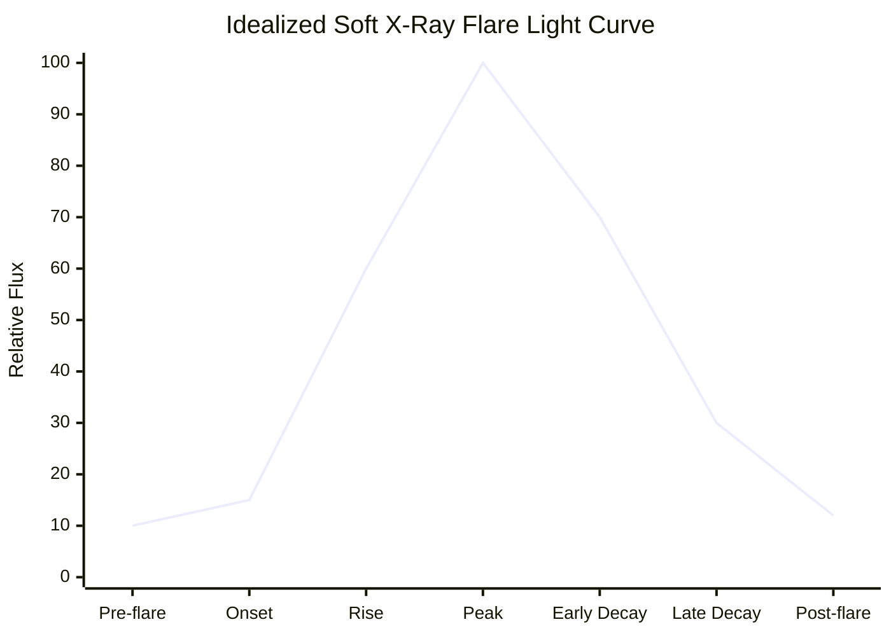

# 15 — SoLEXS

> **Document 15 of 61** in the HeliosAI documentation set (see `README.md` → Repository Structure). Details the first of HeliosAI's two data-source payloads at the level needed for ingestion and preprocessing design. Precedes `16_HEL1OS.md`, its hard X-ray counterpart, and feeds directly into `17_Data_Ingestion.md` and `18_Data_Preprocessing.md`.

---

## Table of Contents

1. [Purpose of This Document](#purpose-of-this-document)
2. [What SoLEXS Measures](#what-solexs-measures)
3. [Why Soft X-Ray Matters for Flare Detection](#why-soft-x-ray-matters-for-flare-detection)
4. [Data Characteristics Relevant to Ingestion](#data-characteristics-relevant-to-ingestion)
5. [Typical Flare Signature in SoLEXS Light Curves](#typical-flare-signature-in-solexs-light-curves)
6. [Known Data-Quality Considerations](#known-data-quality-considerations)
7. [Relevance to HeliosAI's Design](#relevance-to-heliosais-design)
8. [Revision History](#revision-history)

---

## Purpose of This Document

This document gives contributors implementing `17_Data_Ingestion.md`, `18_Data_Preprocessing.md`, and `22_Nowcasting.md` enough instrument-level understanding of SoLEXS to make informed parsing, calibration-awareness, and feature-engineering decisions, without requiring them to separately research the payload from scratch.

> **Note on sourcing:** exact calibration constants, energy-channel boundaries, and current instrument health status should be verified against SoLEXS's official payload documentation (referenced in `README.md` → References) before being hard-coded into calibration logic, since these are instrument specifics best confirmed at implementation time rather than asserted here.

---

## What SoLEXS Measures

SoLEXS (Solar Low Energy X-ray Spectrometer) is Aditya-L1's soft X-ray spectrometer, observing the Sun in the roughly **1–15 keV** energy range. It measures the Sun's disk-integrated soft X-ray flux and spectrum as a function of time, producing a light curve (flux vs. time) plus, depending on data product level, spectral (energy-resolved) information.

This band is dominated by **thermal bremsstrahlung emission** from hot flare plasma (tens of millions of Kelvin during flares), making it directly comparable to the band GOES XRS has used for decades as the operational flare-classification standard — which is precisely why HeliosAI can map SoLEXS-derived flare magnitudes onto GOES-equivalent A/B/C/M/X classes (per `README.md` and `12_Research_Background.md`).

---

## Why Soft X-Ray Matters for Flare Detection

- **Classification backbone:** because GOES XRS classification is soft-X-ray-based, SoLEXS is HeliosAI's primary channel for assigning a flare's magnitude class.
- **Thermal decay signature:** soft X-ray flux typically rises promptly at flare onset and decays more slowly (over minutes to tens of minutes) as heated plasma cools — this decay-time constant is one of HeliosAI's engineered features (per `README.md` → Objectives).
- **Complementary timing to hard X-ray:** per the Neupert effect (a well-established solar-physics relationship), the time-integral of hard X-ray (non-thermal) emission tracks the soft X-ray (thermal) rise — meaning HEL1OS's hard X-ray signal can precede or lead the SoLEXS soft X-ray peak, which is the physical basis for using hardness ratio and cross-band timing as forecasting precursor features.

---

## Data Characteristics Relevant to Ingestion

| Characteristic | Relevance |
|---|---|
| Time series of flux (counts/sec or physical flux units) vs. time | Core light-curve structure HeliosAI ingests |
| Energy-resolved channels (spectrometer, not just a single broadband counter) | Enables spectral hardness features beyond simple broadband flux, if channel-level data is available at Level-1 |
| Spacecraft-clock timestamps | Requires the Time Synchronization Engine (`18_Data_Preprocessing.md`) to convert to UTC before cross-band fusion |
| Background/instrumental counts | Requires background subtraction before flare-relevant flux is isolated (per `README.md` → Objectives) |
| Data gaps (telemetry/ground-contact dependent) | Requires the raw-data validator (Phase 1, per `08_Development_Roadmap.md`) to flag rather than silently interpolate over |

---

## Typical Flare Signature in SoLEXS Light Curves

A canonical solar flare, as seen in soft X-ray flux over time, follows a recognizable shape:

- **Pre-flare baseline:** low, relatively stable background flux.
- **Onset/rise:** rapid flux increase — the phase HeliosAI's changepoint detector (`22_Nowcasting.md`) targets for early detection.
- **Peak:** maximum flux, defining the GOES-equivalent class magnitude.
- **Decay:** slower flux decline as thermal plasma cools; decay time constant is class- and event-dependent, and is one of the engineered features feeding both nowcasting confidence scoring and forecasting precursor windows.

Real light curves are noisier and can include multiple overlapping sub-peaks (complex/compound flares), which is why HeliosAI's detector design (per `10_Risk_Assessment.md` and `22_Nowcasting.md`) must handle candidate-splitting logic rather than assume one clean peak per event.

---

## Known Data-Quality Considerations

- **Instrumental background drift:** low-energy X-ray detectors can exhibit background rate changes with temperature or radiation dose over the mission lifetime, which is why background subtraction (not just a fixed offset) is scoped as a distinct preprocessing step in `README.md` → Objectives, rather than folded silently into feature engineering.
- **Saturation at very high flux (extreme X-class flares):** spectrometers can have a dynamic range ceiling; extreme events may require special-case handling flagged during raw validation rather than silently clipped.
- **South Atlantic Anomaly / particle-background contamination:** relevant primarily to Earth-orbiting instruments; less of a concern for an L1-based payload like SoLEXS, but worth confirming against payload documentation rather than assuming away.

---

## Relevance to HeliosAI's Design

| HeliosAI Component | SoLEXS-Specific Consideration |
|---|---|
| Format parser (`17_Data_Ingestion.md`) | Must handle SoLEXS's specific Level-1 file schema (FITS/CDF/CSV, per payload export convention) |
| Background subtraction (`18_Data_Preprocessing.md`) | Must account for SoLEXS-specific instrumental background behavior, not a generic one-size-fits-all subtraction shared with HEL1OS |
| Flare-class assignment (`22_Nowcasting.md`) | SoLEXS is the primary channel for GOES-equivalent class mapping |
| Hardness ratio feature (`21_Feature_Engineering.md`) | SoLEXS flux is the denominator/reference band against which HEL1OS hard X-ray flux is compared |

---

## Revision History

| Version | Date | Author | Notes |
|---|---|---|---|
| 0.1 | 2026-07-12 | HeliosAI Documentation (Antigravity workflow) | Initial SoLEXS document — instrument overview, flare signature, and ingestion-relevant data characteristics established |
