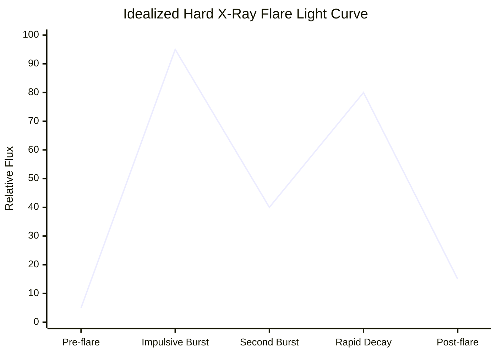

# 16 — HEL1OS

> **Document 16 of 61** in the HeliosAI documentation set (see `README.md` → Repository Structure). Details the second of HeliosAI's two data-source payloads at the level needed for ingestion and preprocessing design. Follows `15_SoLEXS.md` and feeds directly into `17_Data_Ingestion.md` and `18_Data_Preprocessing.md`.

---

## Table of Contents

1. [Purpose of This Document](#purpose-of-this-document)
2. [What HEL1OS Measures](#what-hel1os-measures)
3. [Why Hard X-Ray Matters for Flare Forecasting](#why-hard-x-ray-matters-for-flare-forecasting)
4. [Data Characteristics Relevant to Ingestion](#data-characteristics-relevant-to-ingestion)
5. [Typical Flare Signature in HEL1OS Light Curves](#typical-flare-signature-in-hel1os-light-curves)
6. [Known Data-Quality Considerations](#known-data-quality-considerations)
7. [Relevance to HeliosAI's Design](#relevance-to-heliosais-design)
8. [Revision History](#revision-history)

---

## Purpose of This Document

This document gives contributors implementing `17_Data_Ingestion.md`, `18_Data_Preprocessing.md`, and `23_Forecasting.md` enough instrument-level understanding of HEL1OS to make informed parsing, calibration-awareness, and feature-engineering decisions. It emphasizes how HEL1OS acts as the predictive counterpart to the reactive SoLEXS detections.

> **Note on sourcing:** exact calibration constants, energy-channel boundaries, and current instrument health status should be verified against HEL1OS's official payload documentation (referenced in `README.md` → References) before being hard-coded into calibration logic.

---

## What HEL1OS Measures

HEL1OS (High Energy L1 Orbiting X-ray Spectrometer) is Aditya-L1's hard X-ray spectrometer, observing the Sun in the roughly **10–150 keV** energy range. It measures the Sun's disk-integrated hard X-ray flux and spectrum. 

This band is dominated by **non-thermal bremsstrahlung emission** generated when high-energy electrons, accelerated by magnetic reconnection, crash into the dense lower solar atmosphere (chromosphere). Unlike the gradual heating observed by SoLEXS, the hard X-ray emission is impulsive, bursty, and directly tied to the primary energy release mechanism of the flare.

---

## Why Hard X-Ray Matters for Flare Forecasting

- **The Precursor Signal:** Per the Neupert effect, the hard X-ray flux tracks the rate of energy injection, meaning the hard X-ray profile typically peaks *before* the soft X-ray profile reaches its maximum. This provides a crucial leading indicator.
- **Hardness Ratio:** By comparing the ratio of HEL1OS flux to SoLEXS flux (the "hardness ratio"), HeliosAI models can infer the impulsiveness and spectral hardening of an event. A rising hardness ratio often precedes a rapid escalation in thermal soft X-ray flux.
- **Machine Learning Predictability:** The bursty, pre-peak characteristics of the hard X-ray signal provide the necessary variance and time-lag features that deep learning sequence models (like PatchTST and TFT) leverage to forecast peak magnitudes (`23_Forecasting.md`) before they actually occur.

---

## Data Characteristics Relevant to Ingestion

| Characteristic | Relevance |
|---|---|
| Higher energy, lower count rates | Hard X-ray fluxes are generally much lower than soft X-ray fluxes, meaning Poisson noise is more pronounced. Smoothing or rolling averages may be required in feature engineering. |
| Impulsive time series | Sharp spikes and rapid fluctuations require high temporal resolution. Aggregation downsampling must be careful not to wash out precursor spikes. |
| Spacecraft-clock timestamps | Requires the Time Synchronization Engine (`18_Data_Preprocessing.md`) to convert to UTC and align tightly with SoLEXS timestamps. |
| Background/instrumental counts | Cosmic ray hits and detector background must be subtracted. Because intrinsic count rates are lower, accurate background modeling is critical. |

---

## Typical Flare Signature in HEL1OS Light Curves

A canonical hard X-ray flare signature is fundamentally different from a soft X-ray curve:

- **Pre-flare baseline:** Very low background.
- **Impulsive Burst:** A sudden, jagged spike in flux. This burst corresponds to the rapid acceleration of electrons and occurs concurrently with the *steepest rise* of the SoLEXS soft X-ray curve.
- **Rapid Decay:** Once the electron acceleration ceases, the hard X-ray emission drops off rapidly, often returning to near-baseline well before the soft X-ray thermal plasma has finished cooling.

---

## Known Data-Quality Considerations

- **Poisson Noise:** Due to the low physical photon flux at high energies, binning over time or energy is often necessary to achieve a usable Signal-to-Noise Ratio (SNR).
- **Detector Pile-up:** During exceptionally large flares (e.g., X-class), high incoming photon rates can cause multiple photons to be counted as a single higher-energy event. HeliosAI's raw validation step must monitor metadata flags for pile-up saturation.
- **Particle Background:** High-energy detectors are sensitive to galactic cosmic rays and solar energetic particles (SEPs). Spurious spikes unassociated with solar flares must be filtered out by checking against surrounding context or the SoLEXS baseline.

---

## Relevance to HeliosAI's Design

| HeliosAI Component | HEL1OS-Specific Consideration |
|---|---|
| Format parser (`17_Data_Ingestion.md`) | Must handle HEL1OS's specific Level-1 file schema (FITS/CDF/CSV). |
| Cross-Band Alignment (`18_Data_Preprocessing.md`) | HEL1OS timestamps must be perfectly synchronized with SoLEXS timestamps to calculate the Hardness Ratio without introducing artificial time-lags. |
| Feature Engineering (`21_Feature_Engineering.md`) | Calculates rolling derivatives and cross-correlations specifically tailored to HEL1OS's impulsive spikes. |
| Forecasting Protocol (`23_Forecasting.md`) | Relies heavily on HEL1OS lagged features as the primary leading indicator for future SoLEXS peaks. |

**Next document:** `17_Data_Ingestion.md` — say **NEXT** to continue.

---

## Revision History

| Version | Date | Author | Notes |
|---|---|---|---|
| 0.1 | 2026-07-12 | HeliosAI Documentation (Antigravity workflow) | Initial HEL1OS document — instrument overview, hard X-ray physics, and forecasting relevance established |
