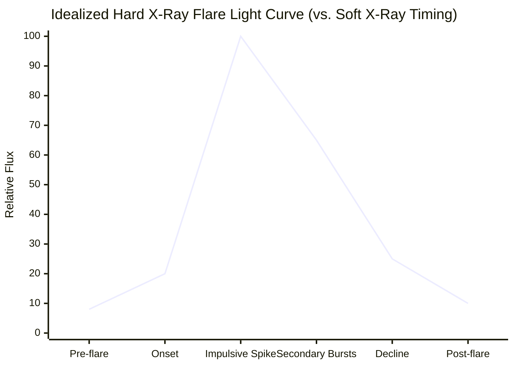

# 16 — HEL1OS

> **Document 16 of 61** in the HeliosAI documentation set (see `README.md` → Repository Structure). Details the second of HeliosAI's two data-source payloads, complementing `15_SoLEXS.md`. Closes out the payload-specific pair before ingestion architecture resumes in `17_Data_Ingestion.md`.

---

## Table of Contents

1. [Purpose of This Document](#purpose-of-this-document)
2. [What HEL1OS Measures](#what-hel1os-measures)
3. [Why Hard X-Ray Matters for Precursor Detection](#why-hard-x-ray-matters-for-precursor-detection)
4. [Data Characteristics Relevant to Ingestion](#data-characteristics-relevant-to-ingestion)
5. [Typical Flare Signature in HEL1OS Light Curves](#typical-flare-signature-in-hel1os-light-curves)
6. [SoLEXS vs. HEL1OS — Side-by-Side](#solexs-vs-hel1os--side-by-side)
7. [Known Data-Quality Considerations](#known-data-quality-considerations)
8. [Relevance to HeliosAI's Design](#relevance-to-heliosais-design)
9. [Revision History](#revision-history)

---

## Purpose of This Document

Mirrors the purpose of `15_SoLEXS.md`, but for HEL1OS: giving contributors implementing ingestion, preprocessing, and the Cross-Band Fusion Layer enough instrument-level grounding to make informed decisions about HEL1OS specifically, rather than assuming it behaves identically to SoLEXS with only a different energy range.

> **Note on sourcing:** as with `15_SoLEXS.md`, exact energy-channel boundaries, calibration constants, and current instrument health status should be verified against HEL1OS's official payload documentation (per `README.md` → References) at implementation time.

---

## What HEL1OS Measures

HEL1OS (High Energy L1 Orbiting X-ray Spectrometer) is Aditya-L1's hard X-ray payload, observing at higher photon energies than SoLEXS. Where SoLEXS captures the thermal, soft X-ray emission of heated flare plasma, HEL1OS captures the **non-thermal** hard X-ray emission produced by populations of electrons accelerated to high energies during magnetic reconnection — a physically distinct emission mechanism, not simply "the same signal at higher energy."

---

## Why Hard X-Ray Matters for Precursor Detection

- **Earlier timing relative to soft X-ray peak:** because hard X-ray emission traces the impulsive, non-thermal electron acceleration phase of a flare, it frequently peaks **before** the soft X-ray thermal peak that SoLEXS observes — this timing lead is the physical mechanism HeliosAI's forecasting precursor features are built to exploit (per `12_Research_Background.md`'s Neupert-effect discussion).
- **Sensitivity to impulsive, short-duration events:** some flare-related energy release is brief and non-thermal-dominated, potentially under-represented in soft X-ray alone — this is part of the physical justification (alongside the differentiator stated in `README.md`) for why single-band-only detections are retained as "tentative" rather than discarded, since a HEL1OS-only impulsive spike can be scientifically real even without a strong corresponding SoLEXS signature.
- **Spectral hardness as a diagnostic:** the ratio of hard-to-soft X-ray flux (hardness ratio) is a standard solar-physics diagnostic of how energetic a given event is, independent of its raw soft X-ray magnitude — this is why hardness ratio is engineered as a first-class feature rather than treated as a secondary derived quantity.

---

## Data Characteristics Relevant to Ingestion

| Characteristic | Relevance |
|---|---|
| Higher-energy time series of flux/counts vs. time | Core light-curve structure, parallel to SoLEXS but at a different energy regime |
| Potentially lower count rates than SoLEXS for weak (A/B-class) events | Affects signal-to-noise for low-class flare detection — relevant to the "detect low- and high-class flares" evaluation criterion in the Problem Statement |
| Spacecraft-clock timestamps (independent of SoLEXS's own clock behavior) | Must be synchronized to the same UTC reference as SoLEXS before fusion — this is the specific risk flagged as R4 in `10_Risk_Assessment.md` |
| Background dominated by different sources than SoLEXS (e.g., different detector technology, different particle-background sensitivity) | Requires its own dedicated background-subtraction logic, not a shared routine copied from SoLEXS |

---

## Typical Flare Signature in HEL1OS Light Curves

Compared to the smoother rise-peak-decay shape typical of soft X-ray, hard X-ray light curves are often more impulsive and spiky, sometimes with multiple short bursts during the flare's impulsive phase:

Note that the **impulsive spike here typically precedes the soft X-ray peak shown in `15_SoLEXS.md`'s light-curve diagram** — this lead/lag relationship between the two payloads' peaks is exactly what HeliosAI's Cross-Band Fusion Layer and forecasting precursor-window features are designed to capture.

---

## SoLEXS vs. HEL1OS — Side-by-Side

| Aspect | SoLEXS (Soft X-ray) | HEL1OS (Hard X-ray) |
|---|---|---|
| Energy range | ~1–15 keV | Higher energy band |
| Emission mechanism | Thermal bremsstrahlung | Non-thermal accelerated electrons |
| Typical timing | Peaks later, decays slowly | Often peaks earlier, more impulsive |
| Role in GOES-equivalent classification | Primary basis | Not directly used for class mapping |
| Role in forecasting | Decay-time and rise features | Precursor/lead-time features, hardness ratio numerator |
| Sensitivity to low-class flares | Class-dependent | Can be lower count rate for weak events |

---

## Known Data-Quality Considerations

- **Lower signal-to-noise for weak events:** for A/B-class flares, HEL1OS's hard X-ray signal may be marginal or absent, meaning nowcasting confidence scoring should not penalize a SoLEXS-only detection as automatically less credible for low-class events — this nuance directly informs the confidence-fusion logic in `22_Nowcasting.md`.
- **Particle-background contamination:** high-energy detectors are generally more susceptible to charged-particle background (e.g., from solar energetic particle events or radiation belt passage, if applicable at L1) than soft X-ray detectors — worth explicit background characterization rather than assuming background is negligible at high energy.
- **Independent clock/timestamp source:** must not be assumed pre-synchronized with SoLEXS; the Time Synchronization Engine (`18_Data_Preprocessing.md`) treats both payloads as independent time sources requiring explicit alignment.

---

## Relevance to HeliosAI's Design

| HeliosAI Component | HEL1OS-Specific Consideration |
|---|---|
| Format parser (`17_Data_Ingestion.md`) | Must handle HEL1OS's own Level-1 file schema, which may differ from SoLEXS's |
| Background subtraction (`18_Data_Preprocessing.md`) | Requires HEL1OS-specific background modeling, distinct from SoLEXS's |
| Cross-Band Fusion Layer (`19_Data_Synchronization.md`) | Must explicitly align HEL1OS's independent clock to the same UTC reference as SoLEXS |
| Confidence-weighted fusion (`22_Nowcasting.md`) | Must not penalize HEL1OS-quiet, SoLEXS-confirmed low-class events, given HEL1OS's lower SNR at weak flare magnitudes |
| Hardness ratio feature (`21_Feature_Engineering.md`) | HEL1OS flux is the numerator against SoLEXS's denominator |

---

## Revision History

| Version | Date | Author | Notes |
|---|---|---|---|
| 0.1 | 2026-07-12 | HeliosAI Documentation (Antigravity workflow) | Initial HEL1OS document — instrument overview, precursor-timing rationale, and SoLEXS comparison established |
