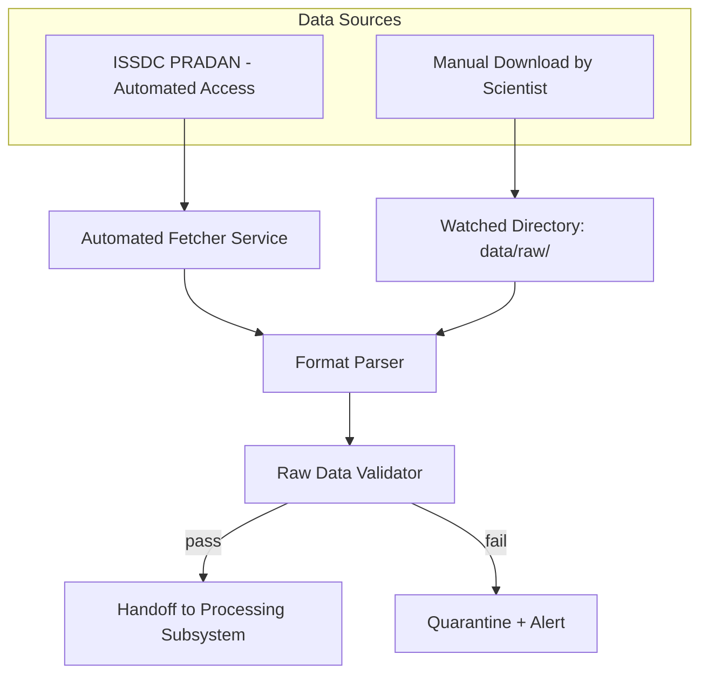
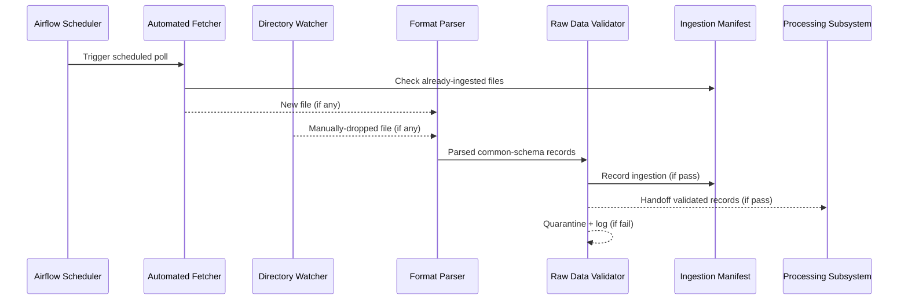

# 17 — Data Ingestion

> **Document 17 of 61** in the HeliosAI documentation set (see `README.md` → Repository Structure). First document in the implementation-facing sequence — translates payload knowledge from `15_SoLEXS.md` and `16_HEL1OS.md` into the concrete Ingestion Subsystem design referenced in `README.md`'s System Overview and scoped as Phase 1 in `08_Development_Roadmap.md`. Precedes `18_Data_Preprocessing.md`.

---

## Table of Contents

1. [Purpose of This Document](#purpose-of-this-document)
2. [Ingestion Subsystem Responsibilities](#ingestion-subsystem-responsibilities)
3. [Dual-Path Ingestion Design](#dual-path-ingestion-design)
4. [Automated Fetcher](#automated-fetcher)
5. [Manual-Drop Ingestion Mode](#manual-drop-ingestion-mode)
6. [Format Parser](#format-parser)
7. [Raw Data Validator](#raw-data-validator)
8. [Ingestion Sequence Diagram](#ingestion-sequence-diagram)
9. [Storage Handoff](#storage-handoff)
10. [Failure Modes and Handling](#failure-modes-and-handling)
11. [Revision History](#revision-history)

---

## Purpose of This Document

This document specifies **how raw SoLEXS and HEL1OS Level-1 data actually enters HeliosAI**, at a level of detail sufficient to scope the Phase 1 Antigravity Master Prompt without requiring the implementer to re-derive design decisions already made in `README.md`, `08_Development_Roadmap.md`, and `10_Risk_Assessment.md`. Low-level class/function signatures are deferred to `05_Low_Level_Design.md`; this document stays at subsystem-behavior level.

---

## Ingestion Subsystem Responsibilities

Per `README.md`'s System Overview, the Ingestion Subsystem is responsible for:

1. Fetching or receiving raw SoLEXS and HEL1OS Level-1 files (and optional GOES XRS supplementary data).
2. Parsing whatever file format each source provides (FITS/CDF/CSV).
3. Validating raw data before it is trusted by the Processing Subsystem (`18`).
4. Handing off validated raw records to the Processing Subsystem's Time Synchronization Engine (`19_Data_Synchronization.md`).

It explicitly does **not** perform time synchronization, background subtraction, or feature engineering — those are Processing Subsystem responsibilities, kept separate so ingestion failures and processing failures are diagnosable independently.

---

## Dual-Path Ingestion Design

As established in `README.md` and reinforced as a top mitigation in `10_Risk_Assessment.md` (R1), HeliosAI treats two ingestion paths as **equally first-class**, not primary/fallback:

Both paths converge at the same Format Parser and Raw Data Validator, so downstream components have **one contract to satisfy**, regardless of which path delivered the file.

---

## Automated Fetcher

- **Purpose:** where ISSDC PRADAN offers programmatic or token-based access, poll or subscribe for new SoLEXS/HEL1OS Level-1 releases on a scheduled cadence (Airflow-managed, per `07_Tech_Stack.md`).
- **Design constraint:** must fail *gracefully and loudly* if authentication fails or access is unavailable — per the R1 mitigation in `10_Risk_Assessment.md`, repeated silent failures here should escalate quickly rather than be treated as a transient issue to keep retrying indefinitely.
- **Idempotency requirement:** per the Reliability NFR in `README.md`, re-running a fetch for an already-ingested time window must not duplicate records — the fetcher checks a manifest/ledger of already-ingested file identifiers before writing.

---

## Manual-Drop Ingestion Mode

- **Purpose:** a scientist manually downloads SoLEXS/HEL1OS Level-1 files from PRADAN (where automated access isn't available for their account tier) and places them into a watched `data/raw/` directory.
- **Design constraint:** this path must be **exercised and tested with the same rigor as the automated path**, not treated as a lesser-quality afterthought — per `11_Feasibility_Study.md`, feasibility is explicitly conditioned on this path working reliably.
- **Detection mechanism:** a filesystem watcher (or scheduled directory scan, for portability across environments) picks up new files, moves them through the same parser/validator pipeline as automated fetches.
- **Naming convention requirement:** scientists dropping files manually should follow a documented naming/metadata convention (finalized in `05_Low_Level_Design.md`) so the parser can determine payload type (SoLEXS vs. HEL1OS) and approximate time range without relying solely on file content inspection.

---

## Format Parser

- Handles **FITS, CDF, and CSV** — the three formats anticipated based on PRADAN's typical Level-1 export conventions (per `14_AdityaL1_Mission.md`), with the parser dispatching to the correct reader based on file extension and/or content-sniffing.
- Produces a **common internal representation** (timestamp, flux/count value, payload identifier, quality flags if present in the source file) regardless of input format — this common schema is what the Raw Data Validator and downstream Processing Subsystem consume, so format differences never leak past this layer.
- Payload-specific parsing quirks (e.g., SoLEXS energy-channel structure vs. HEL1OS's own channel conventions, per `15_SoLEXS.md` and `16_HEL1OS.md`) are isolated into payload-specific parser modules sharing a common interface, so a HEL1OS format change doesn't risk breaking SoLEXS parsing.

---

## Raw Data Validator

Performs checks **before** any record is trusted downstream:

1. **Schema validation** — required fields present, correct types, timestamps parseable.
2. **Gap detection** — flags missing time ranges (relevant given the Scalability NFR's incremental-processing requirement — gaps must be recorded, not silently skipped, so incremental reprocessing knows what's actually been covered).
3. **Corrupt-file quarantine** — files failing schema validation are moved to a quarantine location with a logged reason, never silently dropped, per the Auditability NFR in `README.md`.
4. **Duplicate detection** — cross-checked against the ingestion manifest/ledger described above, regardless of which ingestion path delivered the file.

---

## Ingestion Sequence Diagram

---

## Storage Handoff

Validated raw records are handed to the Processing Subsystem's Time Synchronization Engine (`18_Data_Preprocessing.md`, `19_Data_Synchronization.md`) — ingestion itself does **not** write directly to TimescaleDB's processed feature tables; it writes to a raw/staging area, keeping a clean separation between "what we received" and "what we've cleaned and trust," which supports the reprocessing scenarios described in the Scalability NFR.

---

## Failure Modes and Handling

| Failure | Handling |
|---|---|
| PRADAN authentication failure (automated path) | Log, alert, escalate per R1 mitigation — do not silently retry indefinitely |
| Malformed/corrupt file (either path) | Quarantine with logged reason; never silently dropped |
| Duplicate file/time-range | Detected via ingestion manifest; skipped without error, logged as a no-op |
| Unrecognized format/payload | Quarantine; flagged for manual review, since this may indicate a payload export convention change (per `14_AdityaL1_Mission.md`) worth escalating to the documentation/config, not just the code |
| Partial/truncated file | Schema validation failure → quarantine; gap recorded for eventual re-fetch |

---

## Revision History

| Version | Date | Author | Notes |
|---|---|---|---|
| 0.1 | 2026-07-12 | HeliosAI Documentation (Antigravity workflow) | Initial Data Ingestion document — dual-path design, fetcher, manual-drop mode, parser, and validator specified |
