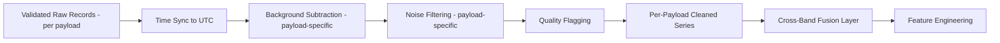

# 18 — Data Preprocessing

> **Document 18 of 61** in the HeliosAI documentation set (see `README.md` → Repository Structure). Specifies what happens to validated raw records handed off by `17_Data_Ingestion.md` before feature engineering (`21_Feature_Engineering.md`) begins. Time synchronization specifically is detailed in the companion document `19_Data_Synchronization.md`; this document covers the remaining preprocessing steps — background subtraction, noise filtering, and quality flagging — referenced together in `README.md` → Objectives.

---

## Table of Contents

1. [Purpose of This Document](#purpose-of-this-document)
2. [Preprocessing Pipeline Overview](#preprocessing-pipeline-overview)
3. [Background Subtraction](#background-subtraction)
4. [Noise Filtering](#noise-filtering)
5. [Quality Flagging](#quality-flagging)
6. [Per-Payload Preprocessing Differences](#per-payload-preprocessing-differences)
7. [Preprocessing Pipeline Diagram](#preprocessing-pipeline-diagram)
8. [Output Contract](#output-contract)
9. [Idempotency and Reprocessing](#idempotency-and-reprocessing)
10. [Revision History](#revision-history)

---

## Purpose of This Document

Raw, validated light-curve records (per `17_Data_Ingestion.md`) are not yet analysis-ready: they contain instrumental background, noise, and time-alignment issues that would corrupt flare detection and feature engineering if left unaddressed. This document specifies the cleaning steps that transform validated raw records into the "cleaned + feature-engineered series" referenced in `README.md`'s Data Flow diagram — stopping short of synchronization (covered separately in `19`) and feature construction (covered in `21`).

---

## Preprocessing Pipeline Overview

The Processing Subsystem (per `README.md`'s System Overview) applies these steps, in order, to each payload's validated raw stream **independently** before cross-band fusion occurs:

1. Time synchronization (spacecraft time → UTC) — detailed in `19_Data_Synchronization.md`.
2. **Background subtraction** (this document).
3. **Noise filtering** (this document).
4. **Quality flagging** (this document).
5. Cross-Band Fusion Layer merge — detailed in `19_Data_Synchronization.md`.
6. Feature engineering — detailed in `21_Feature_Engineering.md`.

Steps 2–4 are applied **per payload, independently**, before fusion — because, as established in `15_SoLEXS.md` and `16_HEL1OS.md`, SoLEXS and HEL1OS have distinct background behavior and noise characteristics that must not be conflated into one shared routine.

---

## Background Subtraction

**Goal:** isolate flare-relevant flux from the instrument's non-flare (quiescent) baseline signal.

- **Method:** a rolling/adaptive background estimate (e.g., a percentile-based or median-filtered baseline over a trailing window long enough to span typical quiescent-Sun variation but short enough to track slow instrumental drift) is subtracted from raw flux, per payload.
- **Why adaptive, not fixed:** per `15_SoLEXS.md` and `16_HEL1OS.md`, instrumental background can drift over the mission lifetime (temperature, radiation dose); a fixed offset calibrated once would degrade over time, which is exactly the failure mode this step is designed to avoid.
- **Payload-specific tuning:** SoLEXS and HEL1OS get independently-tuned background estimators (different window lengths, different baseline statistics) rather than a shared configuration, per the differences documented in `15` and `16`.
- **Auditability:** the background estimate used for each time segment is persisted alongside the subtracted flux (not discarded), so any flare detection can be traced back to exactly what baseline it was measured against — supporting the Auditability NFR in `README.md`.

---

## Noise Filtering

**Goal:** reduce measurement noise without smoothing away genuine flare signal, especially for low-class (A/B) flares whose amplitude may be close to the noise floor.

- **Method:** light smoothing (e.g., a short-window moving average or Savitzky-Golay-style filter) tuned conservatively — aggressive smoothing risks suppressing exactly the low-class flares the Problem Statement's evaluation criteria emphasize detecting.
- **Design constraint:** noise filtering must be tunable per payload and reversible in the sense that the pre-filtered signal is retained (not overwritten), so downstream algorithms — particularly the changepoint detector in `22_Nowcasting.md` — can access either the filtered or raw-background-subtracted signal depending on which is more sensitive for a given detection task.
- **Validation approach:** filter parameters should be tuned against known historical flare events (using GOES XRS cross-validation data, per `README.md`'s in-scope supplementary dataset) to confirm genuine low-class events aren't being filtered out — this validation step is called out explicitly here because it's the most likely place for a well-intentioned smoothing choice to quietly work against the Problem Statement's own evaluation criteria.

---

## Quality Flagging

**Goal:** attach a per-segment (or per-sample) quality indicator so downstream nowcasting/forecasting and the dashboard can distinguish trustworthy data from suspect data, rather than treating all cleaned data as equally reliable.

Quality flags include (non-exhaustive, finalized in `05_Low_Level_Design.md`):

- `GAP` — segment reconstructed across a data gap flagged during ingestion (`17_Data_Ingestion.md`).
- `LOW_SNR` — background-subtracted flux is close to the estimated noise floor for that payload/window.
- `SATURATED` — flux exceeds the instrument's reliable dynamic range (relevant for extreme X-class events per `15_SoLEXS.md`).
- `SINGLE_BAND_ONLY` — the corresponding sample in the *other* payload's stream is itself flagged or missing, relevant context for the fusion layer's "tentative" classification logic (per `README.md`'s key differentiator).

Quality flags are **persisted alongside the data**, never used to silently drop samples — consistent with the Auditability NFR and the general documentation-wide principle (already applied in `17_Data_Ingestion.md`) of flagging rather than discarding.

---

## Per-Payload Preprocessing Differences

| Step | SoLEXS-Specific Consideration | HEL1OS-Specific Consideration |
|---|---|---|
| Background subtraction | Thermal background drift with instrument temperature | Particle-background contamination sensitivity (per `16_HEL1OS.md`) |
| Noise filtering | Tuned for smoother thermal decay curves | Tuned to preserve impulsive, spiky bursts — over-smoothing here would specifically destroy the precursor signal HeliosAI relies on |
| Quality flagging | `SATURATED` flag more relevant given SoLEXS's classification role | `LOW_SNR` flag more frequently expected at low flare classes, per `16_HEL1OS.md`'s known SNR limitation |

---

## Preprocessing Pipeline Diagram

---

## Output Contract

The output of this pipeline, per payload, is a **cleaned, quality-flagged, background-subtracted, UTC-timestamped series** — this is the common contract that the Cross-Band Fusion Layer (`19_Data_Synchronization.md`) consumes from both SoLEXS and HEL1OS streams. Both payload outputs must conform to this identical schema even though the internal processing logic that produced them (background models, filter parameters) differs, per the Per-Payload Preprocessing Differences above.

---

## Idempotency and Reprocessing

Per the Reliability NFR in `README.md`, preprocessing must be **idempotent and resumable** — re-running background subtraction/noise filtering/quality flagging on an already-processed segment must produce the same output (not double-subtract background or re-flag redundantly), and a partial pipeline failure must be resumable from the last successfully completed step rather than requiring a full reprocess. This is why background estimates and filter intermediate outputs are persisted (per [Background Subtraction](#background-subtraction) above) rather than only kept in memory during a single run.

---

## Revision History

| Version | Date | Author | Notes |
|---|---|---|---|
| 0.1 | 2026-07-12 | HeliosAI Documentation (Antigravity workflow) | Initial Data Preprocessing document — background subtraction, noise filtering, and quality flagging specified, per-payload differences and idempotency requirements established |
