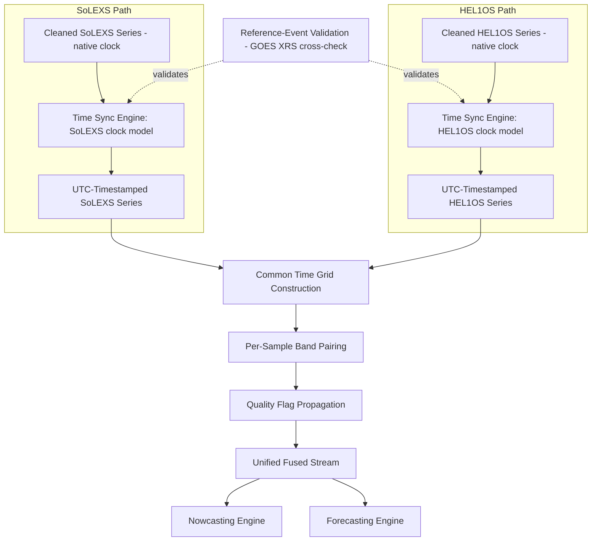

# 19 — Data Synchronization

> **Document 19 of 61** in the HeliosAI documentation set (see `README.md` → Repository Structure). Completes the preprocessing pipeline introduced in `18_Data_Preprocessing.md` by specifying the Time Synchronization Engine and the Cross-Band Fusion Layer — the step that turns two independent payload streams into the single unified stream `20_Signal_Processing.md` and `21_Feature_Engineering.md` operate on.

---

## Table of Contents

1. [Purpose of This Document](#purpose-of-this-document)
2. [Why Synchronization Is Its Own Document](#why-synchronization-is-its-own-document)
3. [Time Synchronization Engine](#time-synchronization-engine)
4. [Clock Drift and Validation](#clock-drift-and-validation)
5. [Cross-Band Fusion Layer](#cross-band-fusion-layer)
6. [Handling Misaligned or Missing Samples](#handling-misaligned-or-missing-samples)
7. [Synchronization & Fusion Diagram](#synchronization--fusion-diagram)
8. [Output Contract](#output-contract)
9. [Revision History](#revision-history)

---

## Purpose of This Document

`18_Data_Preprocessing.md` cleaned SoLEXS and HEL1OS independently but left them as **two separate time series**, each still on its own instrument clock. This document specifies exactly how those two streams become one **time-aligned, fused stream** — the single most important correctness-critical step in the entire pipeline, since every downstream nowcasting and forecasting feature (hardness ratio, cross-band timing lead, confidence fusion) depends on both streams actually referring to the same real-world moments in time.

---

## Why Synchronization Is Its Own Document

Time synchronization was called out as **Risk R4** in `10_Risk_Assessment.md` (cross-band time sync drift, Score 12) precisely because it is easy to under-specify and hard to debug after the fact — a subtle misalignment doesn't crash anything, it just silently corrupts every derived feature downstream. This document exists so the synchronization contract is explicit and testable on its own, independent of whatever background/noise processing choices were made in `18`.

---

## Time Synchronization Engine

**Goal:** convert each payload's onboard spacecraft-clock timestamps into a common UTC reference, independently for SoLEXS and HEL1OS, before any cross-band operation is attempted.

- **Input:** per-payload cleaned series (output of `18_Data_Preprocessing.md`), still timestamped in each payload's native clock/format.
- **Conversion approach:** apply the payload's documented clock-correlation model (spacecraft-time-to-UTC mapping, as provided by mission/payload documentation per `14_AdityaL1_Mission.md`) to produce UTC timestamps for every sample.
- **Critical design rule:** SoLEXS and HEL1OS are treated as **fully independent clock sources** — the engine never assumes one payload's clock as a proxy for the other's, even though both are onboard the same spacecraft, since independent instrument electronics can drift independently.
- **Precision requirement:** UTC timestamp precision must be fine enough to resolve the SoLEXS/HEL1OS peak-timing lead relationship described in `15_SoLEXS.md` and `16_HEL1OS.md` — if native sample cadence is coarser than the timing effect being measured, this is flagged as a modeling limitation, not silently ignored.

---

## Clock Drift and Validation

Per Risk R4's mitigation in `10_Risk_Assessment.md`, the synchronization engine's output must be validated, not just computed and trusted:

1. **Reference-event validation:** for a set of known historical flare events (cross-checked against GOES XRS timing, per `README.md`'s in-scope supplementary data), confirm that SoLEXS and HEL1OS peaks align with physically expected timing relationships (HEL1OS lead, per `16_HEL1OS.md`) after synchronization is applied.
2. **Drift monitoring:** if a payload's clock-correlation model degrades over mission lifetime, this should surface as a growing validation residual against reference events — tracked as a monitored metric (per `45_Monitoring.md`), not discovered only when a scientist notices oddly-timed fused features.
3. **Escalation path:** a validation residual exceeding a documented tolerance halts fusion for the affected time range and flags it for manual review rather than silently fusing on faith.

---

## Cross-Band Fusion Layer

Once both streams are independently UTC-synchronized, the Cross-Band Fusion Layer performs:

1. **Common time grid construction** — since SoLEXS and HEL1OS may have different native sample cadences, both streams are resampled/aligned onto a shared time grid (method — nearest-neighbor, linear interpolation, or cadence-matched binning — finalized in `05_Low_Level_Design.md`, chosen to avoid introducing spurious smoothing that would blur the HEL1OS-leads-SoLEXS timing relationship this whole document exists to preserve).
2. **Per-sample band pairing** — each time-grid point carries both SoLEXS and HEL1OS values (or an explicit missing/flagged indicator if one payload has no valid sample at that point, per quality flags from `18_Data_Preprocessing.md`).
3. **Fused-record quality propagation** — if either input sample was flagged (`GAP`, `LOW_SNR`, `SATURATED`, `SINGLE_BAND_ONLY`, per `18`), that flag propagates to the fused record so downstream nowcasting doesn't treat a fused sample as more trustworthy than its weakest input.

This fused, common-time-grid stream is what feeds **both** the Nowcasting Engine and Forecasting Engine (per `README.md`'s Data Flow diagram) — it is the single unified stream referenced throughout `README.md`'s Executive Summary.

---

## Handling Misaligned or Missing Samples

| Situation | Handling |
|---|---|
| SoLEXS sample exists, HEL1OS sample missing at that time-grid point | Fused record retains SoLEXS value, HEL1OS marked missing/flagged — feeds the "tentative" single-band detection path in `22_Nowcasting.md` |
| HEL1OS sample exists, SoLEXS sample missing | Symmetric handling to above |
| Both present but clock-validation residual exceeds tolerance for that window | Fusion halted for that window; window flagged for manual review, not silently fused |
| Native cadence mismatch (e.g., one payload samples more frequently) | Resampling method applied per the common time grid design above, chosen specifically to preserve timing-lead information |

---

## Synchronization & Fusion Diagram

---

## Output Contract

The Cross-Band Fusion Layer produces a single stream where each record contains: a common UTC timestamp, SoLEXS flux (or missing indicator), HEL1OS flux (or missing indicator), and a propagated quality-flag set. This is the exact contract `20_Signal_Processing.md` and `21_Feature_Engineering.md` build on — no further synchronization logic should be needed downstream of this point.

---

## Revision History

| Version | Date | Author | Notes |
|---|---|---|---|
| 0.1 | 2026-07-12 | HeliosAI Documentation (Antigravity workflow) | Initial Data Synchronization document — Time Synchronization Engine, drift validation, and Cross-Band Fusion Layer specified |
