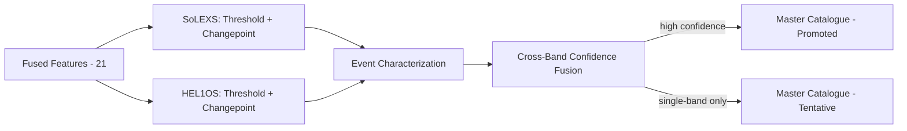

# 22 — Nowcasting

> **Document 22 of 61.** First document of the Intelligence Subsystem (see `README.md` → System Overview). Consumes the feature set from `21_Feature_Engineering.md`; its output (the master flare catalogue) feeds `23_Forecasting.md`'s training labels and `29_Explainable_AI.md`.

---

## Table of Contents
1. [Purpose](#purpose)
2. [Per-Band Detection](#per-band-detection)
3. [Event Characterization](#event-characterization)
4. [Cross-Band Confidence Fusion](#cross-band-confidence-fusion)
5. [Master Catalogue Promotion Rules](#master-catalogue-promotion-rules)
6. [Nowcasting Pipeline Diagram](#nowcasting-pipeline-diagram)
7. [Latency Budget](#latency-budget)
8. [Revision History](#revision-history)

---

## Purpose

Implements the nowcasting algorithm summarized in `README.md` → Core Algorithms Summary: independent per-band detection, fused into a confidence-scored master catalogue, satisfying the Problem Statement's requirement to detect flares "as they occur."

---

## Per-Band Detection

Two independent detectors run on each of SoLEXS and HEL1OS (per `20_Signal_Processing.md`'s Changepoint-Ready Signal Conditioning):

1. **Threshold/peak-finding detector** — flags a candidate when background-subtracted flux crosses a payload-specific, noise-informed threshold.
2. **Changepoint detector** — flags a statistically significant shift in local mean/slope, catching low-class flares that may not clear a fixed threshold.

Both run in parallel per band; a candidate is raised if **either** fires, avoiding a single-method blind spot.

---

## Event Characterization

For each candidate: peak time and magnitude, rise time (onset → peak), decay time (e-folding, peak → background return), and GOES-equivalent class assignment (SoLEXS-based, per `15_SoLEXS.md`). HEL1OS candidates are characterized the same way but are not used for class assignment (per `16_HEL1OS.md`).

---

## Cross-Band Confidence Fusion

A confidence score combines: (a) whether both bands independently raised a candidate within a tolerance window (`cross_band_agreement_flag`, per `21_Feature_Engineering.md`), (b) each band's individual detection strength, and (c) hardness ratio behavior consistent with a genuine flare.

| Scenario | Confidence | Catalogue Status |
|---|---|---|
| Both bands agree | High | Promoted |
| SoLEXS only | Medium (class-dependent) | Tentative |
| HEL1OS only | Medium-low (per known SNR limits, `16_HEL1OS.md`) | Tentative |
| Neither | N/A | No event |

This directly implements the "tentative" rule from `README.md`'s key differentiator and addresses Risk R5 in `10_Risk_Assessment.md`.

---

## Master Catalogue Promotion Rules

1. Confidence ≥ documented threshold (tuned via precision-recall curves per class, per `README.md` → Why This Approach) → promoted.
2. Below threshold but single-band detection → tentative, retained (never discarded).
3. Every promotion records: timestamps, class, confidence score, contributing features, and a model/config version — supporting Auditability (per `README.md` NFRs).

---

## Nowcasting Pipeline Diagram

---

## Latency Budget

Detection must complete within the bound documented in `45_Monitoring.md`; DWT-based (not CWT) representations from `20_Signal_Processing.md` are used in this real-time path for that reason.

**Next document:** `23_Forecasting.md` — say **NEXT** to continue.

---

## Revision History
| Version | Date | Author | Notes |
|---|---|---|---|
| 0.1 | 2026-07-12 | HeliosAI Documentation | Initial Nowcasting spec — detection, fusion, catalogue rules |
