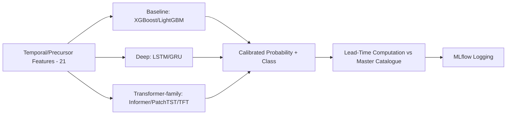

# 23 — Forecasting

> **Document 23 of 61.** Second Intelligence Subsystem document. Trains against the master catalogue produced by `22_Nowcasting.md`, using temporal/precursor features from `21_Feature_Engineering.md`. Feeds `26_Machine_Learning.md`, `27_Deep_Learning.md`, and `28_Transformer_Models.md`.

---

## Table of Contents
1. [Purpose](#purpose)
2. [Problem Framing](#problem-framing)
3. [Training Label Construction](#training-label-construction)
4. [Model Progression](#model-progression)
5. [Lead-Time Computation](#lead-time-computation)
6. [Calibration](#calibration)
7. [Forecasting Pipeline Diagram](#forecasting-pipeline-diagram)
8. [Revision History](#revision-history)

---

## Purpose

Specifies the forecasting capability required by the Problem Statement: predicting flare probability over a rolling future horizon, with **empirically quantified** lead time — the central distinction from nowcasting.

---

## Problem Framing

At each time point, given the rolling lookback window of temporal/precursor features (`21_Feature_Engineering.md`), predict: probability of a flare (and its likely class) occurring within the next N minutes (N = 15/30/60, configurable per `README.md`).

---

## Training Label Construction

Positive labels are derived from the master catalogue (`22_Nowcasting.md`): a time point is labeled positive if a promoted (or, optionally, tentative) event's peak falls within N minutes forward. Class-stratified labeling preserves A/B/C/M/X-equivalent bins for the minority-class handling described in `README.md` → Evaluation Criteria Alignment.

---

## Model Progression

1. **Baselines** — XGBoost/LightGBM/CatBoost on engineered features; fast, interpretable, shipped first (per `08_Development_Roadmap.md`'s baselines-before-deep-models philosophy).
2. **Deep sequence models** — LSTM/GRU as a mid-tier benchmark.
3. **Transformer-family** — Informer, PatchTST, Temporal Fusion Transformer, for longer-range precursor patterns (detailed in `28_Transformer_Models.md`).

Each generation is evaluated against the same held-out historical events before being considered a replacement for the prior generation, not assumed superior.

---

## Lead-Time Computation

For every forecast that precedes an actual catalogued event: `lead_time = actual_peak_ts − predicted_trigger_ts`, computed only after ground truth is known, logged as a first-class MLflow metric per prediction (per `README.md` → Evaluation Criteria Alignment). This addresses Risk R7 in `10_Risk_Assessment.md` directly — lead time is never asserted from model confidence alone.

---

## Calibration

Raw model outputs are calibrated (e.g., Platt scaling / isotonic regression) per flare class, so a reported "70% probability" is empirically meaningful, and thresholds are tuned on precision-recall curves per class rather than a single global cutoff — necessary given the class imbalance discussed in Risk R2 (`10_Risk_Assessment.md`).

---

## Forecasting Pipeline Diagram

**Next document:** `24_AI_Architecture.md` — say **NEXT** to continue.

---

## Revision History
| Version | Date | Author | Notes |
|---|---|---|---|
| 0.1 | 2026-07-12 | HeliosAI Documentation | Initial Forecasting spec — labeling, model progression, lead-time, calibration |
