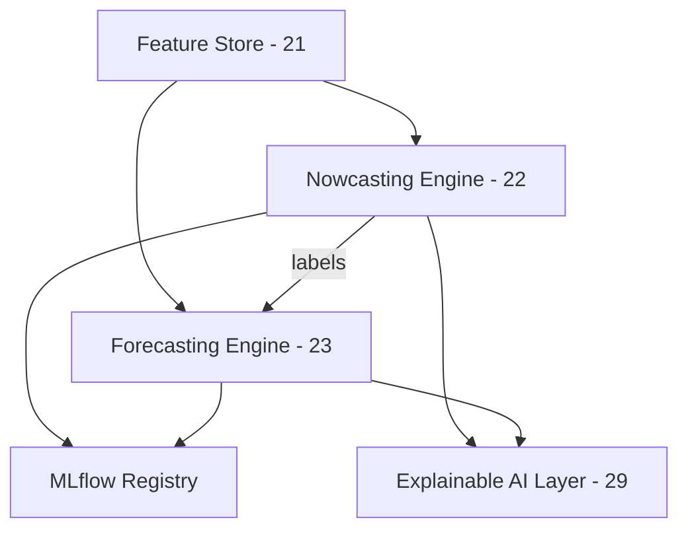

# 24 — AI Architecture

> **Document 24 of 61.** Zooms out from `22_Nowcasting.md` and `23_Forecasting.md` to describe how the two engines relate as one Intelligence Subsystem, before `25_Hybrid_AI_System.md` details their shared infrastructure and `26`–`28` detail individual model families.

---

## Table of Contents
1. [Purpose](#purpose)
2. [Two-Engine Architecture](#two-engine-architecture)
3. [Shared vs. Independent Components](#shared-vs-independent-components)
4. [Model Registry Integration](#model-registry-integration)
5. [Architecture Diagram](#architecture-diagram)
6. [Revision History](#revision-history)

---

## Purpose

Nowcasting and forecasting are deliberately separate engines (per `08_Development_Roadmap.md`'s sequencing rationale) that nonetheless share feature inputs, explainability infrastructure, and a model registry. This document defines that shared architecture so neither engine is built as a silo.

---

## Two-Engine Architecture

- **Nowcasting Engine** — deterministic/statistical (threshold + changepoint), low-latency, produces the master catalogue.
- **Forecasting Engine** — learned (ML/DL), higher-latency-tolerant, produces calibrated probabilities and consumes the catalogue as training labels.

They are architecturally independent (separable failure domains — a forecasting model bug cannot corrupt the catalogue) but data-dependent (forecasting needs nowcasting's labels).

---

## Shared vs. Independent Components

| Component | Shared? | Notes |
|---|---|---|
| Feature Engineering (`21`) | Shared | Both consume the same feature store |
| Explainable AI (`29`) | Shared infrastructure, engine-specific application | SHAP for nowcasting's tree-assisted logic, SHAP + Captum for forecasting |
| MLflow Model Registry | Shared | Both engines' model versions tracked centrally |
| Confidence/probability calibration | Independent | Nowcasting uses precision-recall threshold tuning; forecasting uses probability calibration (`23`) |

---

## Model Registry Integration

Every nowcasting detector configuration and every forecasting model version is registered in MLflow with its feature-version dependency (per `21_Feature_Engineering.md`'s versioning), so any catalogue entry or forecast is traceable to an exact model + feature-version pair — required by the Auditability NFR in `README.md`.

---

## Architecture Diagram

**Next document:** `25_Hybrid_AI_System.md` — say **NEXT** to continue.

---

## Revision History
| Version | Date | Author | Notes |
|---|---|---|---|
| 0.1 | 2026-07-12 | HeliosAI Documentation | Initial AI Architecture — two-engine relationship and shared infrastructure defined |
