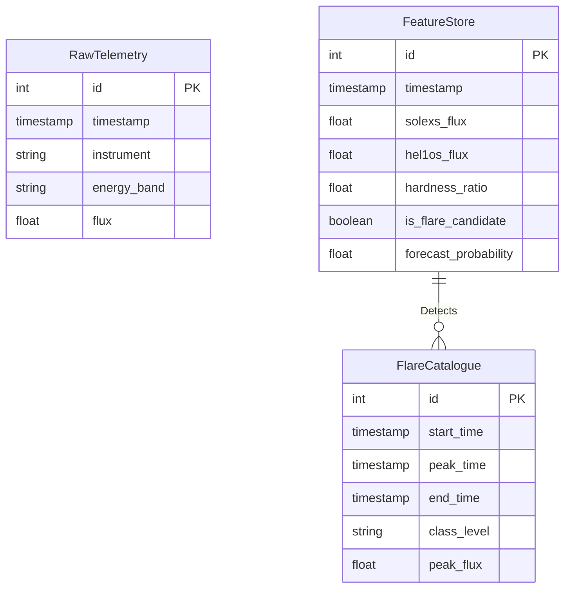

# 30 — Database Design

**HeliosAI** — AI-Powered Space Weather Intelligence Platform
Document 30 of 61

---

## 1. Purpose
Defines the concrete PostgreSQL + TimescaleDB schema underpinning the Data & Catalogue Subsystem, resolving the P0-1 blocker identified in the Final Review Report.

---

## 2. Core Entities

The schema centers on the following tables:

| Table | Purpose | Engine |
|---|---|---|
| `raw_telemetry` | Raw time-series L1 data from payload. | TimescaleDB hypertable |
| `feature_store` | Synchronized, engineered features (e.g., hardness ratio). | TimescaleDB hypertable |
| `flare_catalogue` | Master catalogue of nowcasted events. | Relational |
| `forecast_store` | Log of forecasted probabilities with lead times. | Relational |

---

## 3. Schema Structure

---

## 4. Migration Strategy
All migrations are managed via Alembic. The CI/CD pipeline enforces `alembic upgrade head` prior to application deployment.

**Next document:** `31_Backend_Architecture.md` — say **NEXT** to continue.
