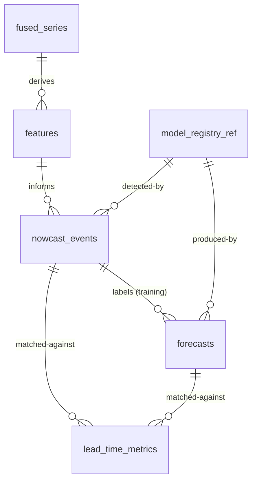

# 30 — Database Design

> **Document 30 of 61.** First document of the Data & Catalogue Subsystem (see `README.md` → System Overview). Formalizes the schema implied by `19_Data_Synchronization.md`, `21_Feature_Engineering.md`, `22_Nowcasting.md`, and `23_Forecasting.md`. Precedes `31_Backend_Architecture.md`.

---

## Table of Contents
1. [Purpose](#purpose)
2. [Core Tables](#core-tables)
3. [Hypertable Strategy](#hypertable-strategy)
4. [Relationships](#relationships)
5. [Indexing Strategy](#indexing-strategy)
6. [Retention & Compression](#retention--compression)
7. [Revision History](#revision-history)

---

## Purpose

Defines the concrete PostgreSQL + TimescaleDB schema underpinning the Data & Catalogue Subsystem, so every subsystem referencing "the database" (`17`–`23`, `31`–`36`) shares one authoritative table design.

---

## Core Tables

| Table | Grain | Key Columns |
|---|---|---|
| `raw_records` | Per validated raw sample, per payload | `payload`, `spacecraft_ts`, `raw_value`, `ingestion_batch_id` |
| `fused_series` | Per common-time-grid point (post `19`) | `utc_ts`, `solexs_flux`, `hel1os_flux`, `quality_flags` |
| `features` | Per timestamp, per feature-version | `utc_ts`, `feature_name`, `value`, `feature_version` |
| `nowcast_events` | Per detected candidate/promoted event | `event_id`, `onset_ts`, `peak_ts`, `class`, `confidence`, `status` (promoted/tentative) |
| `forecasts` | Per prediction | `forecast_id`, `predicted_trigger_ts`, `horizon_minutes`, `probability`, `class_probs`, `model_version` |
| `lead_time_metrics` | Per matched forecast↔event pair | `forecast_id`, `event_id`, `lead_time_seconds` |
| `model_registry_ref` | Per MLflow run | `run_id`, `model_type`, `feature_version`, `metrics_snapshot` |
| `users` / `auth` | Per user | Standard auth fields (per `35_Authentication.md`) |

---

## Hypertable Strategy

`raw_records`, `fused_series`, and `features` are TimescaleDB hypertables partitioned by time (per `07_Tech_Stack.md`'s design decision in `08_Development_Roadmap.md`), since they are high-frequency, append-heavy time series. `nowcast_events`, `forecasts`, and `model_registry_ref` are conventional relational tables — event-grain, not sample-grain, so hypertable partitioning offers little benefit there.

---

## Relationships

---

## Indexing Strategy

- Time-range indexes (native to TimescaleDB hypertables) on all time-series tables.
- Composite index on `(payload, spacecraft_ts)` for `raw_records`, supporting the ingestion manifest/dedup check in `17_Data_Ingestion.md`.
- Index on `nowcast_events(status, class)` to support fast catalogue filtering in the dashboard (`39_Dashboard.md`, `41_Admin_Panel.md`).

---

## Retention & Compression

TimescaleDB native compression is enabled on hypertable chunks older than a documented age threshold, balancing the Scalability NFR (`README.md`) against query performance for recent, actively-monitored data. Full retention policy finalized alongside `55_Performance_Optimization.md`.

**Next document:** `31_Backend_Architecture.md` — say **NEXT** to continue.

---

## Revision History
| Version | Date | Author | Notes |
|---|---|---|---|
| 0.1 | 2026-07-12 | HeliosAI Documentation | Initial Database Design — core tables, hypertable strategy, relationships, indexing |
