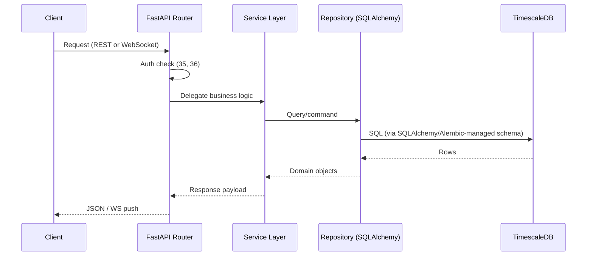

# 31 — Backend Architecture

> **Document 31 of 61.** First document of the Serving Subsystem (see `README.md` → System Overview). Builds on the schema from `30_Database_Design.md`. Precedes `32_API_Design.md`, `33_WebSocket_System.md`, `34_Background_Jobs.md`, `35_Authentication.md`, and `36_Authorization.md`.

---

## Table of Contents
1. [Purpose](#purpose)
2. [Layered Architecture](#layered-architecture)
3. [Service Boundaries](#service-boundaries)
4. [Request Lifecycle](#request-lifecycle)
5. [Technology Choices Recap](#technology-choices-recap)
6. [Revision History](#revision-history)

---

## Purpose

Defines the overall FastAPI-based backend structure that `32`–`36` will each detail a slice of, ensuring those documents share one consistent service boundary picture.

---

## Layered Architecture

Standard layered separation: **routers** (FastAPI path operations) → **services** (business logic: catalogue queries, forecast retrieval, alert dispatch) → **repositories** (SQLAlchemy-based data access against the schema in `30_Database_Design.md`) → **database**. This separation keeps API contract changes (`32`) decoupled from schema changes (`30`).

---

## Service Boundaries

| Service | Responsibility | Consumes |
|---|---|---|
| Catalogue Service | Query/filter nowcast events | `nowcast_events` table |
| Forecast Service | Query/serve forecast probabilities | `forecasts`, `lead_time_metrics` |
| Alert Service | Dispatch webhook/email on new triggers | `nowcast_events`, `forecasts` (via Celery, per `34`) |
| Auth Service | Authentication/authorization | `users`/`auth` tables (per `35`, `36`) |
| Explainability Service | Serve attribution/attention payloads | `29_Explainable_AI.md`'s output contract |

---

## Request Lifecycle

---

## Technology Choices Recap

Per `07_Tech_Stack.md`: FastAPI + Pydantic for request/response validation, Uvicorn/Gunicorn for serving, SQLAlchemy 2.x + Alembic for ORM/migrations against the `30_Database_Design.md` schema. No architectural deviation from the stack already established.

---

## Revision History
| Version | Date | Author | Notes |
|---|---|---|---|
| 0.1 | 2026-07-12 | HeliosAI Documentation | Initial Backend Architecture — layered design, service boundaries, request lifecycle |
