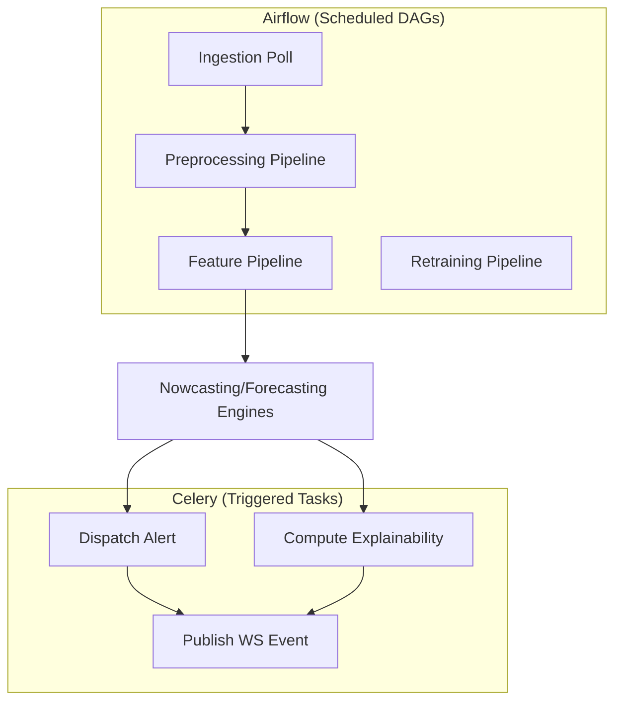

# 34 — Background Jobs

> **Document 34 of 61.** Specifies the Celery/Airflow split referenced throughout `README.md` and `08_Development_Roadmap.md`'s Design Decisions, underpinning ingestion scheduling (`17`), retraining, and alert dispatch (`33`).

---

## Table of Contents
1. [Purpose](#purpose)
2. [Celery vs. Airflow — Division of Responsibility](#celery-vs-airflow--division-of-responsibility)
3. [Airflow DAGs](#airflow-dags)
4. [Celery Tasks](#celery-tasks)
5. [Job Diagram](#job-diagram)
6. [Failure & Retry Policy](#failure--retry-policy)
7. [Revision History](#revision-history)

---

## Purpose

Clarifies exactly which background-processing tool handles which job type, since `07_Tech_Stack.md` lists both Celery and Airflow and this split must be unambiguous before implementation.

---

## Celery vs. Airflow — Division of Responsibility

Per `08_Development_Roadmap.md`'s Design Decision #6: **Airflow** owns scheduled, DAG-structured, long-running jobs (ingestion polling, model retraining pipelines). **Celery** owns short-lived, request-triggered, or streaming-adjacent tasks (alert dispatch, on-demand explainability computation, WebSocket fan-out support).

---

## Airflow DAGs

| DAG | Cadence | Steps |
|---|---|---|
| `ingestion_poll` | Scheduled interval (per `17_Data_Ingestion.md`) | Automated fetcher → parser → validator → handoff |
| `preprocessing_pipeline` | Triggered by new validated raw data | Time sync → background subtraction → noise filter → quality flag → fusion (`18`, `19`) |
| `feature_pipeline` | Triggered by new fused data | Feature computation (`20`, `21`) |
| `retraining_pipeline` | Scheduled (e.g., weekly) or manually triggered | Retrain forecasting models (`23`, `26`–`28`) against updated catalogue, log to MLflow |

---

## Celery Tasks

| Task | Trigger | Action |
|---|---|---|
| `dispatch_alert` | New promoted nowcast event or high-probability forecast | Send webhook/email per `README.md`'s Alert Dispatcher |
| `compute_explainability` | New forecast/event, if not precomputed inline | Run SHAP/Captum (`29`), attach payload |
| `publish_ws_event` | Any of the above completes | Push to Redis Pub/Sub for WebSocket fan-out (`33`) |

---

## Job Diagram

---

## Failure & Retry Policy

Both Airflow and Celery jobs follow the Reliability NFR (`README.md`): idempotent, resumable, with exponential-backoff retry for transient failures (e.g., PRADAN timeout) and immediate escalation (not silent retry) for persistent auth failures, per the R1 mitigation in `10_Risk_Assessment.md`.

---

## Revision History
| Version | Date | Author | Notes |
|---|---|---|---|
| 0.1 | 2026-07-12 | HeliosAI Documentation | Initial Background Jobs spec — Celery/Airflow division, DAGs, tasks, retry policy |
