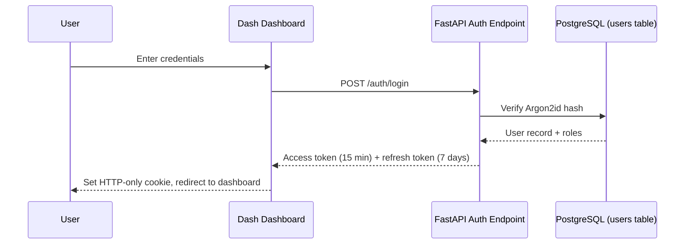

# 35 — Authentication

**HeliosAI** — AI-Powered Space Weather Intelligence Platform
Document 35 of 61

---

## 1. Purpose

Defines how HeliosAI identifies users and services interacting with the FastAPI backend, WebSocket stream, and Dash/Streamlit dashboards. Authentication is a prerequisite for Authorization (`36_Authorization.md`), which governs *what* an authenticated identity may do.

---

## 2. Requirements Traceability

| Source Requirement | Section |
|---|---|
| NFR: "All API endpoints authenticated; secrets never hardcoded" (README §Non-Functional Requirements) | §4, §6 |
| Scope: "Authentication/authorization for multi-user research deployments" | §3 |

---

## 3. Identity Model

HeliosAI recognizes three identity classes:

1. **Human users** — scientists, mission-ops observers, admins — authenticated interactively via the dashboard login screen.
2. **Service accounts** — the Ingestion Subsystem, Airflow DAGs, and Celery workers authenticating to the FastAPI backend machine-to-machine.
3. **External integrations** — webhook/email alert relays and any future third-party consumers of the read-only API.

Each identity class uses the same token format (JWT) but different issuance flows.

---

## 4. Authentication Mechanism

| Component | Technology |
|---|---|
| Token format | JWT (JSON Web Token), signed with RS256 |
| Password hashing | Argon2id (via `passlib`) |
| Framework | FastAPI-Users, built on `python-jose` |
| Session bridge (Dash) | Encrypted, HTTP-only cookie holding the JWT, refreshed via Dash server-side callback |
| Service accounts | OAuth2 Client Credentials flow, long-lived scoped tokens rotated by Airflow's secrets backend |

### 4.1 Login Flow (Human Users)

### 4.2 Token Properties

| Token | Lifetime | Storage | Refreshable |
|---|---|---|---|
| Access token | 15 minutes | Memory / HTTP-only cookie | N/A |
| Refresh token | 7 days | HTTP-only, `Secure`, `SameSite=Strict` cookie | Yes, via `/auth/refresh` |
| Service token | 24 hours | Environment-injected secret (never on disk) | Auto-rotated by Airflow connection |

---

## 5. Multi-Factor Authentication (Optional, Configurable)

TOTP-based MFA (`pyotp`) is offered as an opt-in for admin-role accounts. Not mandatory for the research-deployment default profile, since this is a decision-support system rather than an operational safety-of-life system (per README "Out of Scope").

---

## 6. Secrets Management

- No credentials, API keys, or signing keys are hardcoded anywhere in the repository.
- Local/dev: `.env` file (git-ignored), loaded via `pydantic-settings`.
- Containerized/prod: Docker secrets or an external vault (HashiCorp Vault / cloud secrets manager), referenced by name in `infra/docker/docker-compose.yml`.
- JWT signing keys are rotated on a documented schedule; both current and previous public keys are accepted for a grace window to avoid mid-rotation logout storms.

---

## 7. Failure Handling

| Condition | Response |
|---|---|
| Invalid credentials | `401 Unauthorized`, generic message (no user-enumeration hints) |
| Expired access token | `401` with `WWW-Authenticate: Bearer error="invalid_token"`; client attempts silent refresh |
| Expired/revoked refresh token | Force re-login |
| Repeated failed logins | Exponential backoff + temporary lockout (Redis-backed counter), logged per `44_Logging.md` |

---

## 8. Interfaces to Other Documents

- **`36_Authorization.md`** — role/permission model consuming the identity established here.
- **`32_API_Design.md`** — endpoint-level auth requirements.
- **`54_Security.md`** — broader threat model, TLS, secret rotation policy.
- **`45_Monitoring.md`** — auth failure metrics and alerting thresholds.

---

**Next document:** `36_Authorization.md` — say **NEXT** to continue.
