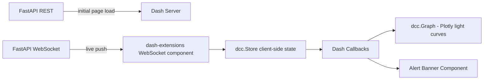

# 37 — Frontend Architecture

**HeliosAI** — AI-Powered Space Weather Intelligence Platform
Document 37 of 61

---

## 1. Purpose

Details the architecture of HeliosAI's **100% Python** frontend, replacing the React/Next.js/TypeScript stack referenced in generic project templates, per the explicit all-Python requirement in the README's Design Decisions.

---

## 2. Framework Choice

| Concern | Choice | Rationale |
|---|---|---|
| Primary interactive dashboard | **Plotly Dash** | Fine-grained callback control, multi-page routing, production-capable for alert-driven, data-dense scientific UIs |
| Admin / rapid internal tools | **Streamlit** | Faster to build simple forms/tables; used for admin panel and internal debugging utilities, not the primary alert console |
| Charting | **Plotly.py** | Native to Dash, WebGL-accelerated for long light-curve series |
| Styling | **Dash Bootstrap Components** | Consistent theming without hand-written CSS/JS |
| Data grids | **Dash AG Grid** | Sortable/filterable catalogue tables at scale |

No JavaScript/TypeScript build toolchain (webpack, npm, React) is part of this repository. Dash's internal use of a React runtime is an implementation detail of the Dash library itself and is not authored or maintained by this project.

---

## 3. Application Structure

```
src/frontend/
├── app.py                 # Dash app factory, server config
├── pages/
│   ├── dashboard.py        # Light-curve visualizer + live alerts (see 39_Dashboard.md)
│   ├── catalogue.py        # Master catalogue browser
│   ├── alerts.py           # Alert console (see 42_Alert_System.md)
│   └── admin/               # Streamlit sub-app, mounted separately (see 41_Admin_Panel.md)
├── components/             # Reusable Dash components (banners, cards, charts)
├── callbacks/               # Callback modules, grouped by page
├── assets/                 # CSS overrides, favicon, static images
└── ws_client.py             # WebSocket client bridging FastAPI stream to Dash
```

---

## 4. Rendering & State Model



- **Initial load:** server-side Dash callback fetches historical light-curve window + current catalogue via REST.
- **Live updates:** `dash-extensions` WebSocket component subscribes to the FastAPI stream (`33_WebSocket_System.md`) and pushes incremental updates into a client-side `dcc.Store`, avoiding full-page reloads.
- **Session state:** authenticated user/role held in an HTTP-only cookie (per `35_Authentication.md`); no sensitive state is kept in browser `localStorage`.

---

## 5. Multi-Page Routing

Dash's `pages` plugin provides file-based routing (`/`, `/catalogue`, `/alerts`, `/admin`), each declaring its own layout and callbacks, avoiding a single monolithic layout file as the app grows.

---

## 6. Design System

Full visual language (typography, color tokens for flare-class severity, layout grid) is specified in `38_UI_UX.md`. This document covers structural/technical architecture only.

---

## 7. Performance Considerations

- Long light-curve series are down-sampled server-side (LTTB algorithm) before transmission for overview views, with full-resolution fetch on zoom — detailed in `40_Data_Visualization.md`.
- Dash callbacks use `prevent_initial_call` and pattern-matching IDs to minimize unnecessary re-renders on high-frequency WebSocket pushes.

---

## 8. Interfaces to Other Documents

- **`38_UI_UX.md`** — visual/interaction design built on this architecture.
- **`39_Dashboard.md`** — the primary page implemented within this structure.
- **`33_WebSocket_System.md`** — the streaming contract consumed by `ws_client.py`.
- **`41_Admin_Panel.md`** — the Streamlit sub-application.

---

**Next document:** `38_UI_UX.md` — say **NEXT** to continue.
