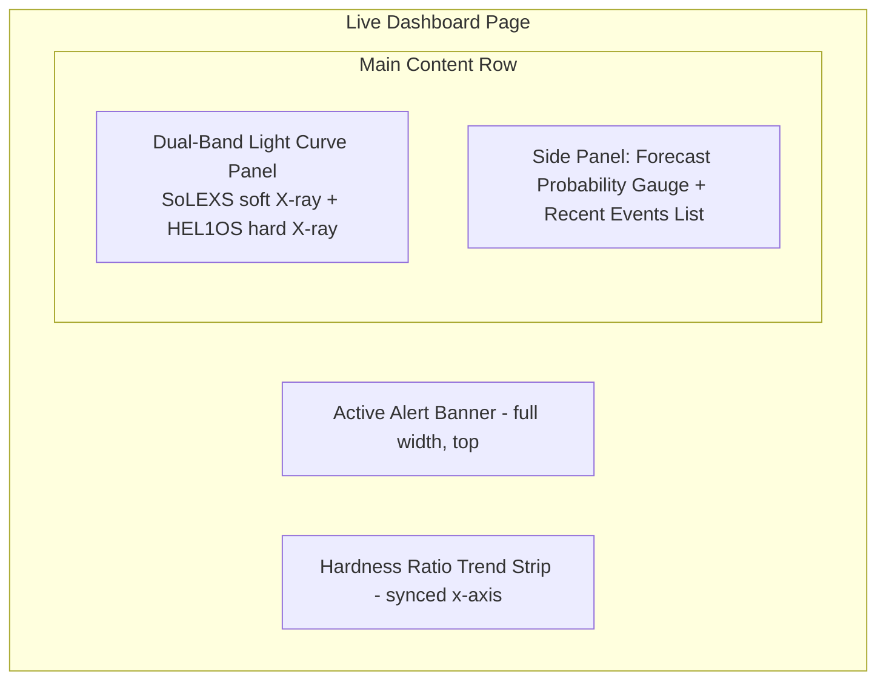

# 39 — Dashboard

**HeliosAI** — AI-Powered Space Weather Intelligence Platform
Document 39 of 61

---

## 1. Purpose

Specifies the **Live Dashboard**, HeliosAI's primary screen, directly fulfilling the README's Expected Outcome: *"Interface that visualizes the X-ray light curves and triggers with visual alerts when a flare is nowcasted or forecasted."*

---

## 2. Layout

- **Alert Banner:** appears only when an active nowcast or forecast crosses its threshold; severity-colored per `38_UI_UX.md`; persists until acknowledged.
- **Light Curve Panel:** two stacked, x-axis-synchronized Plotly traces (SoLEXS top, HEL1OS bottom), with shaded regions marking confirmed/tentative flare windows.
- **Forecast Probability Gauge:** live-updating radial gauge showing P(flare within next N minutes), N selectable (15/30/60).
- **Hardness Ratio Strip:** compact trend line beneath the main curves, since hardness ratio is a first-class engineered feature per README's fusion design.

---

## 3. Data Sources

| Panel | Source | Update Mechanism |
|---|---|---|
| Light curves | TimescaleDB (historical) + WebSocket (live) | Initial REST fetch, then streamed deltas |
| Alert banner | FastAPI WebSocket `alerts` channel | Push on trigger |
| Forecast gauge | FastAPI WebSocket `forecasts` channel | Push on each new inference (per configured cadence) |
| Recent events list | REST `/catalogue/recent` | Poll on page load + push refresh on new catalogue write |

---

## 4. Time Range Controls

- Preset ranges: Last 1h / 6h / 24h / 7d, plus custom range picker.
- "Live" toggle: when enabled, the view auto-scrolls with incoming data; disabled automatically when the user manually pans/zooms, to avoid fighting user interaction.

---

## 5. Empty / Degraded States

| Condition | Dashboard Behavior |
|---|---|
| No data for selected window | Explicit "No data available for this range" message, not a blank chart |
| WebSocket disconnected | Non-blocking reconnect indicator; falls back to periodic REST polling |
| Ingestion delay exceeds latency target (`45_Monitoring.md`) | Staleness badge on the light-curve panel showing last-updated timestamp |

---

## 6. Performance Targets

| Metric | Target |
|---|---|
| Initial page load (24h window) | < 2s on broadband |
| Live update-to-render latency | < 1s from WebSocket push |
| Chart interaction (zoom/pan) responsiveness | < 200ms |

---

## 7. Interfaces to Other Documents

- **`37_Frontend_Architecture.md`**, **`38_UI_UX.md`** — structural and visual foundations.
- **`40_Data_Visualization.md`** — down-sampling and rendering strategy for long series.
- **`42_Alert_System.md`** — banner trigger logic and acknowledgment flow.
- **`33_WebSocket_System.md`** — the streaming channels this page subscribes to.

---

**Next document:** `40_Data_Visualization.md` — say **NEXT** to continue.
