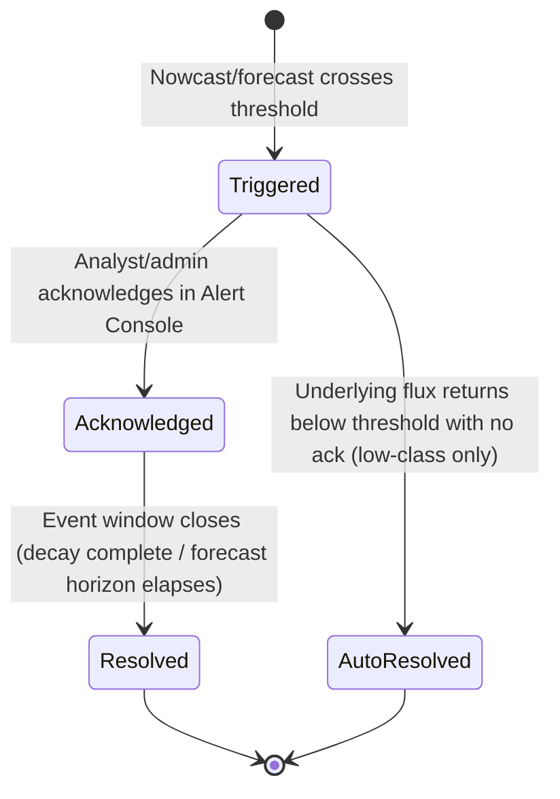
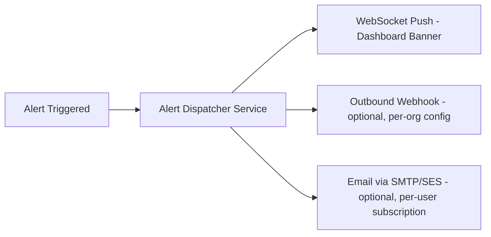

# 42 — Alert System

**HeliosAI** — AI-Powered Space Weather Intelligence Platform
Document 42 of 61

---

## 1. Purpose

Specifies the end-to-end alerting pipeline that turns a nowcasting detection or forecasting trigger into a visible, actionable notification — directly implementing the README's requirement for an interface that "triggers with visual alerts when a flare is nowcasted or forecasted," plus optional webhook/email hooks noted in scope.

---

## 2. Alert Lifecycle

- **Triggered:** created the instant a candidate clears its confidence gate (nowcast) or probability threshold (forecast). Written to the `alerts` table and pushed via WebSocket in the same transaction that writes the catalogue entry.
- **Acknowledged:** a human (`analyst`/`admin`) has seen it; required for M/X-class alerts before the banner can be dismissed, optional for A/B/C.
- **Resolved / Auto-Resolved:** terminal state, retained for audit and for lead-time metric computation.

---

## 3. Alert Types

| Type | Source | Contains |
|---|---|---|
| Nowcast Alert | Nowcasting Engine (`22_Nowcasting.md`) | Flare class, band(s) detected, confidence, confirmed/tentative flag |
| Forecast Alert | Forecasting Engine (`23_Forecasting.md`) | Predicted class, probability, horizon N, model version |
| System Alert | Monitoring stack (`45_Monitoring.md`) | Ingestion delay, model drift, service health — routed to `admin` only |

---

## 4. Delivery Channels

- **In-app (WebSocket):** always on, primary channel, sub-second delivery target.
- **Webhook:** configurable per deployment (e.g., to a Slack/Teams integration or a mission-ops system), signed payload with HMAC for authenticity.
- **Email:** opt-in per user, digest or immediate mode; used mainly for M/X-class and system alerts.

Delivery is decoupled from detection via a Celery task queue so a slow/unavailable downstream channel (e.g., SMTP outage) never blocks the in-app WebSocket path.

---

## 5. Deduplication & Noise Control

- Alerts for the same physical event are deduplicated by catalogue event ID — re-detections during an ongoing flare update the existing alert rather than spawning duplicates.
- Configurable cool-down per severity class prevents alert storms during periods of rapid low-class flare activity (tunable in the Admin Panel, `41_Admin_Panel.md`).

---

## 6. Data Model (Summary)

| Field | Description |
|---|---|
| `alert_id` | Primary key |
| `event_id` | FK to master catalogue entry |
| `type` | nowcast / forecast / system |
| `severity` | A/B/C/M/X or system-severity enum |
| `status` | triggered / acknowledged / resolved / auto_resolved |
| `triggered_at`, `acknowledged_at`, `resolved_at` | Timestamps |
| `acknowledged_by` | User ID (nullable) |

Full schema detail in `30_Database_Design.md`.

---

## 7. Interfaces to Other Documents

- **`22_Nowcasting.md`**, **`23_Forecasting.md`** — alert-triggering sources.
- **`33_WebSocket_System.md`** — the transport for in-app delivery.
- **`39_Dashboard.md`** — the banner UI consuming these alerts.
- **`45_Monitoring.md`** — system-alert generation.
- **`30_Database_Design.md`** — full `alerts` table schema.

---

**Next document:** `43_Analytics.md` — say **NEXT** to continue.
