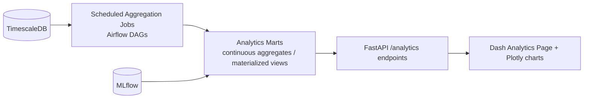

# 43 — Analytics

**HeliosAI** — AI-Powered Space Weather Intelligence Platform
Document 43 of 61

---

## 1. Purpose

Defines the aggregate, retrospective analytics layer of HeliosAI — distinct from the real-time dashboard — used by scientists to study flare activity trends and by the project team to report against the PS evaluation criteria.

---

## 2. Analytics Views

| View | Question Answered | Data Source |
|---|---|---|
| Flare Frequency Trend | How many flares per class occurred per day/week/solar-rotation? | Master catalogue |
| Class Distribution | What is the A/B/C/M/X breakdown over a selected period? | Master catalogue |
| Band Agreement Rate | What fraction of confirmed flares were detected in both bands vs. single-band tentative? | Master catalogue + detection metadata |
| Lead Time Distribution | Histogram of (actual peak − predicted trigger) across resolved forecast alerts | Alerts + catalogue |
| Model Performance Over Time | Rolling TPR/FAR/precision-recall by class, tracked per model version | MLflow + evaluation logs |
| Hardness Ratio vs. Class | Scatter of hardness ratio at peak vs. assigned flare class, for scientific/QA review | Feature store |

---

## 3. Architecture

- TimescaleDB **continuous aggregates** pre-compute daily/weekly rollups so analytics queries stay fast without scanning raw light-curve tables.
- Analytics endpoints are read-only and cache-friendly (Redis-backed short-TTL cache for frequently requested date ranges).

---

## 4. Reporting Outputs

- **Evaluation Criteria Report** — an auto-generated summary (exportable as PDF/CSV) directly mapping to the PS evaluation criteria: class-wise detection counts, TPR/FAR, and lead-time statistics — intended for hackathon/competition submission evidence as well as ongoing research review.
- **Scientist-Facing Notebooks** — the `notebooks/` directory (per `06_Project_Folder_Structure.md`) provides Jupyter notebooks that query the same analytics marts for ad hoc, publication-oriented analysis, feeding into `59_Research_Paper.md`.

---

## 5. Statistical Rigor Notes

- Lead-time and TPR/FAR statistics are always computed on a held-out or time-forward split (never on data the active model was trained on), to avoid optimistic bias in reported analytics — consistent with the evaluation methodology in `48_Model_Evaluation.md`.
- Confidence intervals (bootstrap) are shown alongside point estimates for small-sample class bins (X-class flares are rare), avoiding overconfident single-number claims.

---

## 6. Interfaces to Other Documents

- **`30_Database_Design.md`** — continuous aggregate definitions.
- **`48_Model_Evaluation.md`** — evaluation methodology underlying performance analytics.
- **`59_Research_Paper.md`** — downstream consumer of these analytics for scientific writeup.
- **`40_Data_Visualization.md`** — shared charting components.

---

**Next document:** `44_Logging.md` — say **NEXT** to continue.
