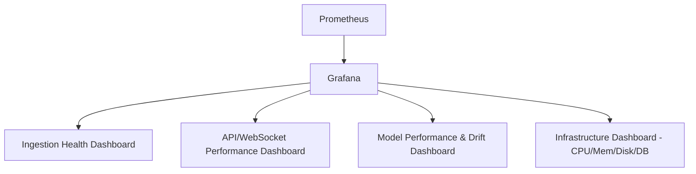

# 45 — Monitoring

**HeliosAI** — AI-Powered Space Weather Intelligence Platform
Document 45 of 61

---

## 1. Purpose

Defines how HeliosAI observes its own health and performance, giving concrete meaning to the Non-Functional Requirements' Latency target ("bounded delay of new data availability") referenced from the README.

---

## 2. Monitoring Stack

| Layer | Technology |
|---|---|
| Metrics collection | Prometheus (via `prometheus-fastapi-instrumentator`, Celery/Airflow exporters) |
| Visualization | Grafana dashboards |
| Log correlation | Loki (optional), linked to Grafana via trace/request IDs |
| Alerting on system health | Prometheus Alertmanager → same Alert Dispatcher used for science alerts (`42_Alert_System.md`), routed to `admin` role only |

---

## 3. Key Metrics

| Category | Metric | Target / Notes |
|---|---|---|
| Ingestion Latency | Time from data availability at PRADAN to persisted-and-processed in TimescaleDB | Documented target, tracked as `ingestion_latency_seconds` histogram |
| Nowcast Latency | Time from processed data to alert dispatch | Bounded delay target — the concrete number is finalized during load testing and recorded here once measured, not asserted in advance |
| API Latency | p50/p95/p99 response time per endpoint | p95 < 300ms for read endpoints |
| WebSocket Delivery Latency | Push-to-client render time | < 1s (per `39_Dashboard.md`) |
| Queue Depth | Celery queue backlog | Alert if sustained backlog > N tasks for > 5 minutes |
| Model Drift Indicators | Rolling precision/recall vs. training-time baseline | Feeds retraining triggers (`46_MLOps.md`) |
| Service Uptime | Per-subsystem availability | Tracked, not contractually SLA'd (research/decision-support system, not certified operational) |

---

## 4. Dashboards

---

## 5. Alerting Policy

| Condition | Severity | Action |
|---|---|---|
| Ingestion delay exceeds bounded target | Warning | Admin notification; dashboard staleness badge (`39_Dashboard.md`) |
| Ingestion fully stalled > 1 hour | Critical | Admin page/email, Airflow DAG auto-retry exhausted flag |
| API error rate > threshold | Warning | Admin notification |
| Model drift metric breaches threshold | Warning | Flags model for review in `46_MLOps.md` retraining workflow |
| Database disk usage > 85% | Warning | Admin notification, compression policy review prompt |

---

## 6. Health Endpoints

Every service exposes a `/healthz` (liveness) and `/readyz` (readiness) endpoint, consumed by both Docker Compose healthchecks and, optionally, Kubernetes probes (`51_Kubernetes.md`).

---

## 7. Interfaces to Other Documents

- **`44_Logging.md`** — log-derived signals feeding some metrics.
- **`42_Alert_System.md`** — shared dispatch mechanism for system alerts.
- **`46_MLOps.md`** — drift metrics triggering retraining.
- **`50_Docker.md`**, **`51_Kubernetes.md`** — healthcheck integration.

---

**Next document:** `46_MLOps.md` — say **NEXT** to continue.
