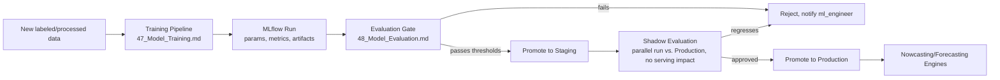

# 46 — MLOps

**HeliosAI** — AI-Powered Space Weather Intelligence Platform
Document 46 of 61

---

## 1. Purpose

Defines how HeliosAI keeps its nowcasting and forecasting models reproducible, versioned, and safely updatable over time — a stated Design Decision requirement ("MLflow... a hard requirement for research-grade acceptance").

---

## 2. MLOps Stack

| Concern | Technology |
|---|---|
| Experiment tracking | MLflow Tracking |
| Model registry | MLflow Model Registry (Staging → Production → Archived stages) |
| Scheduled training/retraining | Apache Airflow DAGs |
| Artifact storage | MLflow-managed artifact store (local/S3-compatible, deployment-dependent) |
| Reproducibility | Pinned `conda`/`pip` environments logged per run; data snapshot ID logged per run (links to `44_Logging.md`'s `data_snapshot_id`) |

---

## 3. Lifecycle

---

## 4. Retraining Triggers

| Trigger | Type |
|---|---|
| Scheduled (e.g., monthly) Airflow DAG | Time-based |
| Model drift metric breach (`45_Monitoring.md`) | Performance-based, automatic candidate training run |
| Manual trigger via Admin Panel (`41_Admin_Panel.md`) | `ml_engineer`/`admin`-initiated |
| Significant new labeled flare events available (e.g., after a high-activity solar period) | Data-volume-based |

All triggers produce a **candidate** model; promotion to Production always requires the Evaluation Gate to pass — no fully automatic production promotion, keeping a human in the loop for a research-grade system.

---

## 5. Promotion Gate Criteria

A candidate model is only eligible for `Staging → Production` promotion if it meets or exceeds the current production model on:

- Class-stratified precision/recall (no regression on rare high-class flares).
- False Alarm Rate ceiling (must not exceed the currently accepted FAR).
- Forecasting lead-time distribution (median lead time must not regress).

Full criteria and methodology in `48_Model_Evaluation.md`.

---

## 6. Rollback

Every production promotion is reversible: the MLflow Model Registry retains the previous Production version as Archived (not deleted), and a one-click rollback (Admin Panel) re-points the serving layer to the prior version, logged as an audited action.

---

## 7. Interfaces to Other Documents

- **`47_Model_Training.md`** — the training pipeline this lifecycle wraps.
- **`48_Model_Evaluation.md`** — gate criteria detail.
- **`45_Monitoring.md`** — drift signals feeding retraining triggers.
- **`41_Admin_Panel.md`** — manual trigger and rollback UI.

---

**Next document:** `47_Model_Training.md` — say **NEXT** to continue.
