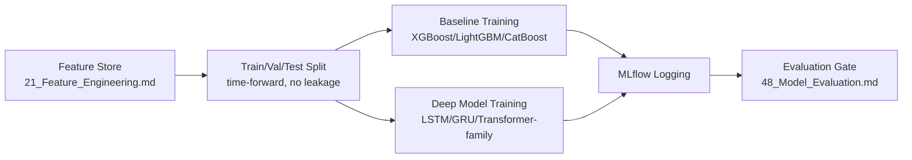

# 47 — Model Training

**HeliosAI** — AI-Powered Space Weather Intelligence Platform
Document 47 of 61

---

## 1. Purpose

Specifies the concrete training pipeline for both the classical ML baselines and deep sequence models used in the Forecasting Engine (`23_Forecasting.md`), and the classifier component of the Nowcasting Engine's class-assignment step.

---

## 2. Training Pipeline Stages

---

## 3. Data Splitting Strategy

Solar activity is non-stationary (solar cycle phase matters), so splits are **time-forward**, never randomly shuffled:

| Split | Definition |
|---|---|
| Train | Earliest N months of processed, labeled data |
| Validation | Following month, used for hyperparameter tuning and early stopping |
| Test (held out) | Most recent month(s), touched only for final evaluation, never for tuning |

This prevents optimistic leakage from a model "seeing the future" relative to its evaluation window — essential for a credible lead-time claim.

---

## 4. Labeling

- Primary labels: nowcasted events from the dual-band detection pipeline, cross-checked against GOES XRS class bins where available (per README's optional supplementary dataset note) for calibration confidence.
- Precursor windows for forecasting are labeled by a configurable lookback offset before each confirmed flare onset (e.g., last 30/60/90 minutes pre-onset), with negative (non-precursor) windows sampled from quiet-Sun periods for class balance.

---

## 5. Model Families

| Model | Role |
|---|---|
| XGBoost / LightGBM / CatBoost | Fast, interpretable baseline on engineered features (flux gradient, rise/decay constants, hardness ratio, wavelet energy) |
| LSTM / GRU | Sequence baseline over raw+engineered time-series windows |
| 1D-CNN | Local pattern extraction as a lightweight alternative/ensemble member |
| Transformer-family (Informer, PatchTST, Temporal Fusion Transformer) | Longer-range precursor pattern modeling; primary candidate for best lead-time performance, per `28_Transformer_Models.md` |

---

## 6. Class Imbalance Handling

High-class (M/X) flares are rare relative to A/B/C. Mitigations:
- Focal loss for deep models.
- Class-weighted loss / `scale_pos_weight` for gradient-boosted trees.
- SMOTE-style oversampling on tabular engineered features (not on raw time series, to avoid synthesizing physically implausible light curves).

---

## 7. Hyperparameter Search

- Baselines: Optuna-driven Bayesian search, logged as nested MLflow runs.
- Deep models: PyTorch Lightning + Optuna, with early stopping on validation loss and a compute budget cap per search (documented per-run in MLflow, not hardcoded silently).

---

## 8. Reproducibility

Every training run logs: exact feature-store snapshot ID, code commit hash, environment lockfile, random seed, and full hyperparameter set — satisfying the Auditability requirement end-to-end from raw data to trained artifact.

---

## 9. Interfaces to Other Documents

- **`21_Feature_Engineering.md`** — input feature source.
- **`46_MLOps.md`** — lifecycle wrapping this pipeline.
- **`48_Model_Evaluation.md`** — downstream evaluation gate.
- **`28_Transformer_Models.md`** — architecture-level deep dive on the transformer-family models.

---

**Next document:** `48_Model_Evaluation.md` — say **NEXT** to continue.
