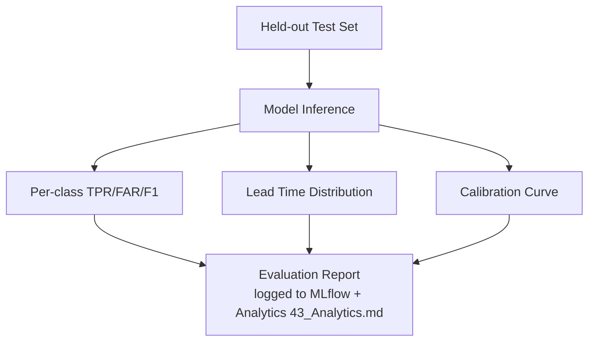

# 48 — Model Evaluation

**HeliosAI** — AI-Powered Space Weather Intelligence Platform
Document 48 of 61

---

## 1. Purpose

Defines exactly how HeliosAI measures model quality, operationalizing the PS's three evaluation criteria: detection of low- and high-class flares, high TPR / low FAR, and quantified lead time.

---

## 2. Nowcasting Evaluation

| Metric | Definition |
|---|---|
| Per-class Precision/Recall/F1 | Computed separately for A/B/C/M/X bins — a model cannot "hide" poor performance on rare high-class flares behind strong low-class numbers |
| True Positive Rate (TPR) | Confirmed flares correctly detected / total confirmed flares, overall and per class |
| False Alarm Rate (FAR) | Nowcast triggers with no corresponding confirmed flare / total triggers |
| Dual-band Agreement Rate | Fraction of catalogue entries confirmed in both bands vs. promoted as single-band "tentative" |

Evaluation is run against a held-out time-forward test period (per `47_Model_Training.md`), and — where available — cross-checked against independent GOES XRS event lists as an external ground-truth reference.

---

## 3. Forecasting Evaluation

| Metric | Definition |
|---|---|
| Forecast TPR / FAR | Same definitions as nowcasting, applied to forecast triggers vs. subsequently confirmed flares |
| **Lead Time** | `actual_peak_ts − predicted_trigger_ts` for every forecast alert that was later confirmed by a real event; reported as a distribution (median, IQR), not a single cherry-picked number |
| Calibration | Reliability diagram / Brier score — does a predicted 70% probability actually correspond to ~70% observed flare occurrence? |
| Horizon Sensitivity | Performance measured separately for each configured N (15/30/60 min), since precision typically trades off against lead time |

---

## 4. Evaluation Report Structure

Every evaluation run is logged to MLflow alongside the training run it evaluates, and surfaced in the Analytics module's "Evaluation Criteria Report" (`43_Analytics.md`) for direct traceability back to the original problem statement.

---

## 5. Promotion Gate (Referenced from `46_MLOps.md`)

A candidate model must not regress the current Production model on: minimum per-class recall for M/X flares, FAR ceiling, and median lead time. Ties are broken toward the model with better calibration, since a well-calibrated moderate performer is operationally more trustworthy than an overconfident marginally-better one.

---

## 6. Known Limitations, Documented Not Hidden

- Rare high-class (X) flares yield small test-set sample sizes; confidence intervals are always reported alongside point metrics for these bins.
- Lead time is only measurable for forecast alerts that preceded a subsequently *confirmed* flare — forecasts that were false alarms have no lead-time value by definition and are excluded from that specific metric (but still counted in FAR).

---

## 7. Interfaces to Other Documents

- **`47_Model_Training.md`** — pipeline producing the models evaluated here.
- **`46_MLOps.md`** — promotion gate consuming these metrics.
- **`43_Analytics.md`** — reporting surface.
- **`29_Explainable_AI.md`** — qualitative complement to these quantitative metrics.

---

**Next document:** `49_Deployment.md` — say **NEXT** to continue.
