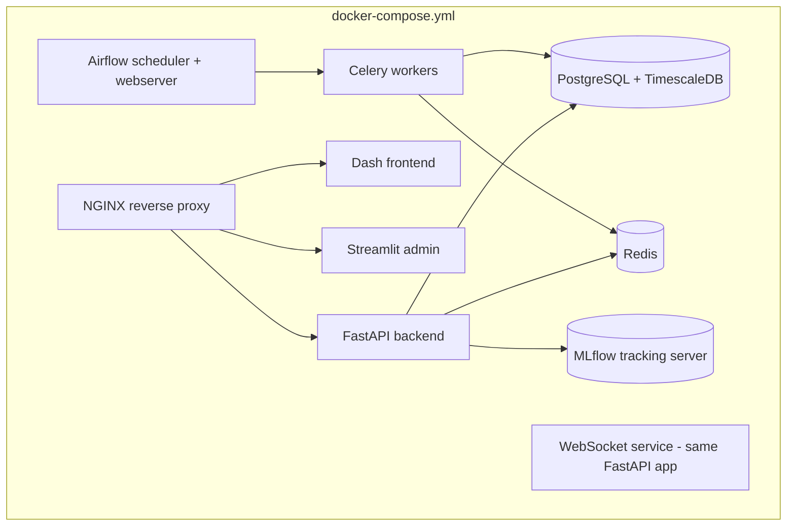

# 49 — Deployment

**HeliosAI** — AI-Powered Space Weather Intelligence Platform
Document 49 of 61

---

## 1. Purpose

Describes how HeliosAI is packaged and deployed, fulfilling the Portability non-functional requirement ("Fully containerized; runs via `docker compose up` for local/research deployment") and setting up the Getting Started quickstart referenced in the README.

---

## 2. Deployment Targets

| Target | Use Case |
|---|---|
| **Local / single research group** | `docker compose up --build`, all services on one host |
| **Shared research-group server** | Docker Compose with external managed PostgreSQL/TimescaleDB and persistent volumes |
| **Scale-out (optional)** | Kubernetes, per `51_Kubernetes.md`, for multi-org or higher-availability deployments |

---

## 3. Service Topology (Docker Compose)



---

## 4. Environments

| Environment | Purpose | Config Source |
|---|---|---|
| `local` | Developer machine, hot-reload enabled | `.env` (git-ignored, from `.env.example`) |
| `staging` | Pre-production validation, mirrors prod topology at smaller scale | Environment-injected secrets |
| `production` | Live research/operational deployment | Vault/secrets manager, per `54_Security.md` |

---

## 5. Deployment Steps (Docker Compose Path)

```bash
git clone <repo-url>
cd HeliosAI
cp .env.example .env        # fill in secrets, DB credentials, PRADAN access mode
docker compose up --build
```

Post-startup, Airflow DAGs for scheduled ingestion are unpaused via the Airflow UI or CLI, and an initial admin user is created via a one-time bootstrap script (`scripts/create_admin.py`).

---

## 6. Zero-Downtime Considerations

For deployments requiring minimal disruption during updates:
- API/Dash/Streamlit services run behind NGINX with rolling container replacement (Compose `--no-deps` + health-checked startup) or, at Kubernetes scale, standard rolling deployments (`51_Kubernetes.md`).
- Database migrations (Alembic) run as a pre-deploy step, designed to be backward-compatible for at least one version to avoid hard coupling between migration and app-container rollout timing.

---

## 7. Rollback Strategy

Each deployment is tagged with a Docker image version; rollback is a matter of redeploying the previous tagged image set plus, if needed, an Alembic downgrade — both steps documented per-release in the CI/CD pipeline artifacts (`52_CI_CD.md`).

---

## 8. Interfaces to Other Documents

- **`50_Docker.md`** — detailed Dockerfile/Compose specifics.
- **`51_Kubernetes.md`** — scale-out deployment option.
- **`52_CI_CD.md`** — automated build/release pipeline producing these images.
- **`54_Security.md`** — secrets handling during deployment.

---

**Next document:** `50_Docker.md` — say **NEXT** to continue.
