# 52 — CI/CD

**HeliosAI** — AI-Powered Space Weather Intelligence Platform
Document 52 of 61

---

## 1. Purpose

Defines the automated build, test, and release pipeline for HeliosAI using GitHub Actions, per the README's Tech Stack.

---

## 2. Pipeline Stages

```mermaid
flowchart LR
    PR[Pull Request] --> Lint[Lint + Format Check]
    Lint --> Unit[Unit Tests - pytest]
    Unit --> Type[Type Checking - mypy]
    Type --> Sec[Security Scan - bandit, pip-audit]
    Sec --> Build[Build Docker Images]
    Build --> IntTest[Integration Tests - docker compose up + pytest]
    IntTest -->|main branch merge| Push[Push Images to Registry]
    Push --> Deploy[Deploy to Staging - automatic]
    Deploy --> Manual[Manual Approval Gate]
    Manual --> Prod[Deploy to Production]
```

---

## 3. Workflow Files (`.github/workflows/`)

| Workflow | Trigger | Purpose |
|---|---|---|
| `ci.yml` | Every PR | Lint, unit test, type-check, security scan |
| `build-images.yml` | Merge to `main` | Multi-stage Docker builds, tag with git SHA, push to registry |
| `integration-tests.yml` | Merge to `main` | Full `docker compose up` + end-to-end `pytest` suite against live containers |
| `deploy-staging.yml` | Successful `build-images.yml` on `main` | Automatic staging deploy |
| `deploy-production.yml` | Manual dispatch, requires approval | Production deploy with rollback plan attached |
| `model-eval-gate.yml` | New model artifact registered in MLflow | Runs `48_Model_Evaluation.md` gate checks before allowing promotion |

---

## 4. Quality Gates

| Gate | Tool | Failing Condition |
|---|---|---|
| Formatting | `black`, `isort` | Any diff from formatted output |
| Linting | `ruff` | Any error-level lint violation |
| Type checking | `mypy` | Any type error in `src/` |
| Test coverage | `coverage.py` | Coverage drop below the documented project floor (tracked per `53_Testing.md`) |
| Dependency vulnerabilities | `pip-audit` | Any known-critical CVE in dependencies |
| Static security scan | `bandit` | Any high-severity finding |

---

## 5. Branching & Release Model

- Trunk-based development: short-lived feature branches off `main`, merged via reviewed PRs (see `57_Git_Workflow.md` for full convention).
- Releases are tagged (`vX.Y.Z`) on `main` after a successful production deploy; the tag corresponds 1:1 with the Docker image SHA deployed.

---

## 6. Secrets in CI

CI secrets (registry credentials, staging deploy keys) are stored in GitHub Actions Encrypted Secrets, scoped to the minimum required workflows, never printed to logs (validated by a log-scanning step in `ci.yml`).

---

## 7. Failure Handling

- Any gate failure blocks merge; no manual override path exists for `main` branch protection, keeping the audit trail (`44_Logging.md`) of what was actually validated before deployment intact.
- Production deploy failures trigger automatic rollback to the previously deployed image tag.

---

## 8. Interfaces to Other Documents

- **`53_Testing.md`** — the test suites this pipeline executes.
- **`50_Docker.md`**, **`49_Deployment.md`** — build/deploy targets.
- **`48_Model_Evaluation.md`** — the model-specific gate integrated here.
- **`57_Git_Workflow.md`** — branching conventions this pipeline assumes.

---

**Next document:** `53_Testing.md` — say **NEXT** to continue.
