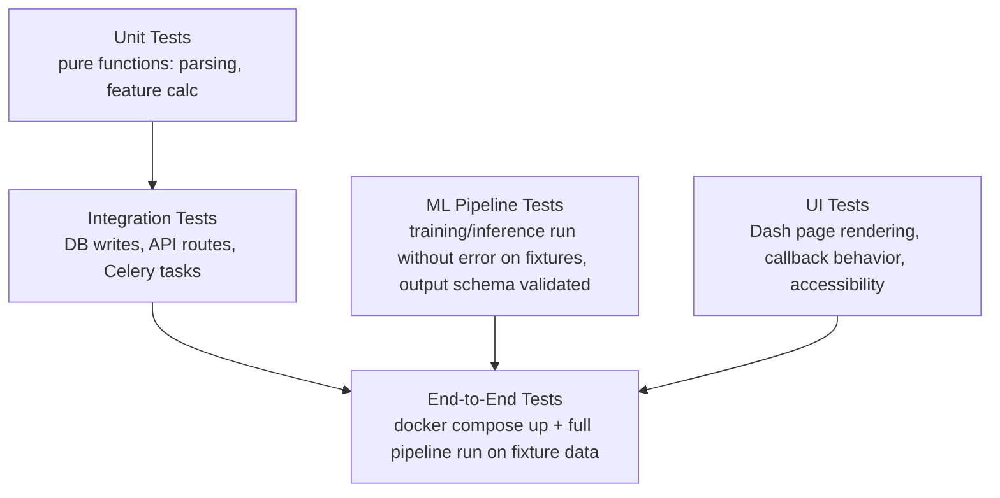

# 53 — Testing

**HeliosAI** — AI-Powered Space Weather Intelligence Platform
Document 53 of 61

---

## 1. Purpose

Defines the testing strategy across HeliosAI's scientific, backend, frontend, and ML components, ensuring the "High TPR, low FAR" and reproducibility claims in the README are actually verified, not merely asserted.

---

## 2. Testing Stack

| Layer | Tools |
|---|---|
| Unit / integration tests | Pytest, `pytest-asyncio` (for FastAPI async routes) |
| Property-based testing | Hypothesis — used on data-parsing and signal-processing functions where edge cases (gaps, NaNs, out-of-order timestamps) matter most |
| Coverage | `coverage.py`, reported in CI (`52_CI_CD.md`) |
| API contract tests | `pytest` + `httpx` test client against FastAPI's OpenAPI schema |
| Frontend interaction tests | Dash's built-in testing utilities (`dash.testing`), Selenium-backed |
| Accessibility tests | `axe-core` integration in `dash.testing` suite |
| Load/performance tests | Locust, targeting API and WebSocket endpoints |
| ML pipeline tests | Pytest fixtures with synthetic light-curve fixtures; model-output shape/range assertions, not accuracy assertions (accuracy is evaluated separately per `48_Model_Evaluation.md`) |

---

## 3. Test Categories

---

## 4. Scientific Correctness Testing

Unlike typical software tests, several HeliosAI test suites validate **domain correctness**, not just code correctness:
- Synthetic light curves with known injected flares (parametrically generated rise/peak/decay shapes) are fed through the nowcasting pipeline; tests assert the known flare is detected within an acceptable timing tolerance.
- Time-synchronization tests assert spacecraft-time-to-UTC conversion against known reference timestamps.
- Regression fixtures: a frozen set of real (anonymized/aggregated where needed) historical light-curve windows with previously-verified expected detections, re-run on every CI build to catch silent pipeline regressions.

---

## 5. Coverage Policy

- Minimum coverage floor enforced in CI for `src/backend/` and `src/processing/` modules (exact percentage tracked and enforced in `ci.yml`, not hardcoded here to avoid drift between documents and pipeline config).
- ML training/inference code is exempted from the same line-coverage bar (behavioral/output tests matter more than line coverage for numerical code) but must have output-shape and range-validation tests for every model class.

---

## 6. Test Data Management

- No real credentials or production data in test fixtures.
- Synthetic and small anonymized real-data fixtures live under `tests/fixtures/`, version-controlled and documented with provenance notes.

---

## 7. Interfaces to Other Documents

- **`52_CI_CD.md`** — pipeline executing these suites.
- **`48_Model_Evaluation.md`** — accuracy/performance evaluation (distinct from correctness testing here).
- **`06_Project_Folder_Structure.md`** — location of `tests/` within the repo.

---

**Next document:** `54_Security.md` — say **NEXT** to continue.
