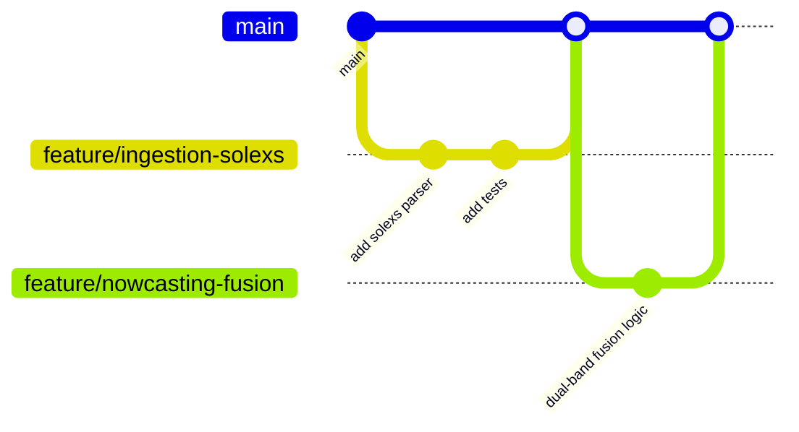

# 57 — Git Workflow

**HeliosAI** — AI-Powered Space Weather Intelligence Platform
Document 57 of 61

---

## 1. Purpose

Defines branching, commit, and review conventions for HeliosAI, ensuring a clean, auditable history — especially important given the project's module-by-module, AI-assisted (Antigravity) implementation approach.

---

## 2. Branching Model

**Trunk-based development**, chosen for a project with frequent, module-scoped changes:



- `main` is always deployable; feature branches are short-lived (target: merged within days, not weeks).
- Branch naming: `feature/<module-slug>`, `fix/<issue-slug>`, `docs/<doc-slug>`, `chore/<task-slug>`.

---

## 3. Module-per-Branch Alignment

Because the README specifies each subsystem gets its own **Antigravity Master Prompt** for context-isolated implementation, branches are generally scoped 1:1 with those modules (e.g., `feature/nowcasting-engine`, `feature/dash-dashboard`), keeping AI-assisted diffs reviewable in isolation rather than sprawled across unrelated subsystems.

---

## 4. Commit Convention

Conventional Commits, enforced via a commit-msg hook (`commitlint`):

```
<type>(<scope>): <short summary>

<optional body>

<optional footer: Closes #123>
```

| Type | Use |
|---|---|
| `feat` | New capability |
| `fix` | Bug fix |
| `docs` | Documentation-only change |
| `refactor` | No behavior change |
| `test` | Test-only change |
| `chore` | Tooling/dependency/build change |

---

## 5. Pull Request Requirements

- At least one review approval before merge (even for AI-generated module implementations — a human reviews the Antigravity output before merge).
- CI (`52_CI_CD.md`) must pass fully; no admin-override merges.
- PR description links back to the relevant documentation file(s) (e.g., a PR implementing the nowcasting engine references `22_Nowcasting.md`), keeping code and docs traceable to each other.

---

## 6. Tagging & Releases

- Semantic versioning (`vMAJOR.MINOR.PATCH`).
- Tags created only on `main`, only after a successful production deploy (`52_CI_CD.md`), never manually pushed ahead of a verified deploy.

---

## 7. Handling Documentation Commits

Documentation files (this 61-document set) are committed under `docs:` scope, one file (or tightly related small group) per commit, mirroring the "one file at a time" generation sequencing rule established in the README — keeping documentation history as reviewable as code history.

---

## 8. Interfaces to Other Documents

- **`52_CI_CD.md`** — automation triggered by this branching model.
- **`56_Coding_Standards.md`** — code quality bar enforced pre-merge.
- **`58_Open_Source_Guidelines.md`** — contribution process for external contributors.
- **`61_Antigravity_Master_Prompt.md`** — module-to-branch mapping for AI-assisted implementation.

---

**Next document:** `58_Open_Source_Guidelines.md` — say **NEXT** to continue.
