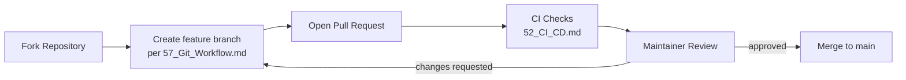

# 58 — Open Source Guidelines

**HeliosAI** — AI-Powered Space Weather Intelligence Platform
Document 58 of 61

---

## 1. Purpose

Establishes how HeliosAI operates as an open, community-contributable project, supporting the Future Scope item: "Federated/community model contribution workflow for open-source (GSSoC-style) collaborative model improvement."

---

## 2. License

The project is intended to be released under a permissive open-source license (e.g., MIT or Apache-2.0 — final selection recorded in the repository's `LICENSE` file at release time), consistent with enabling broad academic and community reuse of a space-weather research tool.

---

## 3. Contribution Workflow

- First-time contributors are directed to `CONTRIBUTING.md` (repository root, generated alongside this documentation set) covering setup, coding standards (`56_Coding_Standards.md`), and PR expectations.
- Good-first-issue labeling is used to onboard new contributors, particularly relevant for GSSoC-style (open-source program) participation.

---

## 4. Areas Open to Community Contribution

| Area | Contribution Type |
|---|---|
| Model improvements | New model architectures, hyperparameter studies, benchmark comparisons submitted as MLflow-tracked experiments |
| Feature engineering | New candidate features for the hardness-ratio/wavelet feature set (`21_Feature_Engineering.md`) |
| Dashboard/UX | Dash component improvements, accessibility fixes |
| Documentation | Corrections, translations, tutorial notebooks |
| Data connectors | Support for additional supplementary datasets (e.g., other mission X-ray instruments), per Future Scope's multi-mission fusion goal |

---

## 5. Code of Conduct

A Contributor Covenant–style Code of Conduct governs community interaction, with a clear, named reporting channel for violations (documented in the repository's `CODE_OF_CONDUCT.md`).

---

## 6. Scientific Contribution Standards

Because this is a research-grade scientific tool, model/algorithm contributions are expected to include:
- Reproducible evaluation results per `48_Model_Evaluation.md`'s methodology (no unverified accuracy claims).
- Clear documentation of any new external dataset dependency, including licensing compatibility.

---

## 7. Governance

- Maintainer team reviews and merges PRs; scientific/algorithmic contributions affecting the master catalogue or production models require sign-off from a maintainer with `ml_engineer`/`admin` role context (per `36_Authorization.md`) before merge, distinct from routine documentation/tooling PRs.

---

## 8. Interfaces to Other Documents

- **`57_Git_Workflow.md`** — branching/PR mechanics contributors follow.
- **`56_Coding_Standards.md`** — code quality bar for contributions.
- **`60_Future_Enhancements.md`** — roadmap items open for community contribution.
- **`48_Model_Evaluation.md`** — evaluation bar for model/algorithm contributions.

---

**Next document:** `59_Research_Paper.md` — say **NEXT** to continue.
