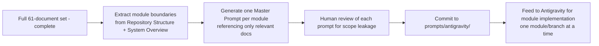

# 61 — Antigravity Master Prompt

**HeliosAI** — AI-Powered Space Weather Intelligence Platform
Document 61 of 61 (final documentation-phase document)

---

## 1. Purpose

Defines the template and workflow for generating **per-module Antigravity Master Prompts** — the context-isolated, branch-scoped implementation prompts referenced throughout this documentation set (README §Repository Structure, `57_Git_Workflow.md` §3) that hand off each subsystem to downstream AI-assisted implementation without cross-module context bleed.

---

## 2. Why Context-Isolated Prompts

A single monolithic "build everything" prompt risks:
- Context dilution across unrelated subsystems (e.g., auth logic bleeding into signal-processing code).
- Inconsistent conventions between modules implemented far apart in a long session.
- Difficult review — a reviewer cannot easily verify a diff that touches ingestion, ML, and frontend simultaneously.

Instead, each module gets its own master prompt: self-contained, referencing only the documentation files relevant to that module, and scoped to one Git branch (`feature/<module-slug>`, per `57_Git_Workflow.md`).

---

## 3. Master Prompt Template

Each file under `prompts/antigravity/<module-slug>.md` follows this structure:

```markdown
# Antigravity Master Prompt: <Module Name>

## Context
- Problem Statement 15 summary (one paragraph)
- This module's role in the six-subsystem architecture (README §System Overview)

## Relevant Documentation (read these, and only these, before implementing)
- <doc-number>_<Doc_Name>.md (primary spec)
- <doc-number>_<Doc_Name>.md (supporting spec)
- 56_Coding_Standards.md (always included)
- 53_Testing.md (always included)

## Scope
### In scope for this module
- ...
### Explicitly out of scope (belongs to other modules)
- ...

## Deliverables
- Source files under src/<module-path>/
- Tests under tests/<module-path>/
- Updated docs/06_Project_Folder_Structure.md if new directories are introduced

## Acceptance Criteria
- [ ] Passes 56_Coding_Standards.md lint/type/format gates
- [ ] Test coverage per 53_Testing.md
- [ ] No hardcoded secrets (54_Security.md)
- [ ] Matches API/data contracts defined in referenced docs exactly

## Branch
feature/<module-slug>
```

---

## 4. Module-to-Prompt Mapping

Each of the six subsystems (README §System Overview) decomposes into one or more Antigravity prompts, each mapped to its primary documentation source:

| Subsystem | Example Module Prompts | Primary Docs |
|---|---|---|
| Ingestion | `ingestion-solexs`, `ingestion-hel1os`, `ingestion-scheduler` | `17_Data_Ingestion.md`, `15_SoLEXS.md`, `16_HEL1OS.md` |
| Processing | `time-sync`, `signal-processing`, `feature-engineering` | `19_Data_Synchronization.md`, `20_Signal_Processing.md`, `21_Feature_Engineering.md` |
| Intelligence | `nowcasting-engine`, `forecasting-engine`, `explainable-ai` | `22_Nowcasting.md`, `23_Forecasting.md`, `29_Explainable_AI.md` |
| Data & Catalogue | `database-schema`, `catalogue-builder` | `30_Database_Design.md` |
| Serving | `api-core`, `websocket-stream`, `auth`, `alert-dispatcher` | `32_API_Design.md`, `33_WebSocket_System.md`, `35_Authentication.md`, `42_Alert_System.md` |
| Experience | `dash-dashboard`, `catalogue-explorer`, `admin-panel` | `39_Dashboard.md`, `41_Admin_Panel.md` |

The complete mapping, generated once all 61 documents exist, is maintained in `prompts/antigravity/INDEX.md`.

---

## 5. Generation Workflow



Master prompts are generated **after** this full documentation set is complete, since each prompt depends on stable, finished specs — generating a prompt against a not-yet-finalized doc risks implementation drift.

---

## 6. Guardrails for AI-Assisted Implementation

- A module's Antigravity prompt never grants scope beyond its own subsystem boundary — cross-module integration points are explicit interfaces (documented in each doc's "Interfaces to Other Documents" section), not implicit shared context.
- Every AI-generated module implementation still passes through standard human PR review (`57_Git_Workflow.md` §5) — Antigravity accelerates drafting, it does not bypass review.
- Security-sensitive modules (`auth`, `admin-panel`, anything touching secrets) require explicit human security review beyond standard code review, per `54_Security.md`.

---

## 7. Interfaces to Other Documents

- **All prior documents (00–60)** — the complete spec surface these prompts draw from.
- **`57_Git_Workflow.md`** — branch mapping for prompt-driven implementation.
- **`56_Coding_Standards.md`**, **`53_Testing.md`** — universal acceptance criteria included in every prompt.

---

## 8. Documentation Set Complete

This closes the full 61-document HeliosAI documentation set (`00_Project_Overview.md` through `61_Antigravity_Master_Prompt.md`). Next phase: generation of per-module `prompts/antigravity/*.md` files, followed by implementation.
